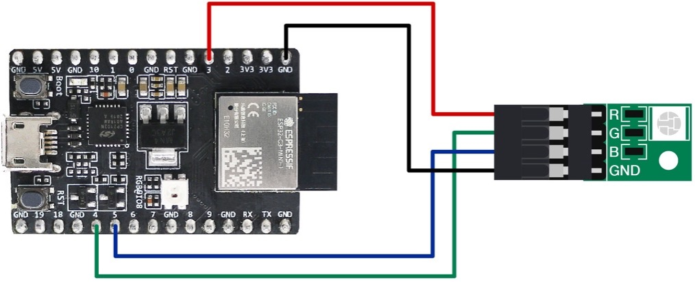
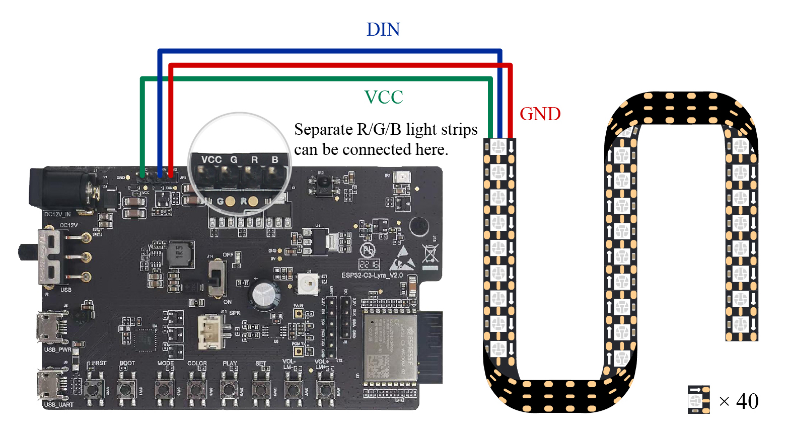

# Hardware Preparation

If interested in putting the project into practice, you will also need the following hardware: smart lights, smartphones, Wi-Fi routers, and a computer that meets the installation requirements of the development environment.

## Smart lights

Smart lights are a new type of bulbs, whose shape is the same as the general incandescent bulb. A smart light is composed of capacitor step-down regulated power supply, wireless module (with built-in ESP32-C3), LED controller and RGB LED matrix. When connected to power, the 15 V DC voltage output after capacitor step-down, diode rectification, and regulation provides energy to the LED controller and LED matrix. The LED controller can automatically send high and low levels at certain intervals, switching the RGB LED matrix between closed (lights on) and open (lights off), so that it can emit cyan, yellow, green, purple, blue, red, and white light. The wireless module is responsible for connecting to the Wi-Fi router, receiving and reporting the status of smart lights, and sending commands to control the LED.

<figure align="center">
    
    <figcaption>Figure 2.2. A simulated smart light</figcaption>
</figure>

In the early development stage, you can simulate a smart light using the ESP32-C3-DevKitM-1 board connected with RGB LED lamp beads (see Figure 2.2). But you should note that this is not the only way to assemble a smart light. The hardware design of the project in this book only contains a wireless module (with built-in ESP32-C3), but not a complete smart light hardware design.

In addition, Espressif also produces a ESP32-C3-based audio development board &ndash; ESP32-C3-Lyra &ndash; for controlling lights with audio. The board has interfaces for microphones and speakers and can control LED strips. It can be used for developing ultra-low-cost, high-performance audio broadcasters and rhythm light strips. Figure 2.3 shows a ESP32-C3-Lyra board linked with a strip of 40 LED lights.

<figure align="center">
    
    <figcaption>Figure 2.3. ESP32-C3-Lyra linked with a strip of 40 LED
lights</figcaption>
</figure>

## Smartphones (Android/iOS)

The Smart Light project involves the development of a smartphone app for setting up and controlling smart light products.

## Wi-Fi routers

Wi-Fi routers convert wired network signals and mobile network signals into wireless network signals, for computers, smartphones, tablets, and other wireless devices to connect to the network. For example, broadband in the home only needs to be connected to a Wi-Fi router to achieve wireless networking of Wi-Fi devices. The mainstream protocol standard supported by Wi-Fi routers is IEEE 802.11n, with an average TxRate of 300 Mbps, or 600 Mbps at maximum. They are backward compatible with IEEE 802.11b and IEEE 802.11g. The ESP32-C3 chip by Espressif supports IEEE 802.11b/g/n, so you can choose a single-band (2.4 GHz) or dual-band (2.4 GHz and 5 GHz) Wi-Fi router.

## A computer (Linux/macOS/Windows)

Development environment will be introduced in Chapter 4.
