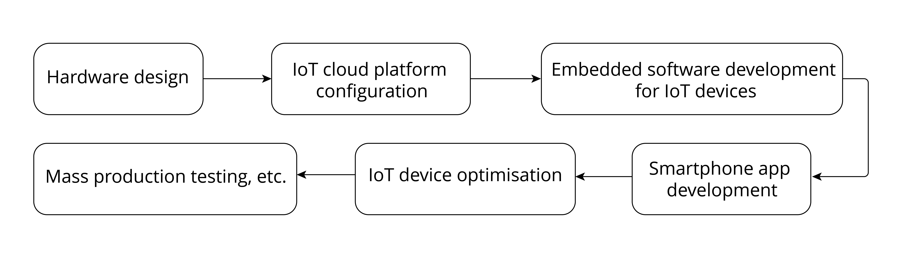

# Development Process

<figure align="center">
    
    <figcaption>Figure 2.4. Steps of developing the Smart Light project</figcaption>
</figure>

## Hardware design

Hardware design of IoT devices is essential to an IoT project. A complete smart light project is intended to produce a lamp working under mains supply. Different manufacturers produce lamps of different styles and driver types, but their wireless modules are usually of the same function. To simplify the development process of the Smart Ligh project, this book only covers the hardware design and software development of wireless modules.

## IoT cloud platform configuration

To use IoT cloud platforms, you need to configure projects on the backend, such as creating products, creating devices, setting device properties, etc.

## Embedded software development for IoT devices

Implement expected functions with ESP-IDF, Espressif's device-side SDK, including connecting to IoT cloud platforms, developing LED drivers, and upgrading firmware.

## Smartphone app development

Develop smartphone apps for Android and iOS systems to realise user registration and login, device control and other functions.

## IoT device optimisation

Once the basic development of IoT device functions is completed, you may turn to optimisation tasks, such as power optimisation.

## Mass production testing

Carry out mass production tests according to related standards, such as equipment function test, aging test, RF test, etc.

 
Despite the steps listed above, a Smart Light project is not necessarily subject to such procedure as different tasks can also be carried out at the same time. For example, embedded software and smartphone apps can be developed in parallel. Some steps may also need to be repeated, such as IoT device optimisation and mass production testing.
