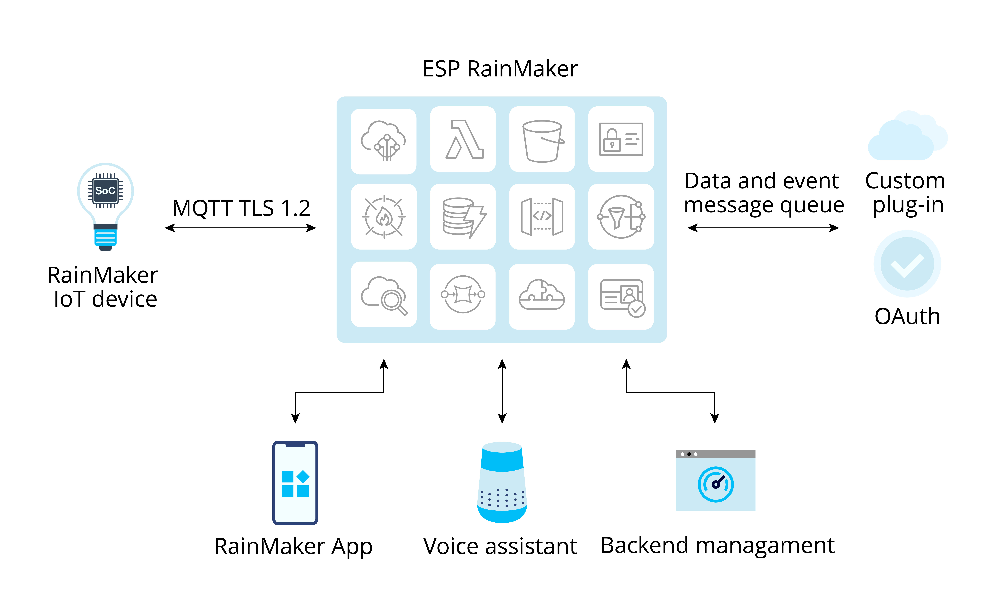

# What is ESP RainMaker?

ESP RainMaker is a complete AIoT platform built with multiple mature AWS products. It provides various services required for mass production such as device cloud access, device upgrade, backend management, third-party login, voice integration, and user management. By using the Serverless Application Repository (SAR) provided by AWS, terminal manufacturers can quickly deploy ESP RainMaker to their AWS accounts, which is time-efficient and easy to operate. Managed and maintained by Espressif, the SAR used by ESP RainMaker helps developers reduce cloud maintenance costs and accelerate the development of AIoT products, thus building secure, stable, and customizable AIoT solutions. Figure 3.1 shows the architecture of ESP RainMaker.

<figure align="center">
    
    <figcaption>Figure 3.1. Architecture of ESP RainMaker</figcaption>
</figure>

The ESP RainMaker public server by Espressif is free for all ESP enthusiasts, makers, and educators for solution evaluation. Developers can log in with Apple, Google, or GitHub accounts, and quickly build their own IoT application prototypes. The public server integrates Alexa and Google Home, and provides voice control services, which are supported by Alexa Skill and Google Actions. Its semantic recognition function is also powered by third parties. RainMaker IoT devices only respond to specific actions. For an exhaustive list of supported voice commands, please check the third-party platforms. In addition, Espressif offers a public RainMaker App for users to control the products through smartphones.
