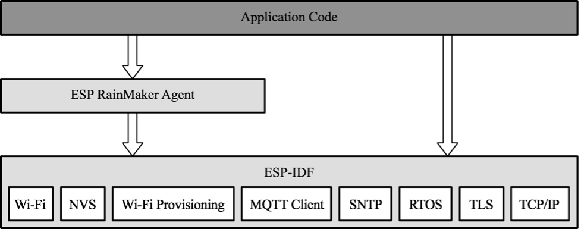

# RainMaker Agent

The primary function of the RainMaker Agent is to provide connectivity and assist the application layer to process uplink/downlink cloud data. It is built through the RainMaker SDK and developed based on the proven ESP-IDF framework, using ESP-IDF components such as RTOS, NVS, and MQTT. Figure 3.3 shows the structure of the RainMaker SDK.

<figure align="center">
    
    <figcaption>Figure 3.3. Structure of RainMaker SDK</figcaption>
</figure>

The RainMaker SDK includes two major features.

## Connection

<ol type="i">
<li>Cooperating with Claiming Service to obtain device certificates.</li>
 
<li>Connecting to the cloud backend using the secure MQTT protocol to   provide remote connectivity and implement remote control, message   reporting, user management, device management, etc. It uses the MQTT    component in ESP-IDF by default and provides an abstraction layer to    interface with other protocol stacks.</li>
 
<li>Providing <code>wifi_provisioning</code> component for Wi-Fi connection and provisioning, <code>esp_https_ota</code> component for OTA upgrades, and <code>esp_local_ctrl</code> component for local device discovery and connection. All these objectives can be achieved through simple configuration.</li>
</ol>

## **Data processing**

<ol type="i">
<li>Storing the device certificates issued by Claiming Service and the data needed when running RainMaker, by default using the interface provided by the <code>nvs_flash</code> component, and providing APIs for
developers for direct use.</li>
 
<li>Using the callback mechanism to process uplink/downlink cloud data and automatically unblocking the data to the application layer for easy processing by developers. For example, the RainMaker SDK provides rich interfaces for establishing TSL (Thing Specification Language) data, which are required to define TSL models to describe IoT devices and implement functions such as timing, countdown, and voice control. For basic interactive features such as timing, RainMaker SDK provides a development-free solution which can be simply enabled when needed. Then, the RainMaker Agent will directly process the data, send it to the cloud through the associated MQTT topic, and feed back the data changes in the cloud backend through callback mechanism.</li>
</ol>
