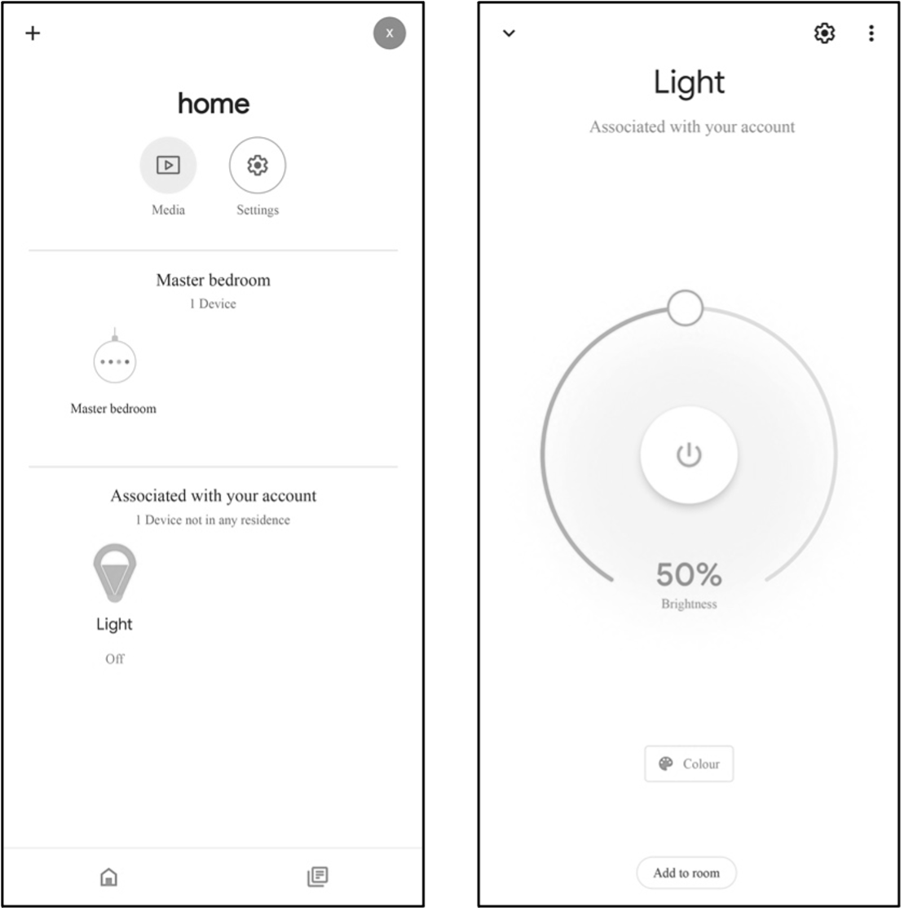
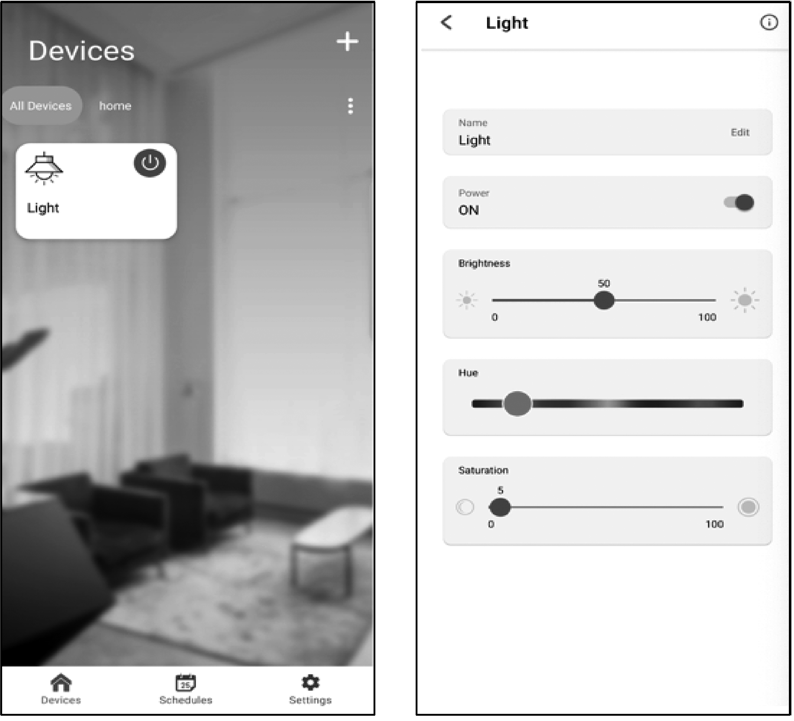

# RainMaker Client

RainMaker clients, such as App and CLI, communicate with the cloud backend through REST APIs. Detailed information and instructions about REST APIs can be found in the Swagger documentation provided by Espressif. RainMaker's mobile application client is available for both iOS and Android systems. It allows device provisioning, control, and sharing, as well as creating and enabling countdown tasks and connecting to third-party platforms. It can automatically load UI and icons according to the configuration reported by the devices and fully display the device TSL.

For example, if a smart light is built on the RainMaker SDK-provided examples, the icon and UI of the bulb light will be loaded automatically when the provisioning is completed. Users can change the color and brightness of the light through the interface and achieve third-party control by linking Alexa Smart Home Skill or Google Smart Home Actions to their ESP RainMaker accounts. Figure 3.4 shows the icon and UI examples of the bulb light respectively on Alexa, Google Home, and ESP RainMaker App.

<figure align="center">
    
    <figcaption>(a) Example - Alexa</figcaption>
</figure>

<figure align="center">
    
    <figcaption>(b) Example - Google Home</figcaption>
</figure>

<figure align="center">
    
    <figcaption>(c) Example - ESP RainMaker</figcaption>
     
    <figcaption>Figure 3.4. Examples of icon and UI of the bulb light on Alexa, Google Home, and ESP RainMaker App</figcaption>
</figure>