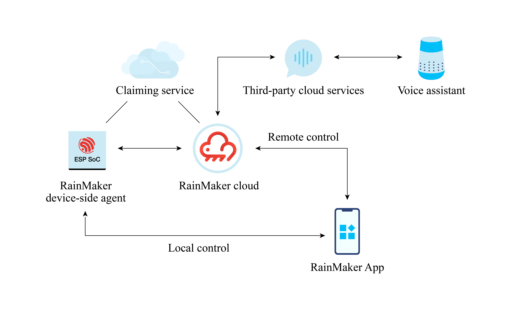

# The Implementation of ESP RainMaker

As shown in Figure 3.2, ESP RainMaker consists of four parts:

- **Claiming Service**, enabling RainMaker devices to dynamically obtain certificates.
- **RainMaker Cloud** (also known as cloud backend), providing services such as message filtering, user management, data storage, and third-party integrations.
- **RainMaker Agent**, enabling RainMaker devices to connect to RainMaker Cloud.
- **RainMaker Client** (RainMaker App or CLI scripts), for provisioning, user creation, device association and control, etc.

<figure align="center">
    
    <figcaption>Figure 3.2. Structure of ESP RainMaker</figcaption>
</figure>

ESP RainMaker provides a complete set of tools for product development and mass production, including:

### RainMaker SDK

RainMaker SDK is based on ESP-IDF and provides the source code of the device-side agent and related C APIs for firmware development. Developers only need to write the application logic and leave the rest to the RainMaker framework. For more information about C APIs, please visit <https://bookc3.espressif.com/rm/c-api-reference>.

### RainMaker App

The public version of RainMaker App allows developers to complete device provisioning, and control and query the status of devices (e.g., smart lighting products). It is available on both iOS and Android app stores. For more details, please refer to Chapter 10.

### REST APIs

REST APIs help users build their own applications similar to the RainMaker App. For more information, please visit <https://swaggerapis.rainmaker.espressif.com/>.

### Python APIs

A Python-based CLI, which comes with the RainMaker SDK, is provided to implement all functions similar to smartphone features. For more information about Python APIs, please visit <https://bookc3.espressif.com/rm/python-api-reference>.

### Admin CLI

Admin CLI, with higher level of access, is provided for ESP RainMaker private deployment to generate device certificates in bulk.
