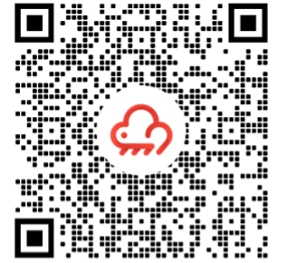

# Summary

In this chapter, we introduced some key differences between the public RainMaker deployment and the private deployment. The private ESP RainMaker solution launched by Espressif is highly reliable and extensible. All ESP32 series chips have been connected and adapted to AWS, which greatly reduces the cost. Developers can focus on prototype verification without having to learn about AWS cloud products. We also explained the implementation and features of ESP RainMaker, and some key points for development using the platform.

<figure align="center">
    
    
</figure>

Download ESP RainMaker for Android&nbsp;&nbsp;&nbsp;&nbsp;&nbsp;&nbsp;Download ESP RainMaker for iOS

