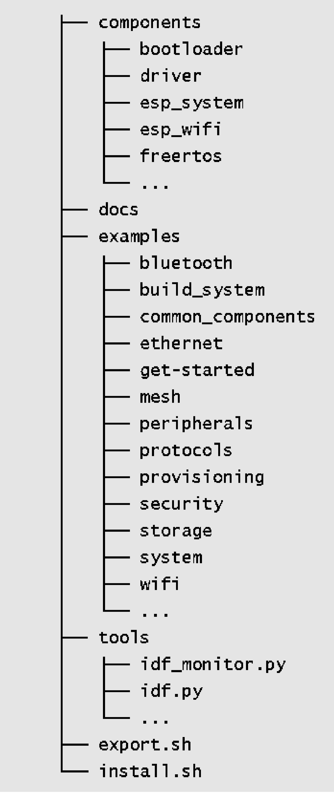

# Overview of ESP-IDF SDK Directory
The ESP-IDF SDK consists of two main directories: `esp-idf` and
`.espressif`. The former contains ESP-IDF repository's source code files
and compilation scripts, while the latter mainly stores compilation tool
chains and other software. Familiarity with these two directories will
help developers make better use of available resources and speed up the
development process. The directory structure of ESP-IDF is described
below:

### ESP-IDF repository code directory (`~/esp/esp-idf`)

<figure align="center">
    
    <figcaption>Figure 4.2. ESP-IDF repository code directory</figcaption>
</figure>

<!--  -->
<!-- we could probably make the tree by ourself with markdown -->
#### Component directory `components`

This core directory integrates numerous essential software
components of ESP-IDF. No project code can be compiled without
relying on the components within this directory. It includes
driver support for various Espressif chips. From the LL library
and HAL library interfaces for peripherals to the upper-level
Driver and Virtual File System (VFS) layer support, developers
can choose the appropriate components at different levels for
their development needs. ESP-IDF also supports multiple standard
network protocol stacks such as TCP/IP, HTTP, MQTT, WebSocket,
etc. Developers can utilise familiar interfaces like Socket to
build network applications. Components provide comprehensive
functionality and can be easily integrated into applications,
allowing developers to focus solely on the business logic. Some
common components include:

-   `driver`: This component contains peripheral driver programs
    for various Espressif chip series, such as GPIO, I2C, SPI,
    UART, LEDC (PWM), etc. The peripheral driver programs in
    this component offer chip-independent abstract interfaces.
    Each peripheral has a common header file (such as `gpio.h`),
    eliminating the need to deal with different chip-specific
    support questions.

-   `esp_wifi`: Wi-Fi, as a special peripheral, is treated as a
    separate component. It includes multiple APIs such as
    initialisation of various Wi-Fi driver modes, parameter
    configuration, and event processing. Certain functions of
    this component are provided in the form of static link
    libraries. ESP-IDF also provides comprehensive driver
    documentation for ease of use.

-   `freertos`: This component contains the complete FreeRTOS
    code. Apart from providing comprehensive support for this
    operating system, Espressif has also extended its support to
    dual-core chips. For dual-core chips like ESP32 and
    ESP32-S3, users can create tasks on specific cores.

 #### Document directory `docs`

This directory contains ESP-IDF related development documents,
including the Get Started Guide, API Reference Manual,
Development Guide, etc.

  > 📌 **Note**
  >
  > After being compiled by automated tools, the contents of this directory are deployed at <https://docs.espressif.com/projects/esp-idf>. Please ensure to switch the document target to ESP32-C3 and select the specified ESP-IDF version.

  
#### Script tool `tools`

This directory contains commonly used compilation front-end
tools such as `idf.py`, and the monitor terminal tool
`idf_monitor.py`, etc. The sub-directory `cmake` also contains
core script files of the compilation system, serving as the
foundation for implementing ESP-IDF compilation rules. When
adding the environment variables, the contents within the
`tools` directory are added to the system environment variable,
allowing `idf.py` to be executed directly under the project
path.

 #### Example program directory `examples`

This directory comprises a vast collection of ESP-IDF example
programs that demonstrate the usage of component APIs. The
examples are organised into various sub-directories based on
their categories:

-   `get-started`: This sub-directory includes entry-level
examples like "hello world" and "blink" to help users grasp
the basics.

-   `bluetooth`: You can find Bluetooth related examples here,
including Bluetooth LE Mesh, Bluetooth LE HID, BluFi, and
more.

-   `wifi`: This sub-directory focuses on Wi-Fi examples,
including basic programs like Wi-Fi SoftAP, Wi-Fi Station,
`espnow`, as well as proprietary communication protocol
examples from Espressif. It also includes multiple
application layer examples based on Wi-Fi, such as Iperf,
Sniffer, and Smart Config.

-   `peripherals`: This extensive sub-directory is further
divided into numerous sub-folders based on peripheral names.
It mainly contains peripheral driver examples for Espressif
chips, with each example featuring several sub-examples. For
instance, the `gpio` sub-directory includes two examples:
GPIO and GPIO matrix keyboard. It's important to note that
not all examples in this directory are applicable to
ESP32-C3. For example, the examples in `usb/host` are only
applicable to peripherals with USB Host hardware (such as
ESP32-S3), and ESP32-C3 does not have this peripheral. The
compilation system typically provides prompts when setting
the target. The README file of each example lists the
supported chips.

-   `protocols`: This sub-directory contains examples for
various communication protocols, including MQTT, HTTP, HTTP
Server, PPPoS, Modbus, mDNS, SNTP, covering a wide range of
communication protocol examples required for IoT
development.

-   `provisioning`: Here, you'll find provisioning examples for
different methods, such as Wi-Fi provisioning and Bluetooth
LE provisioning.

-   `system`: This sub-directory includes system debugging
examples (e.g., stack tracing, runtime tracing, task
monitoring), power management examples (e.g., various sleep
modes, co-processors), and examples related to common system
components like console terminal, event loop, and system
timer.

-   `storage`: Within this sub-directory, you'll discover
examples of all file systems and storage mechanisms
supported by ESP-IDF (such as reading and writing of Flash,
SD card and other storage media), as well as examples of
non-volatile storage (NVS), FatFS, SPIFFS and other file
system operations.

-   `security`: This sub-directory contains examples related to
flash encryption.

### ESP-IDF compilation tool chain directory (`~/.espressif`)

<!--  -->

<figure align="center">
    
    <figcaption>Figure 4.3. ESP-IDF compilation tool chain directory</figcaption>
</figure>

#### Software distribution directory `dist`

The ESP-IDF tool chain and other software are distributed in the
form of compressed packages. During the installation process,
the installation tool first downloads the compressed package to
the `dist` directory, and then extracts it to the specified
directory. Once the installation is complete, the contents in
this directory can be safely removed.

#### Python virtual environment directory `python_env`

Different versions of ESP-IDF rely on specific versions of
Python packages. Installing these packages directly on the same
host can lead to conflicts between package versions. To address
this, ESP-IDF utilises Python virtual environments to isolate
different package versions. With this mechanism, developers can
install multiple versions of ESP-IDF on the same host and easily
switch between them by importing different environment
variables.

#### ESP-IDF compilation tool chain directory `tools`

This directory mainly contains cross-compilation tools required
to compile ESP-IDF projects, such as CMake tools, Ninja build
tools, and the gcc tool chain that generates the final
executable program. Additionally, this directory houses the
standard library of the C/C++ language along with the
corresponding header files. If a program references a system
header file like `#include <stdio.h>`, the compilation tool
chain will locate the `stdio.h` file within this directory.

