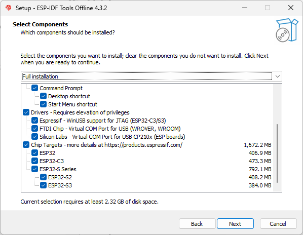

# Setting up ESP-IDF Development Environment on Windows

### 1. Download ESP-IDF tools installer

> 💡 **Tip**
>
>It is recommended to set up the ESP-IDF development environment on Windows 10 or above. You can download the installer from <https://dl.espressif.com/dl/esp-idf/>. The installer is also an open-source software, and its source code can be viewed at <https://github.com/espressif/idf-installer>.

-   **Online ESP-IDF tools installer**

    This installer is relatively small, around 4 MB in size, and other
    packages and code will be downloaded during the installation
    process. The advantage of the online installer is that not only can
    software packages and code be downloaded on demand during the
    installation process, but also allows the installation of all
    available releases of ESP-IDF and the latest branch of GitHub code
    (such as the `master` branch). The disadvantage is that it requires
    a network connection during the installation process, which may
    cause installation failure due to network problems.

-   **Offline ESP-IDF tools installer**

    This installer is larger, about 1 GB in size, and contains all the
    software packages and code required for environment set up. The main
    advantage of the offline installer is that it can be used on
    computers without Internet access, and generally has a higher
    installation success rate. It should be noted that the offline
    installer can only install stable releases of ESP-IDF identified by
    v\*.\* or v\*.\*.\*.

### 2. Run the ESP-IDF tools installer

After downloading a suitable version of the installer (take ESP-IDF
Tools Offline 4.3.2 for example here), double-click the exe file to
launch the ESP-IDF installation interface. The following demonstrates
how to install ESP-IDF stable version v4.3.2 using the offline
installer.

<ol type="i">
<li>
In the "Select installation language" interface shown in Figure 4.4, select the language to be used from the drop-down list.

<figure align="center">
    
    <figcaption>Figure 4.4. "Select installation language" interface</figcaption>
</figure>
</li>
<li>
After selecting the language, click "OK" to pop up the "License agreement" interface (see Figure 4.5). After carefully reading the installation license agreement, select "I accept the agreement" and click "Next".

<figure align="center">
    
    <figcaption>Figure 4.5. "License agreement" interface</figcaption>
</figure>
</li>
<li>
Review the system configuration in the "Pre-installation system check" interface (see Figure 4.6). Check the Windows version and the installed antivirus software information. Click "Next" if all the configuration items are normal. Otherwise, you can click "Full log" for solutions based on key items.

<figure align="center">
    
    <figcaption>Figure 4.6. "Pre-installation system check" interface</figcaption>
</figure>

> 💡 **Tip**
>
>You can submit logs to <https://github.com/espressif/idf-installer/issues> for help.
</li>
<li>
Select the ESP-IDF installation directory. Here, select <code>D:/.espressif</code>, as shown in Figure 4.7, and click "Next". Please note that <code>.espressif</code> here is a hidden directory. After the installation is completed, you can view the specific contents of this directory by opening the file manager and displaying hidden items.

<figure align="center">
    
    <figcaption>Figure 4.7. Select the ESP-IDF installation directory</figcaption>
</figure>
</li>
<li>
Check the components that need to be installed, as shown in Figure 4.8. It is recommended to use the default option, that is, complete installation, and then click "Next".

<figure align="center">
    
    <figcaption>Figure 4.8. Select the components to install</figcaption>
</figure>
</li>
<li>
Confirm the components to be installed and click "Install" to start the automated installation process, as shown in Figure 4.9. The installation process may last tens of minutes and the progress bar of the installation process is shown in Figure 4.10. Please wait patiently.

<figure align="center">

<figcaption>Figure 4.9. Preparing for installation</figcaption>
  

<figcaption>Figure 4.10. Installation progress bar</figcaption>
</figure>
</li>
<li>
After the installation is complete, it is recommended to check "Register the ESP-IDF Tools executables as Windows Defender exclusions..." to prevent antivirus software from deleting files. Adding exclusion items can also skip frequent scans by antivirus software, greatly improving the code compilation efficiency of the Windows system. Click "Finish" to complete the installation of the development environment, as shown in Figure 4.11. You can choose to check "Run ESP-IDF PowerShell environment" or "Run ESP-IDF command prompt". Run the compilation window directly after installation to ensure that the development environment functions normally.

<figure align="center">
    
    <figcaption>Figure 4.11. Installation completed</figcaption>
</figure>
</li>
<li>
Open the installed development environment in the program list (either ESP-IDF 4.3 CMD or ESP-IDF 4.3 PowerShell terminal, as shown in Figure 4.12), and the ESP-IDF environment variable will be automatically added when running in the terminal. After that, you can use the <code>idf.py</code> command for operations. The opened ESP-IDF 4.3 CMD is shown in Figure 4.13.

<figure align="center">

<figcaption>Figure 4.12. Development environment installed</figcaption>
  

<figcaption>Figure 4.13. ESP-IDF 4.3 CMD</figcaption>
</li>
</ol>
