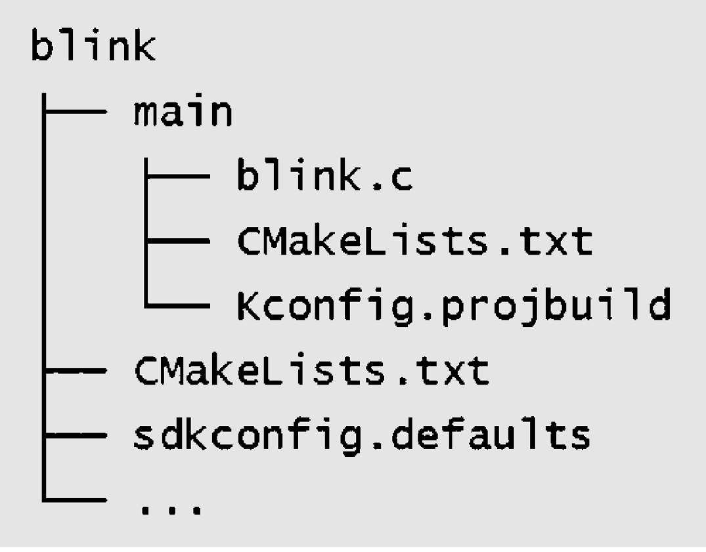

# Project File Structure
A project is a folder that contains an entry program `main`,
user-defined components, and files required to build executable
applications, such as compilation scripts, configuration files,
partition tables, etc. Projects can be copied and passed on, and the
same executable file can be compiled and generated in machines with the
same version of ESP-IDF development environment. A typical ESP-IDF
project file structure is shown in Figure 4.14.

<!--  add ../../ it could render pic, but suggest to use html to better adjust the pic in web -->

<figure align="center">
    
    <figcaption>Figure 4.14. Typical ESP-IDF project file structure</figcaption>
</figure>

Since ESP-IDF supports multiple IoT chips from Espressif, including
ESP32, ESP32-S series, ESP32-C series, ESP32-H series, etc., a target
needs to be determined before compiling the code. The target is both the
hardware device that runs the application program and the build target
of the compilation system.

Depending on your needs, you can specify one or more targets for your
project. For example, through command `idf.py set-target esp32c3`, you
can set the compilation target to ESP32-C3, during which the default
parameters and compilation tool chain path for ESP32-C3 will be loaded.
After compilation, an executable program can be generated for ESP32-C3.
You can also run the command `set-target` again to set a different
target, and the compilation system will automatically clean up and
reconfigure.

### Components

Components in ESP-IDF are modular and independent code units managed
within the compilation system. They are organised as folders, with the
folder name representing the component name by default. Each component
has its own compilation script that specifies its compilation parameters
and dependencies. During the compilation process, components are
compiled into separate static libraries (.a files) and eventually
combined with other components to form the application program.

ESP-IDF provides essential functions, such as the operating system,
peripheral drivers, and network protocol stack, in the form of
components. These components are stored in the `components` directory
located within the ESP-IDF root directory. Developers do not need to
copy these components to the `components` directory of `myProject`.
Instead, they only need to specify the dependency relationships of these
components in the project's `CMakeLists.txt` file using the `REQUIRES`
or `PRIV_REQUIRES` directives. The compilation system will automatically
locate and compile the required components.

Therefore, the `components` directory under `myProject` is not
necessary. It is only used to include some custom components of the
project, which can be third-party libraries or user-defined code.
Additionally, components can be sourced from any directory other than
ESP-IDF or the current project, such as from an open-source project
saved in another directory. In this case, you only need to add the path
of the component by setting the `EXTRA_COMPONENT_DIRS` variable in the
`CMakeLists.txt` under the root directory. This directory will override
any ESP-IDF component with the same name, ensuring the correct component
is used. 

### Entry program `main`

The `main` directory within the project follows the same file structure as other components (e.g.,`component1`). However, it holds a special significance as it is a
mandatory component that must exist in every project. The main directory
contains the project's source code and the user program's entry point,
typically named `app_main`. By default, the execution of the user
program starts from this entry point. The `main` component also differs
in that it automatically depends on all components within the search
path. Therefore, there is no need to explicitly indicate dependencies
using the `REQUIRES` or `PRIV_REQUIRES` directives in the
`CMakeLists.txt` file. 

### Configuration file

The root directory of the project contains a configuration file called `sdkconfig`, which contains the configuration parameters for all the components within the project.
The `sdkconfig` file is automatically generated by the compilation
system and can be modified and regenerated by the command
`idf.py menuconfig`. The menuconfig options mainly originate from the
`Kconfig.projbuild` of the project and the `Kconfig` of the components.
Component developers generally add configuration items in `Kconfig` to
make the component flexible and configurable. 

### `Build` directory

By default, the `build` directory within the project stores intermediate
files and the final executable programs generated by the `idf.py build`
command. In general, it is not necessary to directly access the contents
of the `build` directory. ESP-IDF provides predefined commands to
interact with the directory, such as using the `idf.py flash` command to
automatically locate the compiled binary file and flash it to the
specified flash address, or using the `idf.py fullclean` command to
clean the entire `build` directory. 

### Partition table (`partitions.csv`)

Each project requires a partition table to divide the space of flash and
specify the size and starting address of the executable program and user
data space. Command `idf.py flash` or OTA upgrade program will flash the firmware to the corresponding address according to this table. ESP-IDF provides several
default partition tables in `components/partition_table`, such as
`partitions_singleapp.csv` and `partitions_two_ota.csv`, which can be
selected in `menuconfig`.

If the default partition table of the system cannot meet the
requirements of the project, a custom `partitions.csv` can be added to
the project directory and be selected in `menuconfig`.