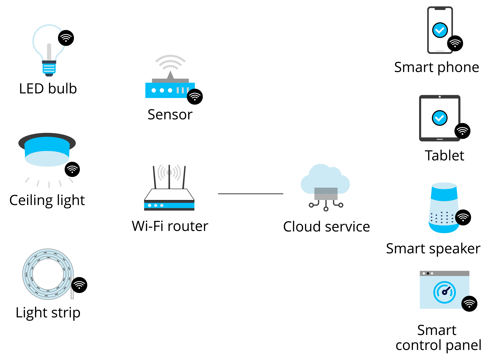
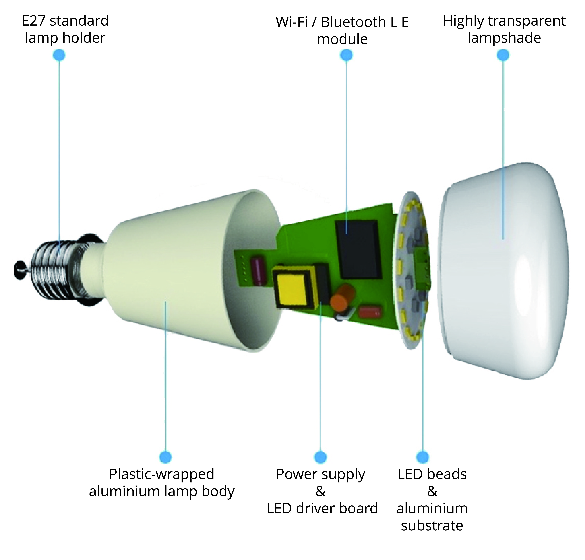
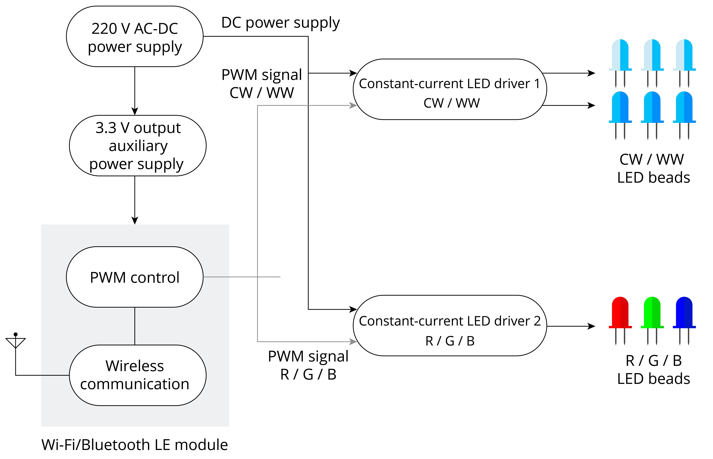

# Features and Composition of Smart Light Products

Smart light products generally use LEDs as light sources. LEDs are solid-state light sources and semiconductor light devices, characterised by low power consumption and long lifespan, easy to control, and pollution-free. Compared with traditional lighting products, they have higher efficiency of light energy conversion. At the same time, smart light products have wireless connectivity functionality, supporting connection to wireless routers or smart gateways through Wi-Fi, Bluetooth LE, or ZigBee, and then connection to the Internet or cloud servers. You can not only use smartphones, tablets, smart speakers that support voice control, and smart control panels to adjust their brightness and colour, as well as setting timers for turning on/off the lights. You can also group multiple lights together and control their brightness and colour in batch. You can pre-set lighting scenes for different occasions, such as "theatre mode" for dimming the ambient lighting, "reading mode" for a soft and eye-friendly brightness, "music mode" for colour changing and light blinking following the beat of the music, and "sleep mode" for turning off all the lights except the night lamp. The structure of a smart light system is shown in Figure 5.1.

<figure align="center">
    
    <figcaption>Figure 5.1. Structure of smart light system</figcaption>
</figure>

From the description above, we can see that the main features of smart light products is to be controlled through wireless connection. Now we will take the colour-changing smart LED light as an example to explain the main components of smart light products and how to control them.

Figure 5.2 shows the structure of a smart LED bulb, including an E27 standard lamp holder, a plastic-wrapped aluminium lamp body, a power supply & an LED driver board, a Wi-Fi module, LED beads & an aluminium substrate, and a highly transparent lampshade. Compared with traditional LED bulbs, a smart LED bulb has an additional Wi-Fi module. So how does this Wi-Fi module help control the light wirelessly? The following sections will further elaborate on the functional implementation.

<figure align="center">
    
    <figcaption>Figure 5.2. Structure of smart LED bulb</figcaption>
</figure>

Figure 5.3 shows the functional block diagram of a smart LED bulb, which mainly includes a 220 V AC-DC power supply module, a constant-current LED driver, a 3.3 V output auxiliary power supply, a PWM control and wireless communication module, and LED beads of various colours.

<figure align="center">
    
    <figcaption>Figure 5.3. Block diagram of functional units for smart LED bulb</figcaption>
</figure>

Before detailing each functional unit, let's first take a glance at how they manage to change the brightness and colour of the lighting as a whole. The key lies in the LED lamp beads.

LED lamp beads can be dimmed in two ways: analogue dimming and digital dimming. Analogue dimming changes LED light output by simply adjusting the DC current in the circuit; while digital dimming, also known as PWM dimming, is achieved by varying the conduction time of forward current through turning on/off LEDs using PWM signals of different pulse widths. Section 6.3.3 will describe PWM dimming in detail. Here we will briefly introduce PWM dimming using PWM signals.

When using a controllable constant-current source to drive LED beads, to adjust colour temperature, you can change the duty cycles of PWM signals on two channels to adjust the current of warm-white (WW) and cool-white (CW) LED beads; to adjust light colours, you can change the duty cycles of PWM signals on three channels to adjust the brightness of corresponding colours so that the smart LED light emits the mixed colour of different lamp beads.

Knowing the basics of light dimming and colour change, now let's dig into the functional units one by one.

### 220 V AC-DC power supply

The input power of smart LED lights is usually high-voltage AC, and the standard household AC in China is 220 V. The 220 V AC-DC power module first converts the AC to DC through a rectifier bridge, and then reduces it to 18 ~ 40 V for the constant-current LED drivers. Since the operating voltage of the PWM control and wireless communication module is 3.3 V, there is another auxiliary power supply to reduce the DC power to 3.3 V.

### Constant-current LED driver

To ensure consistency in the emission of multiple LED beads, you can use a series circuit and drive the LEDs with a constant current source. The brightness of the LEDs can be adjusted by controlling the constant current source using PWM signals. Constant-current LED driver 1 is used to drive the LEDs in cool white (CW) and warm white (WW), and the output power is relatively higher; constant-current LED driver 2 is used to drive red (R) / green (G) / blue (B) LEDs, mainly for changing colours, and the output power is lower.

### LED beads

In smart LED lights, there are usually warm-white, cool-white, red, green, and blue LED beads, among which more warm-white and cool-white beads are used for lighting, and less red, green or blue beads for colour adjustment.

### PWM control and wireless communication

In smart light products, to realise PWM control and wireless communication functions, a highly-integrated system-on-a-chip (SoC) is usually used. SoC supports multiple PWM signal outputs, as well as one or more mainstream wireless communication protocols such as Wi-Fi, Bluetooth LE, or ZigBee. It can run embedded RTOS, and supports software application development. With chips of Wi-Fi connectivity, you can connect your product to the Internet and cloud servers through a Wi-Fi router; with chips of Bluetooth LE or ZigBee functions, you need to configure a gateway device to connect to an Ethernet or Wi-Fi router first and then get it connected to the Internet and cloud servers.

  
The introduction above explains the main components of smart LED lights, as well as the realisation of dimming and colour change functions. It can be concluded that the biggest difference between smart light products and ordinary light products lies in the use of PWM control and wireless communication. The following sections of this chapter will focus on how to design the minimal hardware system based on the ESP32-C3 chip to realise PWM dimming, colour change, and wireless communication. The design is also applicable to other types of smart light products such as spotlights, ceiling lights, lamps, light strips, etc.
