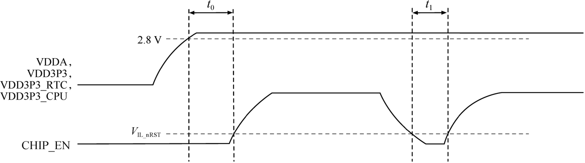

# Power-on Sequence and System Reset

ESP32-C3 uses a 3.3 V system power supply. The chip should be activated after the power rails have stabilised. This is achieved by delaying the activation of pin 7 CHIP_EN after the 3.3 V rails have been brought up. Figure 5.7 shows the power-up and reset timing of ESP32-C3. Details about the parameters are listed in Table 5.2.

<figure align="center">
    
    <figcaption>Figure 5.7. ESP32-C3 power-up and reset timing</figcaption>
</figure>

<i>Table 5.2. Parameter description of ESP32-C3 power-up and reset timing</i>

|Parameter|Description|Min.|
|:-------:|-----------|:---:|
|*t0*|Time between bringing up the VDDA, VDD3P3, VDD3P3_RTC, and VDD3P3_CPU rails, and activating CHIP_EN|
50 μs
|
|*t1*|Duration of CHIP_EN signal level < *V*IL_nRST to reset the chip|50 μs|

To ensure that the power supply to ESP32-C3 is stable during power-up, it is advised to add an RC delay circuit at the CHIP_EN pin. The recommended setting for the RC delay circuit is usually *R = 10 k&Omega;* and *C = 1 μF*, while specific parameters should be adjusted based on the power-up timing of the power supply and the power-up and reset sequence timing of the chip.

CHIP_EN can also be used as the reset pin of ESP32-C3. When CHIP_EN is
at low level, the reset voltage (*V*IL_nRST) should be (-0.3 ~ 0.25) × *V*DD (where *V*DD is the I/O voltage for a particular power domain of pins). To avoid reboots caused by external interference, route the CHIP_EN trace as short as possible, and add a pull-up resistor as well as a capacitor to ground. Note that CHIP_EN pin must not be left floating.
