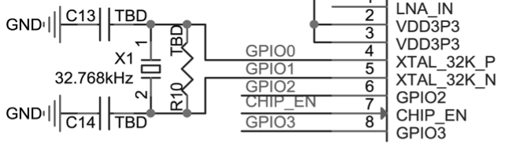

# Clock Source

Currently, the ESP32-C3 firmware supports 40 MHz crystal. The specific capacitance of C1 and C2 depends on further testing of, and adjustment to, the overall performance of the whole circuit. Please add a component (i.e., R1 in Figure 5.6) in series on the XTAL_P clock trace to minimise the impact of crystal harmonics on RF performance. The value of this component (initially of 24 nH) depends on further RF testing. Note that the accuracy of the selected crystal needs to be ±10 ppm. In actual use, as the temperature of smart light products rises, the frequency deviation of the crystal will also increase. Therefore, please ensure that the frequency deviation of the crystal does not exceed 25 ppm, so as not to affect Wi-Fi communication.

Although ESP32-C3 has integrated an RC oscillator as the RTC clock source, it also supports an external 32.768 kHz crystal to act as the RTC clock source. Figure 5.8 shows the schematic of the external 32.768 kHz crystal.

<figure align="center">
    
    <figcaption>Figure 5.8. Schematic of ESP32-C3's external crystal (RTC)</figcaption>
</figure>

> 📌 **Note**
>
>- Requirements for the 32.768 kHz crystal:
>   - Equivalent series resistance (ESR) &leq; 70 k&Omega;.
>   - Load capacitance at both ends should be configured according to the crystal's specification.
>
>- The parallel resistor R10 is used for biasing the crystal circuit (5 M&Omega; < R10 &leq; 10 M&Omega;). In general, you do not need to populate R10.
>
>- If the RTC source is not required, then pin 4 (XTAL_32K_P) and pin 5 (XTAL_32K_N) can be used as normal GPIOs.
