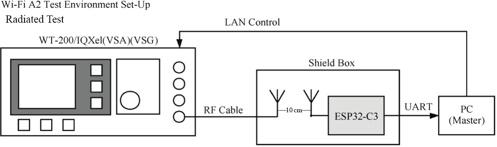

# RF and Antenna

In your circuit design, please add a &pi;-matching network between the RF port (LNA_IN) and the antenna, for antenna matching purpose. A CLC network is preferred, as shown in Figure 5.9. The parameters of C8, L2, and C9 in the matching network are subject to the actual antenna and PCB layout.

<figure align="center">
    
    <figcaption>Figure 5.9. CLC circuit for ESP32-C3 RF matching</figcaption>
</figure>

The antenna can be selected based on product design and the overall cost. You can choose PCB onboard antenna, or an external antenna such as rod antenna, FPC antenna, ceramic antenna, 3D metal antenna, etc. Commonly-used antenna types are shown in Figure 5.10. Their installation methods and characteristics are provided in Table 5.3.

<figure align="center">
    
    <figcaption>Figure 5.10. Commonly-used antenna types</figcaption>
</figure>

<i>Table 5.3. Installation methods and characteristics of commonly-used antenna types</i>

|Antenna Type|Installation Methods|Characteristics|
|:---:|:---:|---|
|PCB onboard antenna|PCB onboard|Low cost, medium gain, usually integrated on modules|
|Rod antenna|External connection through I-PEX connector|High cost, high gain, less susceptible to interference, good omni-directional performance|
|FPC antenna|Adhesive installation|Medium cost, medium gain, can be adhered to the package, suitable for products with restricted structure|
|Ceramic antenna|PCB mounting|Medium cost, low gain, small size, suitable for small-sized modules|
|3D metal antenna|PCB mounting|High cost, high gain, less susceptible to interference, good omni-directional performance|

The RF performance can be optimised through antenna matching. After matching, you can use CMW500, WT-200, IQ View, IQ Xel or other comprehensive RF testers to test RF performance of the ESP32-C3 core board. RF test includes conducted test and radiatied test.

### Conducted test

In conducted tests, use a 50 &Omega; RF cable to connect the RF output port of the ESP32-C3 core board to the tester's RF port, and run the RF test software on the PC. Through the software, you can communicate with the ESP32-C3 core board and the tester, thus controlling the test. The conducted test set-up is shown in Figure 5.11.

<figure align="center">
    
    <figcaption>Figure 5.11. Conducted test set-up for ESP32-C3 core board</figcaption>
</figure>

### Radiated test

When performing a radiated test, place the tester's antenna and ESP32-C3 board's antenna close to each other in the shield box. It is recommended that the distance between the two antennas be about 10 cm. Control the test through PC software. The radiated test set-up is shown in Figure 5.12.

<figure align="center">
    
    <figcaption>Figure 5.12. Radiated test set-up for ESP32-C3 core board</figcaption>
</figure>

For Wi-Fi RF performance test, the primary test parameters are target transmit power, EVM, receiver sensitivity, and frequency error, as shown in Table 5.4.

<i>Table 5.4. Key parameters for Wi-Fi RF test</i>

|Working Mode and Rate|Target TX Power (dBm)|EVM (dB)|Receiver Sensitivity (dBm)|Frequency Error (ppm)|
|:---:|:---:|:---:|:---:|:---:|
|IEEE 802.11b, 1 Mbit/s|21.0±2.0|<-24.5|<-98|±25|
|IEEE 802.11g, 54 Mbit/s|19.0±2.0|<-27.5|<-76.2|±20|
|IEEE 802.11n, MCS7 HT20|18.5±2.0|<-29|<-74.4|±20|
|IEEE 802.11n, MCS7 HT40|18.5±2.0|<-28|<-71.2|±20|

Figure 5.13 shows the spectral mask requirements in different working modes.

<figure align="center">
    
    <figcaption>Figure 5.13. Spectral mask requirements in different working modes</figcaption>
</figure>
