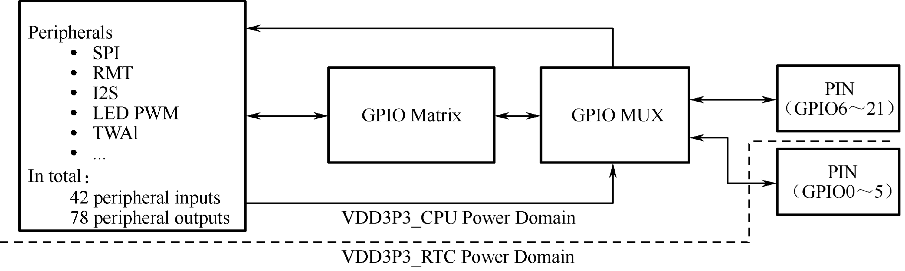

# GPIO and PWM Controller

ESP32-C3 has 22 GPIO pins which can be assigned various functions by configuring corresponding registers. All GPIOs can be configured with internal pull-up, pull-down, or set to high impedance. GPIO MUX and GPIO Matrix are used to collectively control the GPIO pin signals of the chip. By utilising GPIO MUX and GPIO Matrix (as shown in Figure 5.14), it is possible to configure the peripheral input signals from any GPIO pin, and the peripheral output signals can also be connected to any GPIO pin.

<figure align="center">
    
    <figcaption>Figure 5.14. IO MUX and GPIO matrix</figcaption>
</figure>

The PWM controller can generate independent PWM signals on six channels, which can be configured to any GPIO pins through the GPIO Matrix.
