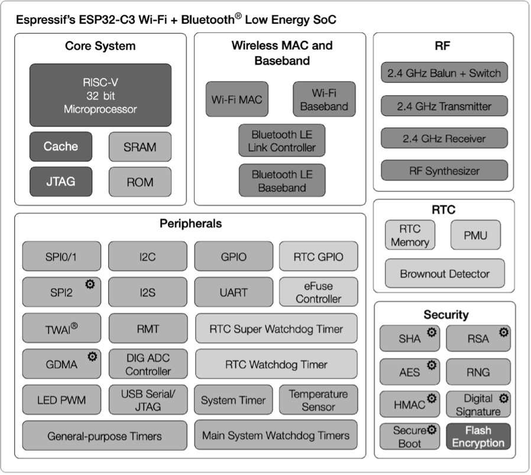
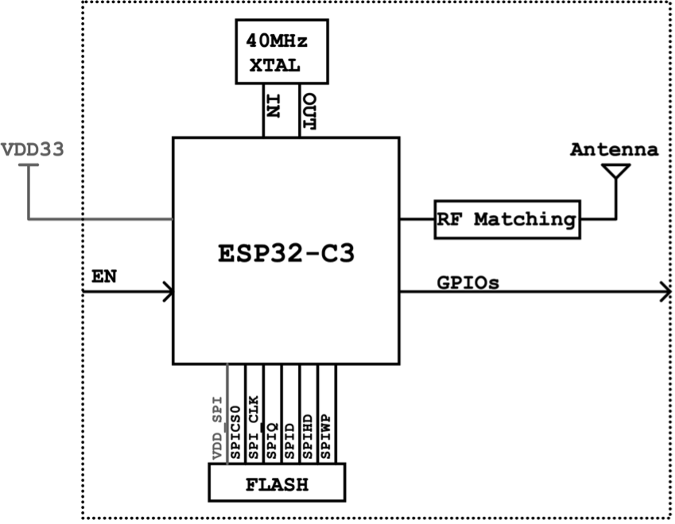
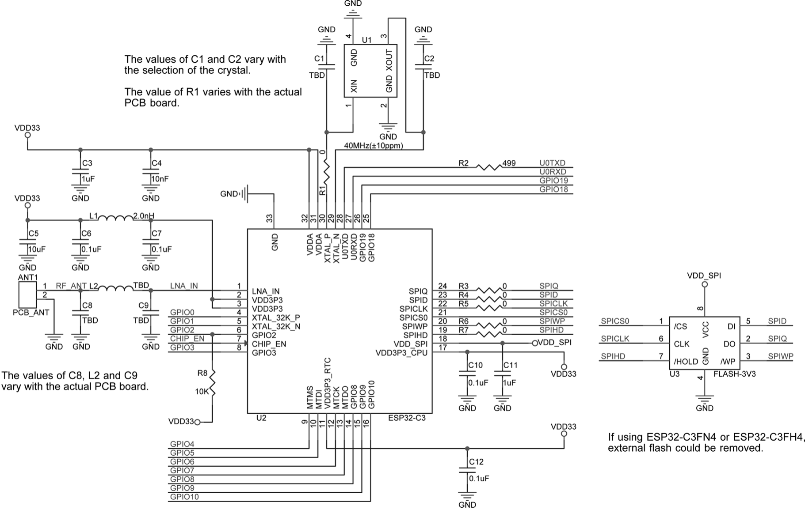

# Hardware Design of ESP32-C3 Core System

Through Section 5.1, we can see that the PWM control and wireless communication module is the core unit of smart light products, which distinguishes them from traditional light products. Then how should we design this core system to implement the functions of smart light products? In this section, we'll use the ESP32-C3 chip to demonstrate its hardware design.

ESP32-C3 is a highly-integrated SoC equipped with a 32-bit RISC-V processor, supporting 2.4 GHz Wi-Fi and Bluetooth LE connectivity. The functional block diagram of ESP32-C3 is shown in Figure 5.4.

<figure align="center">
    
    <figcaption>Figure 5.4. Block diagram of ESP32-C3 functions</figcaption>
</figure>

ESP32-C3 has the following features:

-   A 32-bit RISC-V single-core processor with a four-stage pipeline
    which operates at up to 160 MHz.

-   A **complete Wi-Fi subsystem** which complies with IEEE 802.11b/g/n
    protocol and supports Station mode, SoftAP mode, SoftAP + Station
    mode, and promiscuous mode.

-   A **Bluetooth LE subsystem** which supports Bluetooth 5 and
    Bluetooth mesh.

-   Storage capacities ensured by 400 KB SRAM and 384 KB ROM on the
    chip, and SPI, Dual SPI, Quad SPI, and QPI interfaces that allow
    connection to external flash.

-   **Reliable security mechanisms** ensured by cryptographic hardware
    accelerators that support AES-128/256, Hash, RSA, HMAC, digital
    signature and secure boot, external memory encryption and
    decryption, random number generator, and permission control on
    accessing internal memory, external memory, and peripherals.

-   **A rich set of peripheral interfaces** which are ideal for various
    scenarios and complex applications; **22 programmable GPIOs** that
    can be configured flexibly to support LED PWM, UART, I2C, SPI, I2S,
    ADC, TWAI, RMT, and USB Serial/JTAG applications.

The ESP32-C3 series of chips has several variants, including the version with in-package SPI flash. ESP8685 is a small package version of ESP32-C3, as shown in Table 5.1.

<i>Table 5.1. ESP32-C3 series</i>

|MPN|Flash (MB)|Temp (℃)|Size (mm)|
|:---:|:---:|:---:|:---:|
|ESP32-C3|&ndash;|-40 ~ 105|QFN32 (5×5)|
|ESP32-C3-FN4|4|-40 ~ 85|QFN32 (5×5)|
|ESP32-C3-FH4|4|-40 ~ 105|QFN32 (5×5)|
|ESP32-C3-FH4AZ|4|-40 ~ 105|QFN32 (5×5)|
|ESP8685H2|2|-40 ~ 105|QFN32 (4×4)|
|ESP8685H4|4|-40 ~ 105|QFN32 (4×4)|

> 📌 **Note**
>
> - For ESP32-C3FH4AZ, ESP8685H2, and ESP8685H4, pins for flash connection are not bonded.
> - Nomenclature of ESP32-C3 series: **F** stands for in-package flash, **H**/**N** indicates the flash temperature, and **AZ** is other identification code.

The core circuit for ESP32-C3 requires about 20 resistors, capacitors, and inductors in total, as well as one crystal and one SPI flash. The high integration of ESP32-C3 makes it suitable for small-sized applications such as smart light products. Figure 5.5 and Figure 5.6 show the block diagram and the schematic of ESP32-C3 core circuit.

<figure align="center">
    
    <figcaption>Figure 5.5. Block diagram of ESP32-C3 core circuit</figcaption>
</figure>

<figure align="center">
    
    <figcaption>Figure 5.6. Schematic of ESP32-C3 core circuit</figcaption>
</figure>

The following explains in detail the schematics and PCB layout of ESP32-C3.