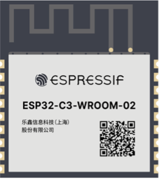
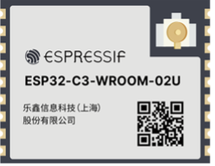
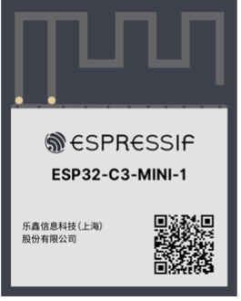
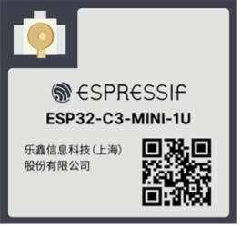

# Selecting Modules

As shown in Table 5.6, in terms of the type of antenna, ESP32-C3 modules can be divided into PCB antenna modules and IPEX external antenna modules; in terms of size and pins, they can be divided into WROOM series and MINI series. Each module has two temperature range versions: -40 ~ 85 ℃ version and -40 ~ 105 ℃ version, suitable for smart lights of different temperature requirements. For lighting products such as LED bulbs which characterise high internal temperature, it is recommended to use the -40 ~ 105 ℃ module. For other lighting products which do not have high internal temperature, the -40 ~ 85 ℃ module is suitable.

<i>Table 5.6. ESP32-C3 modules</i>

|Module|Antenna|Temp (℃)|Size (mm)|Image|
|:----:|:-----:|:------:|:-------:|:---:|
|ESP32-C3-WROOM-02|PCB antenna|
-40 ~ 85 ℃/ -40 ~ 105 ℃
|18×20×3.2|

|
|ESP32-C3-WROOM-02U|IPEX external antenna|-40 ~ 85 ℃/ -40 ~ 105 ℃|18×14.3×3.2||
|ESP32-C3-MINI-1|PCB antenna|-40 ~ 85 ℃/ -40 ~ 105 ℃|13.2×16.6×2.4||
|ESP32-C3-MINI-1U|IPEX external antenna|-40 ~ 85 ℃/ -40 ~ 105 ℃|13.2×12.5×2.4||

> 📌 **Note**
>
> You can also select one module from ESP8685-WROOM-01 to ESP8685-WROOM-07 series for a smaller package. For more information, please visit [products.espressif.com](https://products.espressif.com/#/).
