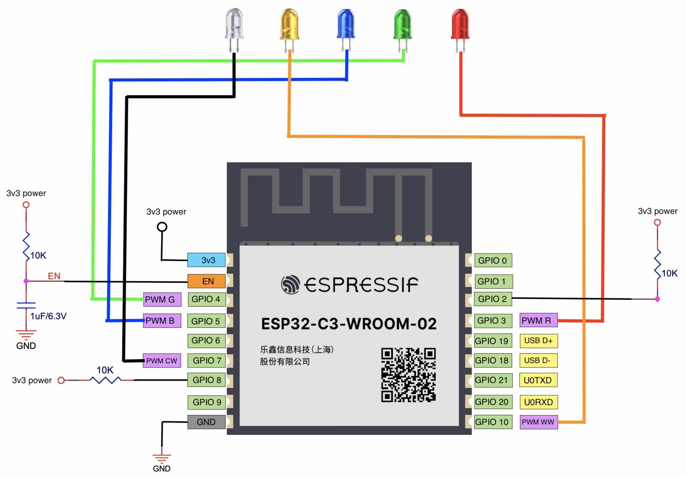

# Configuring GPIOs of PWM Signals

The PWM controller of ESP32-C3 can generate independent PWM signals on six channels, which can be assigned to any GPIOs through the GPIO matrix. In our design, five channels of PWM signals are used to control R (red), G (green), B (blue), CW (cool white), and WW (warm white) signals. In real application, we can use one channel to control the duty cycles of WW and CW LEDs to adjust the colour temperature, and another channel to control the total current to adjust the brightness of WW and CW LEDs. The GPIO configuration of each PWM signal is shown in Table 5.7.

<i>Table 5.7. GPIO configuration for PWM signals</i>

|Function|GPIO Configuration|
|:------:|:----------------:|
|R (Red)|GPIO3|
|G (Green)|GPIO4|
|B (Blue)|GPIO5|
|CW (Cool white)|GPIO7|
|WW (Warm white)|GPIO10|

When selecting GPIOs, make sure that they are not at high level after chip start-up, otherwise the LED bulb may flicker when powered on. If no suitable GPIO is available, add a 10 k&Omega; pull-down resistor to the GPIO to prevent flickering. Any GPIOs on ESP32-C3 can be used for PWM function, as long as they are configured during initialisation after
chip power-up.

Figure 5.15 shows the minimum control system based on the ESP32-C3-WROOM-02 module, which is connected to five LEDs of red, green, blue, cool white, and warm white.

<figure align="center">
    
    <figcaption>Figure 5.15. Minimum control system based on ESP32-C3-WROOM-02</figcaption>
</figure>
