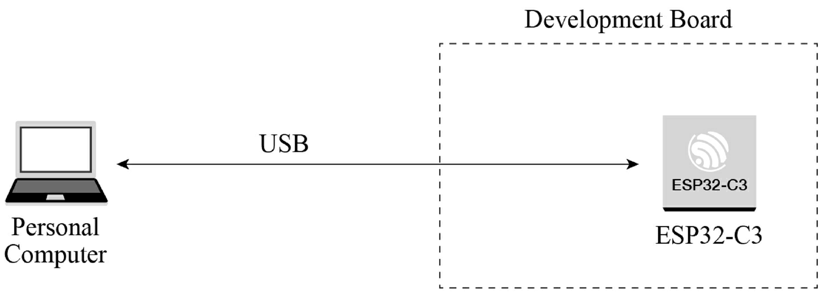
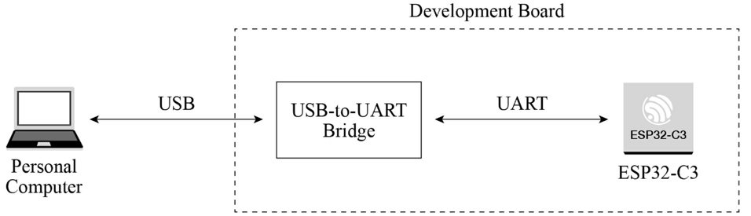
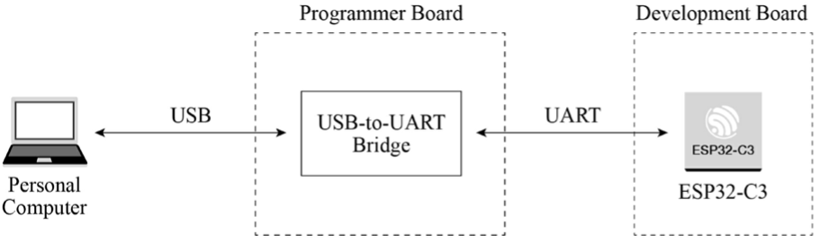

# Downloading Firmware and Debugging Interface

### 1. Connect ESP32-C3 to a PC.

The ESP32-C3 chip integrates a USB Serial/JTAG controller which makes external USB-to-UART bridge or JTAG adapter unnecessary. The USB on ESP32-C3 uses GPIO19 as D+ and GPIO18 as D-, and can be directly connected to the USB interface on the PC, so as to realise firmware download, log printing, and JTAG debugging. Figure 5.16 shows that an ESP32-C3 board is connected to a PC through the built-in USB Serial/JTAG controller. You may visit <https://bookc3.espressif.com/usb> for more applications of the USB Serial/JTAG controller.

<figure align="center">
    
    <figcaption>Figure 5.16. ESP32-C3 and PC connected through USB Serial/JTAG controller</figcaption>
</figure>

For some ESP32-C3 development boards, a USB-to-UART bridge has been connected to the UART0 interface of the chip. Developers only need to connect the USB interface of the PC to the development board through the bridge, to realise firmware download and log printing, as shown in Figure 5.17.

<figure align="center">
    
    <figcaption>Figure 5.17. USB-to-UART bridge connecting ESP32-C3 development board and PC</figcaption>
</figure>

As for a finished board, to save its space and cost, we often use a programmer with USB-to-UART bridge to connect to the UART0 interface on the ESP32-C3 chip, to implement firmware download and log printing. Figure 5.18 shows that a programmer with USB-to-UART bridge is used to connect the development board and the PC.

<figure align="center">
    
    <figcaption>Figure 5.18. Programmer with USB-to-UART bridge connecting ESP32-C3 and
PC</figcaption>
</figure>

### 2. Download firmware.

The firmware and system parameters of ESP32-C3 are stored in the SPI flash. To flash firmware into the chip, first put the chip in download boot mode. According to Table 5.5, GPIO2 and GPIO8 should be at high level, and GPIO9 should be at low level. Reset the chip to enter download boot mode. Connect ESP32-C3 to the PC using any of the three methods above to start firmware download.

### 3. Debug interface.

There are two ways to debug interface: log printing over serial port and JTAG debugging.

#### Log printing over serial port

ESP32-C3 ROM code and IDF SDK output log messages through UART0 by default. Connect ESP32-C3 and the PC with any of the three methods above to enable logging in the PC's terminal.

#### JTAG debugging

You can directly use the USB JTAG controller integrated in ESP32-C3 for debugging. To do this, you need to connect the JTAG pins &ndash; MTMS/GPIO4, MTDI/GPIO5, MTCK/GPIO6, and MTDO/GPIO7 &ndash; to an external JTAG adapter to implement debugging.
