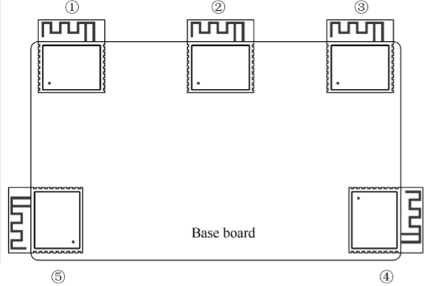
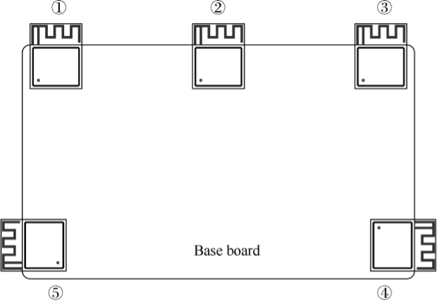
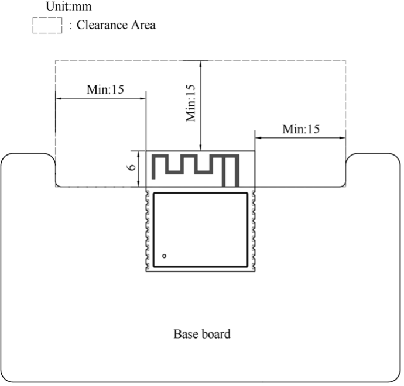

# Guidelines for RF Design

When designing a smart light product using a module with PCB onboard antenna, pay attention to its placement on the base board to minimize the impact of the board on its antenna performance. The module should be placed as close to the edge of the base board as possible. It's best to place the PCB antenna area outside the base board and keep its feed point closest to the board.

The antenna feed point of ESP32-C3-WROOM-02 is on the right, while that of ESP32-C3-MINI-1 is on the left. The placement of these two modules is shown in Figure 5.19 and 5.20.

<figure align="center">
    
    <figcaption>Figure 5.19. ESP32-C3 module on base board - antenna feed point on the right</figcaption>
</figure>

<figure align="center">
    
    <figcaption>Figure 5.20. ESP32-C3 module on base board - antenna feed point on the left</figcaption>
</figure>

> 📌 **Note**
>
> For feed points on the right (as in Figure 5.19), position ③ and ④ are preferred. For feed points on the left (as in Figure 5.20), position ① and ⑤ are preferred.

If the positions recommended are unavailable, please make sure that the module is not covered by any metal shell. The PCB antenna area and the area extended by 15 mm should be kept clear, namely no copper traces, wiring, or component placement. The clearance area should be as large as possible, as shown in Figure 5.21. In addition, if there is base board under the antenna area, it is recommended to cut it off to minimize its impact. When designing an end product, pay attention to the impact of enclosure on the antenna.

<figure align="center">
    
    <figcaption>Figure 5.21. Clearance area on the base board</figcaption>
</figure>
