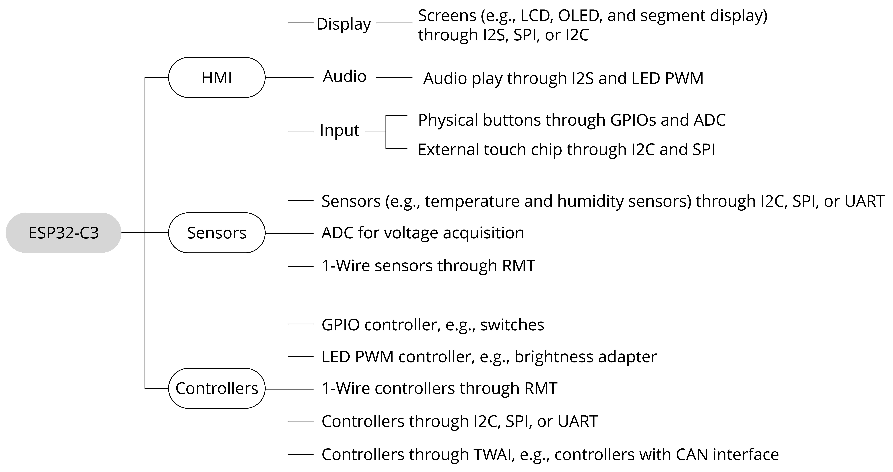

# ESP32-C3 Peripheral Applications

The ESP32-C3 chip has rich peripheral interfaces, as shown in Figure 6.1. In this section, we will introduce the application scenarios of ESP32-C3 peripheral interfaces in terms of the perception & control layer.

<figure align="center">
    
    <figcaption>Figure 6.1. Peripheral applications of ESP32-C3</figcaption>
</figure>

### Human Machine Interface (HMI)

HMI products are digital devices composed of an input unit (e.g., touch screen and buttons) to receive commands and a display to show information, thus realising human machine interaction. According to their application scenarios, LCD displays, monochrome displays, and OLED displays can be connected through the SPI and I2C interfaces on ESP32-C3. GPIOs and ADC are used to read physical button inputs from users. Furthermore, capacitive touch pins of ESP32, ESP32-S2, and ESP32-S3 can be used for touch buttons, matrix buttons, linear sliders, 2D touch panels, and proximity sensing. These button and display related functions apply to smart door locks and other devices with screens. The I2S interface can be used to connect external audio codecs for devices with voice interaction features. The I2C interface can be used to drive digital tube displays or LED dot matrix displays, which are common for embedded applications. Compared with LCD displays, these displays use fewer GPIOs and less internal memory, and are easier to be implemented. They are more suitable for scenarios with simpler requirements such as timing, counting, and status display.

### Sensors

Simply speaking, sensors refer to devices and components that can convert various physical, chemical, and biological quantities in nature into measurable electrical signals. In this case, different types of sensors are needed. Sensors are the nerve endings of IoT and the core components for human beings to fully perceive nature. It is indispensable to deploy various sensors at a large scale for IoT development. We may use temperature and humidity sensors, inertial sensors, light sensors, air pressure sensors, gesture sensors, etc., depending on application scenarios. They need to be connected through different peripheral interfaces to function and collect data. As for ESP32-C3, I2C, SPI, and ADC are the common peripheral interfaces to drive sensors.

For your reference, drivers compatible with different types of sensors are provided in the [`espressif/esp-iot-solution`](https://github.com/espressif/esp-iot-solution) repository on our GitHub.

### Controllers

Controlling objects is an important function of the perception & control layer. Control systems can be divided into two categories: the **open-loop system** and the **closed-loop system**. An open-loop control system, with no feedback mechanism, uses actuators to directly control objects. Its output signals have no influence or effect on other control actions within the system. But in closed-loop control systems, output is usually measured by sensors and fed back for comparison with the set point. The deviation between the actual output and the expected point is then used to automatically generate the next command. In smart home applications, common controlled objects include lighting, motors, and switches, which are mostly controlled by SoCs' digital and analog signals. The LED PWM, GPIO, and ADC peripheral interfaces of ESP32-C3 can be used to tranmit the above signals.
