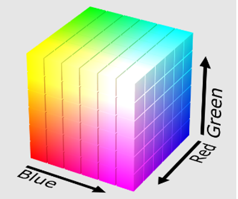
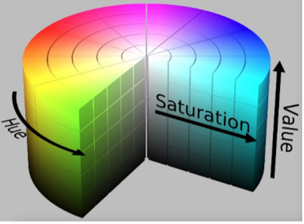
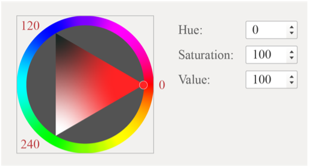
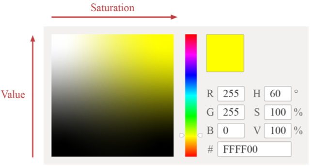
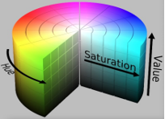
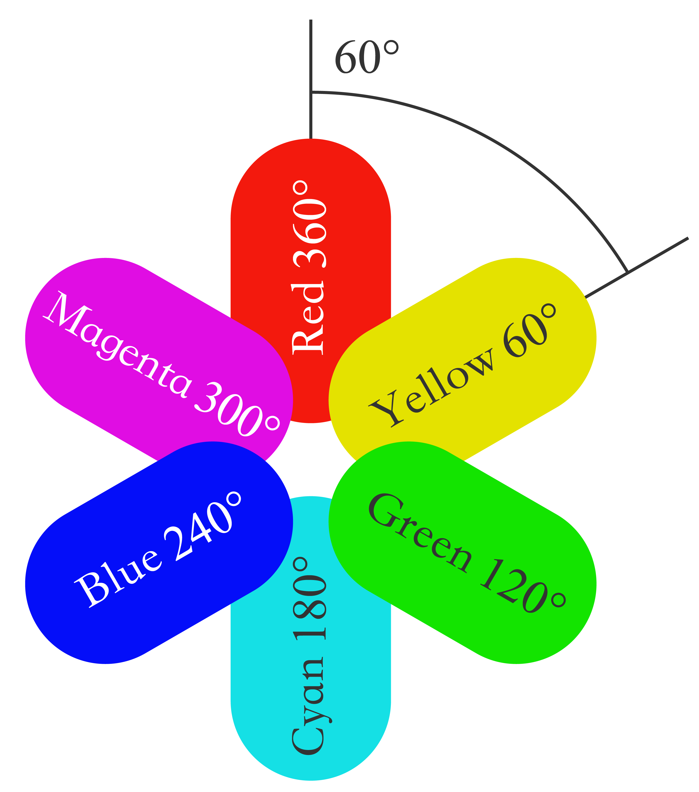
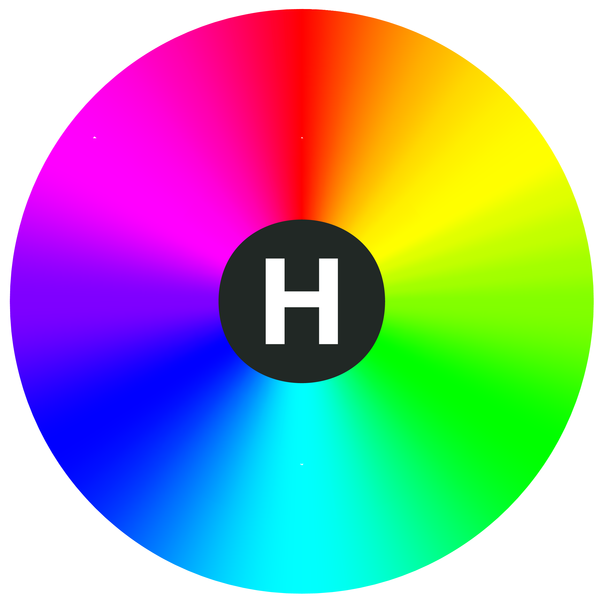
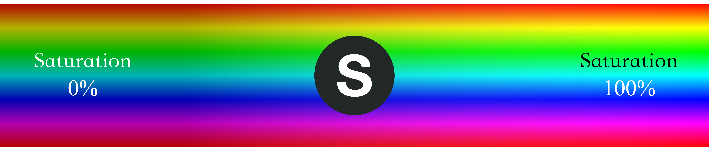
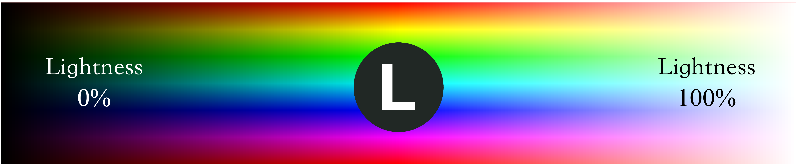

# Color Spaces

Cyan, magenta, and yellow (CMY) are the three primary colors for painting. They mix with each other and generate a set of colors which constitute the CMY color space. We define the amount of magenta as the *x* axis, yellow as the *y* axis, and cyan as the *z* axis, thus creating a 3D space where each color has a unique position.

CMY is not the only color space. Computer monitors generally use the RGB (red, green, blue) color space, in which the amount of red, green, and blue are assigned as *x*, *y*, and *z* axis. Another color space is HSV, which describes colors in terms of hue (*x* axis), saturation (or chroma, *y* axis) and value (or brightness, *z* axis). The lighting industry commonly uses the HSL color space, which generates colors by changing hue, saturation, and lightness.

### 1. RGB color space

The RGB color space is the one we are most familiar with. As shown in Figure 6.2, this color space is represented by mixing the three primary colors to reproduce almost any color. It is the basic, hardware-oriented color space commonly used in image processing, and is relatively easy to understand. It uses a linear combination of three primary colors to represent a secondary color. The three primary components are highly correlated, so it is not visually intuitive when transitioning colors continuously. To adjust the color of an LED, you need to change the amount of all three primary colors.

<figure align="center">
    
    <figcaption>Figure 6.2. RGB color space</figcaption>
</figure>

Images acquired in natural environments are easily affected by natural light, occlusion, and shadows. That is, they are sensitive to brightness. The amount of three primary colors in the RGB color space are closely related to brightness. So long as the brightness changes, the amount of all three colors will change accordingly. There is, however, no intuitive way to reflect this change. The human eye is not equally sensitive to the three colors. In monochrome vision, the human eye is least sensitive to red and most sensitive to blue. Due to this variation in sensitivity, the RGB color space is considered to have poor uniformity. The way the human eye perceives color similarities deviates greatly from the Euclidean distance in the RGB color space. Therefore, it is difficult for human beings to represent a color accurately by the amount of three primary colors.

### 2. HSV color space

The HSV color space is widely used in computers, as shown in Figure 6.3. Compared with the RGB color space, HSV is closer to the human perception of colors. It can intuitively represent the hue, saturation, and brightness value of colors for comparison.

<figure align="center">
    
    <figcaption>Figure 6.3. HSV color space</figcaption>
</figure>

It is easier to track an object of a particular color in the HSV space than in the RGB space, and thus the HSV color space is often used to segment objects of a specified color. HSV space defines colors in terms of hue, saturation, and value (brightness).

Usually, the HSV color space is mapped to a cylinder. The cross section of the cylinder can be regarded as a polar coordinate system, in which the polar angle is interpreted as hue, the polar axis length interpreted as saturation, and the height of the cylinder axis as value. Hue is measured in angle and ranges from 0 to 360°, indicating the position of the spectral color. Figure 6.4 illustrates hue in the HSV color space.

<figure align="center">
    
    <figcaption>Figure 6.4. HSV color space &ndash; hue</figcaption>
</figure>

In Figure 6.4, all the colors on the wheel are spectrum colors. Calculated counterclockwise from red, 0 represents red, 120° represents green, and 240° represents blue.

In the RGB color space, one color is determined by three values. For example, yellow is represented by (255,255,0). In the HSV color space, yellow is represented by only one value, i.e., Hue=60.

Figure 6.5 is the semi horizontal cross-section of the cylinder (Hue=60) and illustrates saturation and value in the HSV color space.

<figure align="center">
    
    <figcaption>Figure 6.5. HSV color space &ndash; saturation and value</figcaption>
</figure>

In Figure 6.5, the horizontal axis represents saturation, which indicates the deviation from the spectrum colors. It ranges from 0% to 100%, where 0 represents pure white. The higher the saturation, the darker the color, the closer to the spectrum color, and vice versa.

The vertical axis represents value, which indicates the brightness of the color in the HSV color space. Value ranges from 0% to 100%, where 0 represents plain black. The higher the value, the brighter the color.

### 3. HSL color space

The HSL color space is similar to the HSV color space. It also has three components: hue, saturation, and lightness. The difference lies in the last component. Lightness in HSL represents luminance. A lightness of 100 means white, whereas a lightness of 0 means black. Value in HSV represents brightness. A value of 100 equals spectrum color, whereas a value of 0 equals black. Figure 6.6 shows the HSL color space.

<figure align="center">
    
    <figcaption>Figure 6.6. HSL color space</figcaption>
</figure>

Figure 6.7 shows hue in the HSL color space, which represents the range of colors the human eye can perceive. They are distributed on a flat color wheel; each represented by a hue of 0 to 360°. The significance of hue is that we can change the color by rotating the color wheel without changing saturation or lightness.

<figure align="center">
    
    
    <figcaption>Figure 6.7. HSL color space &ndash; hue</figcaption>
</figure>

Figure 6.8 shows saturation in the HSL color space, ranging from 0% to
100%. It describes the changes of color purity under the same hue and
lightness. The larger the saturation, the brighter and less gray of the
color.

<figure align="center">
    
    <figcaption>Figure 6.8. HSL color space &ndash; saturation</figcaption>
</figure>

Figure 6.9 shows lightness in the HSL color space, which represents the luminance of a color. It ranges from 0% to 100%. The smaller the value, the darker the color, and the closer to black, and vice versa.

<figure align="center">
    
    <figcaption>Figure 6.9. HSL color space &ndash; lightness</figcaption>
</figure>

The three color spaces introduced above merely describe colors from different dimensions, and thus can be mutually converted. In practice, the LED lights uses RGB color space as the brightness of red, green, and blue beads are adjusted to generate various colors. However, the user interface and control commands usually use the HSV or HSL color space. Therefore, the LED driver needs to convert values from the HSV or HSL dimension to the RGB dimension, so as to get the expected LED color.
