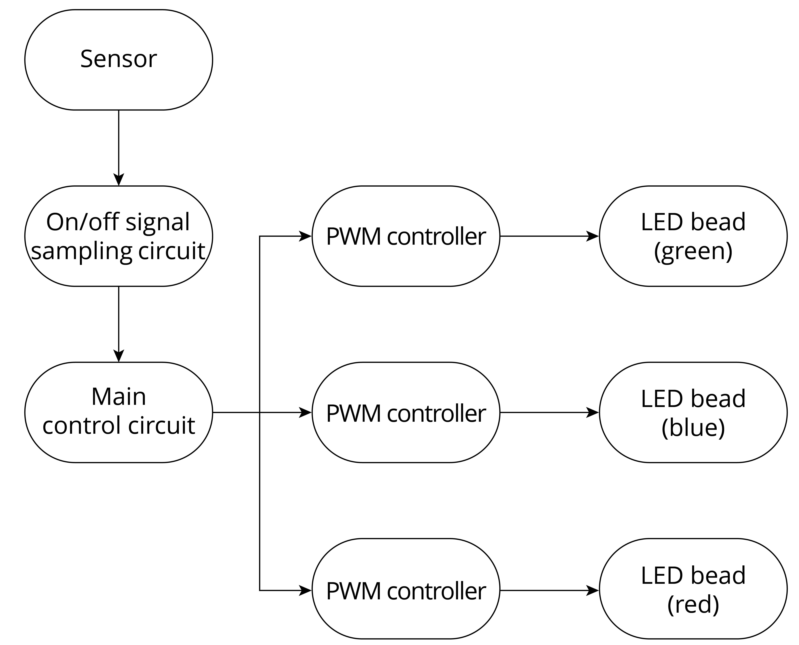

# LED Dimming

Dimming is a basic feature of smart LED lights including changing the color, brightness, and on/off status. Users can adjust LED lights through a smartphone app, a remote controller, etc. There are three LED dimming methods.

### TRIAC dimming

When using TRIAC dimming, the waveform of the input voltage changes with the conduction angle of the TRIAC, thereby changing the effective value of the input voltage and eventually dimming the LED light. TRIAC dimming is suitable for traditional lamps such as incandescent lamps and fluorescent lamps.

### PWM dimming

Basically, PWM switches on/off LED lights and dims lights by sending PWM signals and changing their frequency and duty cycle.

### I2C dimming

The constant-current LED linear controller ICs with I2C interfaces are suitable for driving low-power LED lights. Such ICs receive control signals through I2C input interfaces and adjust the current of multiple independent output interfaces to dim the LED.

  
Among the three LED dimming methods above, PWM dimming performs the best. It guarantees no color shifts and stability at low brightness and is therefore widely used.

Figure 6.10 is the block diagram of PWM dimming, which mainly includes on/off signal sampling circuit, the main control circuit and the PWM controller. The on/off signal sampling circuit generates a clock signal after detecting the on/off signal in the circuit. The main control circuit receives the clock signal and generates three pulse signals, which are respectively output to three PWM controllers. The PWM controllers output different current signals based on the pulse signals to adjust the brightness of corresponding LED bead. The main control circuit usually includes a microcontroller unit, whose input is connected to the on/off signal sampling circuit, and three outputs are respectively connected to three PWM controllers. The outputs of PWM controllers are connected to the red, green, and blue LED beads respectively, thereby controlling their brightness to get the expected color. All LED beads are packaged in one lampshade.

<figure align="center">
    
    <figcaption>Figure 6.10. Block diagram of PWM dimming</figcaption>
</figure>
