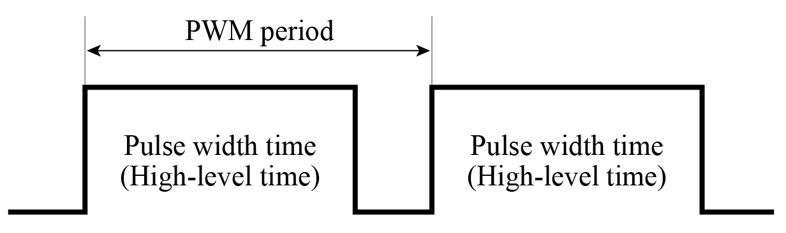
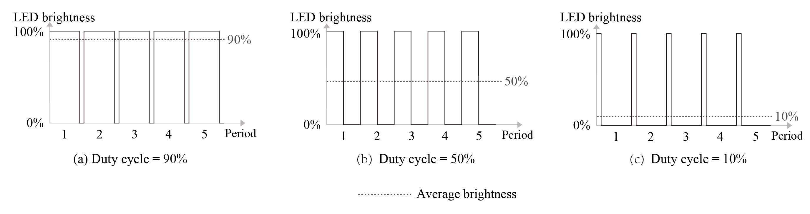

# Introduction to PWM

Pulse width modulation (PWM) is a technique that converts analogue signals into pulse signals (a means of controlling analogue output with digital signals). It can be used to control the brightness of LEDs, the speed of DC motors, etc.

It has three main parameters: frequency, period, and duty cycle. PWM frequency is the number of times the PWM signal goes from high level to low level and back to high level within one second. It is measured in Hz. PWM period is the reciprocal of PWM frequency. PWM duty cycle refers to the ratio of the high-level time to one PWM period, ranging from 0% to 100%. Figure 6.11 shows the PWM duty cycle.

<figure align="center">
    
    <figcaption>Figure 6.11. PWM duty cycle</figcaption>
</figure>

For example, if the PWM period is 10 ms and the pulse width time is 8 ms, then the PWM duty cycle is 8/10=80%.

When using PWM to control an LED, if the light is turned on for 1 second and then off for 1 second repeatedly (i.e., period = 2s, duty cycle = 50%), the LED will appear to blink. If this cycle is shortened to 200 ms, with the LED being on for 100 ms and then off for 100 ms, the LED will appear to blink at a higher frequency. Due to the persistence of vision, as the cycle continues decreasing, there will be a critical threshold where the human eye cannot perceive the blinking of the LED. At this point, the persistence of vision blends the on and off images, resulting in a stable average brightness. This average brightness is directly related to the PWM duty cycle, as shown in Figure 6.12. Therefore, we can dim LED lights by adjusting the PWM duty cycle.

<figure align="center">
    
    <figcaption>Figure 6.12. Relationship between PWM duty cycle and average brightness</figcaption>
</figure>
