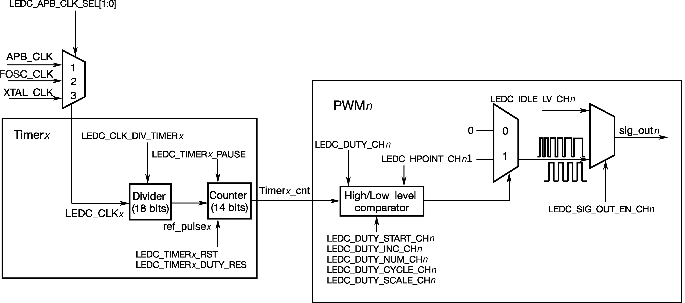

# LED PWM Controller (LEDC)

The LED PWM controller of ESP32-C3 can generate six independent digital waveforms, with the following features:

- Six independent PWM generators (i.e., six channels)
- Four independent timers that support division by fractions
- Automatic duty cycle fading (i.e., gradual increase/decrease of a PWM's duty cycle without interference from ESP32-C3) with interrupt generation on fade completion
- Adjustable phase of PWM signal output
- PWM signal in Light-sleep mode (see details of low-power modes in Chapter 12)
- Maximum PWM resolution: 14 bits

The four timers are identical regarding their features and operation. The following sections refer to the timers collectively as Timer*x* (where *x* ranges from 0 to 3). Likewise, the six PWM generators are also identical in features and operation, and thus are collectively referred to as PWM*n* (where *n* ranges from 0 to 5). Figure 6.13 shows the LED PWM timer.

<figure align="center">
    
    <figcaption>Figure 6.13. LED PWM timer</figcaption>
</figure>

The four timers can be independently configured (i.e., configurable clock divider, and counter overflow value) and each internally maintains a timebase counter (i.e., a counter that counts on cycles of a reference clock). Each PWM generator selects one of the four timers, uses the timer's counter value as a reference to generate PWM signals, and outputs the signals to the timer.

Figure 6.14 shows the main functional blocks of the timer and the PWM generator.

<figure align="center">
    
    <figcaption>Figure 6.14. Functional blocks of LED PWM timer and generator</figcaption>
</figure>

To generate PWM signals, a PWM generator (PWM*n*) needs to select one of the four timers (Timer*x*) and use its counter value as a reference to generate signals. Each PWM generator has a comparator and two multiplexers. It compares the timer's 14-bit counter value (timer*x*_cnt) to two trigger values of the comparator hpoint*n* and lpoint*n*. When timer*x*_cnt equals hpoint*n* or lpoint*n*, high- or low-level PWM signal will be generated respectively.

Figure 6.15 shows how hpoint*n* and lpoint*n* are used to generate PWM signals with a fixed duty cycle.

<figure align="center">
    
    <figcaption>Figure 6.15. Generating PWM signals with a fixed duty cycle using hpointn and lpointn</figcaption>
</figure>

PWM generators can fade the duty cycle of a PWM output signal. When duty cycle fading is enabled, the value of lpoint*n* will be incremented/decremented every time the counter overflows a certain number of times. Figure 6.16 demonstrates the process of duty cycle fading.

<figure align="center">
    
    <figcaption>Figure 6.16. Duty cycle fading</figcaption>
</figure>
