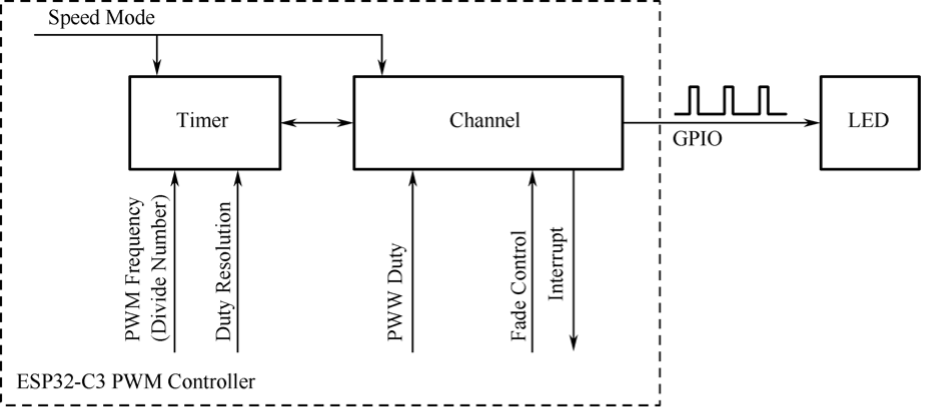

# LED PWM Programming

Having learned about the LEDC of ESP32-C3, now we need to configure the controller using LED PWM APIs provided by ESP-IDF. The configuration includes three steps, as shown in Figure 6.17.

1. **Configure the timer**, specifying the frequency and duty resolution of PWM signals.
2. **Configure the channel**, mapping the timer to the GPIOs that output PWM signals.
3. **Output PWM signals** to drive the LED. The brightness of the LED can be changed through software control or the hardware's duty cycle fading function.

<figure align="center">
    
    <figcaption>Figure 6.17. Steps of configuring PWM controller</figcaption>
</figure>

### 1. Configuring the timer

Timers can be configured by calling `ledc_timer_config()`, when an `ledc_timer_config_t` structure with the following parameters needs to be passed to the function:

- Speed mode (the value of this parameter must be `LEDC_LOW_SPEED_MODE`);
- Timer index `timer_num`;
- PWM frequency;
- PWM duty resolution.

PWM frequency is inversely proportional to duty resolution, as higher frequency results in fewer available duty cycles for a given period and vice versa. This interrelationship may be more important if the API is used for purposes other than changing the brightness of LEDs.

### 2. Configuring the channel

After configuring the timer, you also need to configure the required channel (one of `ledc_channel_t`) by calling `ledc_channel_config()`. An `ledc_channel_config_t` structure with channel configuration parameters needs to be passed to the function.

Then the channel will start operating according to the `ledc_channel_config_t` structure and generate PWM signals on the selected GPIOs with the frequency specified in step 1 and the duty cycle specified in step 2. This process can be suspended at any time by calling the `ledc_stop()` function.

### 3. Changing PWM signals

Once the channel starts operating and generating the PWM signal with a constant duty cycle and frequency, there are a couple of ways to change this signal. For LED dimming, we primarily change the duty cycle to vary the light color and brightness.

#### Changing PWM duty cycle using software

To set the duty cycle, use the dedicated function `ledc_set_duty()`. After that, call `ledc_update_duty()` to activate the changes. To check the currently set value, use the function `ledc_get_duty()`.

Another way to set the duty cycle, as well as some other channel parameters, is by calling `ledc_channel_config()`.

The PWM duty cycle passed to the function depends on `duty_resolution`, and the value ranges from 0 to 2<sup>`duty_resolution`</sup>-1. For example, if `duty_resolution` is 10, then the duty cycle values can range from 0 to 1023.

#### Changing PWM duty cycle using hardware

LEDCs provide the means to gradually change (fade) the duty cycle. To use this functionality, enable fading with `ledc_fade_func_install()` and then configure it by calling one of the following functions.

```c
esp_err_t ledc_set_fade_with_time(ledc_mode_t speed_mode,
                                  ledc_channel_t channel,
                                  uint32_t target_duty,
                                  int max_fade_time_ms);
  
esp_err_t ledc_set_fade_with_step(ledc_mode_t speed_mode,
                                  ledc_channel_t channel,
                                  uint32_t target_duty,
                                  uint32_t scale,
                                  uint32_t cycle_num);
 
esp_err_t ledc_set_fade(ledc_mode_t speed_mode,
                        ledc_channel_t channel,
                        uint32_t duty,
                        ledc_duty_direction_t fade_direction,
                        uint32_t step_num,
                        uint32_t duty_cycle_num,
                        uint32_t duty_scale);
```

Finally, call `ledc_fade_start()` to initiate fading. If not required anymore, the fading can be disabled with `ledc_fade_func_uninstall()`.

### 4. Range of PWM frequency and duty resolution

The LED PWM controller is mainly used for driving LED dimming. It provides a large flexibility of PWM duty cycle settings. For instance, the PWM frequency of 5 kHz can have the maximum duty resolution of 13 bits. This means that the duty can be set anywhere from 0% to 100% with a resolution of ~0.012% (2<sup>13</sup> = 8192 discrete levels of LED brightness). Please note that these parameters depend on the clock signal clocking the LED PWM controller timer which in turn clocks the channel.

The LEDC can be used for generating signals with higher frequencies that are sufficient to clock other devices such as digital camera modules. In this case, the maximum frequency can be 40 MHz with duty resolution of 1 bit. This means that the duty cycle is fixed at 50% and cannot be adjusted.

The LEDC API will report an error when the configured frequency and duty resolution exceed the range of LEDC's hardware. For example, an attempt to set the frequency to 20 MHz and the duty resolution to 3 bits will result in the following error reported on a serial monitor:

```c
[E (196) ledc: requested frequency and duty resolution cannot be achieved, try reducing freq_hz or duty_resolution. div_param=128]
```

In such a situation, either the duty resolution or the frequency must be reduced. For example, setting the duty resolution to 2 bits can solve this problem and will make it possible to set the duty cycle at 25% steps, i.e., at 25%, 50%, or 75%.

The LEDC driver will also capture and report attempts to configure frequency / duty resolution combinations that are below the supported minimum, e.g.:

```c
[[E (196) ledc: requested frequency and duty resolution cannot be achieved, try increasing freq_hz or duty_resolution. div_param=128000000]]
```

The duty resolution is normally set by `ledc_timer_bit_t`, with a range of 10 to 15 bits. For smaller duty resolutions (from 10 down to 1), just enter the equivalent numeric directly.
