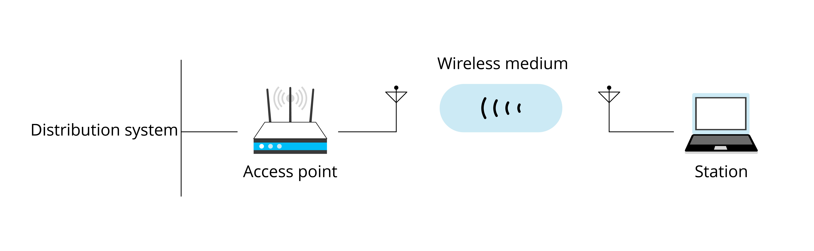
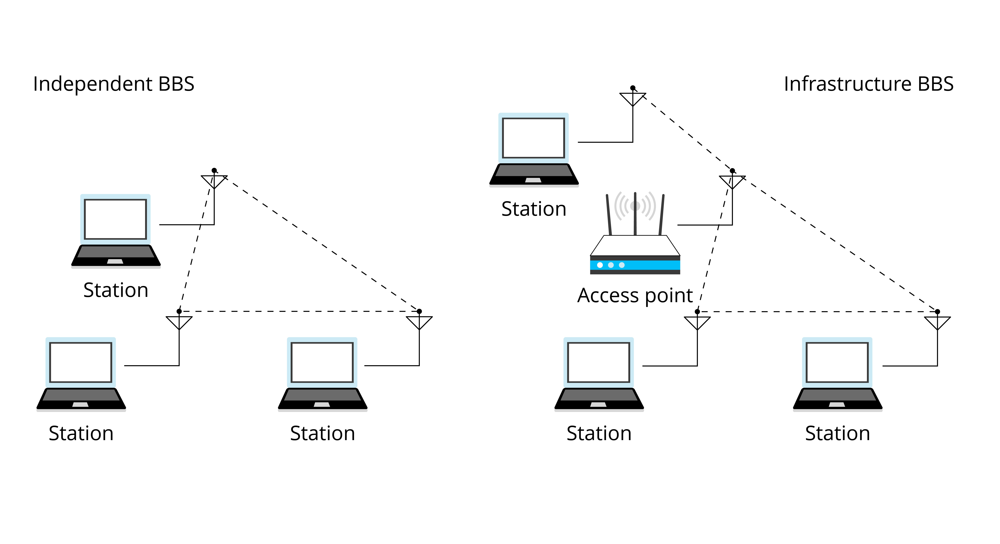

# Wi-Fi Concepts
In this section, we'll introduce the network technologies related to
IEEE 802.11, including the Open System Interconnection Reference Model
(OSI/RM) and physical components of IEEE 802.11.

## Open System Interconnection Reference Model (OSI/RM)
In OSI/RM, the computer network system is conceived as a seven-layer
framework. Their names and relationships are shown in Figure 7.1.

<!-- {width="80%"} -->

<figure align="center">
    
    <figcaption>Figure 7.1. Architecture of OSI/RM</figcaption>
</figure>

## Physical components of IEEE 802.11

IEEE 802.11 architecture consists of four major physical components, as
shown in Figure 7.2.

<!-- {width="80%"} -->
<figure align="center">
    
    <figcaption>Figure 7.2. Physical components of IEEE 802.11</figcaption>
</figure>

- **Wireless Medium (WM)**

    WMs refer to the physical layer where wireless MAC
    frame data is transmitted. Initially, two radio frequency (RF) physical
    layers and one infrared physical layer were introduced, but the RF
    layers turned out to be more popular.

- **Stations (STA)**

    Stations comprise all devices and equipment that are
    connected to the wireless LAN. Battery-operated laptops and handheld
    computers are typical STAs, but "portable" is not a must. In some cases,
    desktops are also connected to wireless LANs to avoid pulling new
    cables.

- **Access Points (AP)**

    As a branch of STA, AP provides access to distribution services for associated STAs.

- **Distribution System (DS)**

    When several APs are connected to cover a
    larger area, they have to communicate with each other to track the
    movements of mobile stations. This is conducted through the distribution
    system, an external data network. It is responsible for transmitting
    data frames to their destinations.

## Building wireless networks

The physical components above constitute a wireless network. The basic
building block of an IEEE 802.11 network is the Basic Service Set (BSS).
It comes in two categories, the Independent BSS and the Infrastructure
BSS, as shown in Figure 7.3.

<figure align="center">
    
    <figcaption>Figure 7.3. Independent BSS and infrastructure BSS</figcaption>
</figure>

- **Independent BSS**
    
    Stations in an independent BSS communicate with each other directly without AP.

- **Infrastructure BSS**
    
    In an infrastructure BSS, STAs must associate with an
    AP to obtain network services. APs function as the control centre of the
    set. This is the most common network architecture. Every STA needs to go
    through association and authorisation before joining a certain BSS.
    Infrastructure BSS is the most common network architecture.

Network architectures are accompanied with identifications:

- **BSS Identification (BSSID)** 
    
    Each BSS has a physical address for identification, called BSSID. For an Infrastructure BSS, the BSSID is the MAC address of the AP. It comes with a factory default value and can be changed according a fixed naming format.

- **Service Set Identification (SSID)** 
    
    Each AP has an identifier for user identification. In most cases, one BSSID is associated with one SSID. It is usually a readable string, which is what we call the Wi-Fi name.

