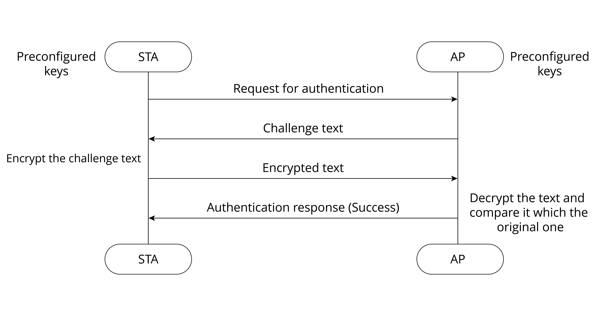

# Wi-Fi Connection
An STA first searches for nearby wireless networks through active or
passive scanning, then establishes a connection with an AP after
authentication and association, and finally accesses the wireless LAN.
Figure 7.4 shows the process of Wi-Fi connection.

<figure align="center">
    
    <figcaption>Figure 7.4. Process of Wi-Fi connection</figcaption>
</figure>

## 1. Scanning

An STA can actively or passively scan wireless networks.

### Passive scanning

Passive scanning refers to discovering wireless networks nearby through
monitoring the beacon frames periodically sent by an AP. It is
recommended when users need to save power.

### Active scanning

During active scanning, the STA actively sends out probe requests and
receives probe responses from the AP. It is further divided into two
modes based on the involvement of SSID.

- **Active scanning without SSID**
    
    The STA periodically sends out probe requests through supported channels to search for wireless networks. APs that receive the probe request will return probe responses, which carry the information of available wireless networks. This enables an STA to obtain all the available wireless services nearby.

- **Active scanning with specific SSIDs**

    If the STA needs to configure a wireless network to be connected or has accessed a wireless network before, it will periodically send out probe requests with configuration information or the SSID of the accessed wireless network. When an AP with specific SSID receives the request, it will return a probe response. In this way, an STA can actively access a specified wireless network.

For hidden APs, active scanning with specific SSID is recommended.

## 2. Authentication

When the STA finds an available wireless network, it will select one of
the APs with matching SSID according to certain connection strategy,
such as selecting the one with strongest signal or with matching MAC
address. The next step is authentication. There is open authentication
and non-open authentication.

### Open authentication

Essentially, open authentication requires no authentication or
encryption. Any STA can access the network. The AP does not verify STA's
identity in this process, as shown in Figure 7.5.

<figure align="center">
    
    <figcaption>Figure 7.5. Process of open authentication</figcaption>
</figure>

The STA sends a request for authentication, and the AP returns the
result. If the result reads "Success", then the authentication is
completed.

### Non-open authentication

Non-open authentication includes shared key authentication, Wi-Fi
Protected Access (WPA), and Robust Security Network (RSN).

- **Shared key**
    
    Shared key authentication is based on the Wired Equivalent
    Privacy (WEP) method. It is a basic encryption technology with security
    flaws.

    STAs and APs can only interpret the data transmitted between each other
    when they have the same key configured. There are 64-bit keys and
    128-bit keys. Users can set up to four groups of different keys. Figure
    7.6 shows the process of shared key authentication.

    <figure align="center">
        
        <figcaption>Figure 7.6. Process of shared key authentication</figcaption>
    </figure>

    The STA sends an authentication request to the AP. Then the AP generates
    a challenge text and sends it to the STA. The STA uses its preconfigured
    keys to encrypt the text and sends it back. The AP uses its
    preconfigured keys to decrypt the text and compares it with the original
    text. If the two texts are identical, then the authentication is
    completed.

- **Wi-Fi Protected Access (WPA)**
    
    WPA is an intermediate solution to replace
    WEP before the official release of IEEE 802.11i. It uses a new Message
    Integrity Check (MIC) algorithm to replace the CRC algorithm in WEP. It
    also adopts the Temporal Key Integrity Protocol (TKIP) to generate
    different keys for different MAC frames. TKIP is a transitional
    encryption protocol and has proved of low security.

- **Robust Security Network (RSN)**
    
    The WFA calls RSN the WPA2. It adopts a
    new encryption method, the Counter Mode with CBC-MAC Protocol (CCMP), a
    block security protocol based on the Advanced Encryption Standard (AES).
    We will expound on this later along with authorisation.

- **Wi-Fi Protected Access 3 (WPA3)** 
    
    Although WPA2 consolidates Wi-Fi
    networks to a certain extent, new security vulnerabilities keep
    emerging, such as offline dictionary attacks, brute force attacks, and
    key reinstallation attacks (KRACK). To this end, the WFA released the
    WPA3 in 2018, a new generation of Wi-Fi encryption protocol that
    mitigates the risks in WPA2 and provides new features. 
    
    Compared with WPA2, WPA3 has the following advantages:
    
    ✅ The use of AES encryption is mandatory instead of TKIP.

    ✅ Management frames are protected.

    ✅ The more secure method, Simultaneous Authentication of Equals (SAE), is used to replace the pre-shared key (PSK) authentication in WPA2.

    <!-- This part talks about the advantages of SAE, not WPA3 in general. -->
    > 📚 **Further Reading: What makes SAE stand out?**
    >
    > - First, SAE denies services for STAs that repeatedly try to connect to the AP, preventing brute-force attacks or password cracking.
    >
    > - Second, its forward secrecy function ensures that the key will be changed frequently and automatically, so that even if the most recent key is hacked, only a minimal amount of data will be exposed.
    >
    > - Last, SAE considers devices as peers. Either party can initiate a handshake and send authentication information independently, cancelling the message exchange process, thus leaving no opportunity for KRACKs.

    ✅ 192-bit security suite is used to strengthen password protection.

    ✅ HMAC-SHA-384 algorithm is used to export and confirm keys in the four-way handshake phase.

    ✅ Galois-Counter Mode Protocol-256 (GCMP-256) is used to protect wireless traffic after STAs go online.

    ✅ Galois Message Authentication Code-256 (GMAC-256) of GCMP is used to protect multicast management frames.

    ✅ WPA3 introduces a Wi-Fi Enhanced Open authentication mode &ndash; the Opportunistic Wireless Encryption (OWE), which allows for connection without password, retaining the facilitation for accessing open networks. It uses the Diffie-Hellman key exchange algorithm to encrypt data on the Wi-Fi network, thereby protecting data exchange between STAs and the Wi-Fi network.

## 3. Association

After the AP returns successful authentication result to the STA, the
next step is association to get full network access, as shown in Figure 7.7.

<figure align="center">
    
    <figcaption>Figure 7.7. Process of association</figcaption>
</figure>

## 4. Authorisation

After scanning, authentication, and association, let's focus on the last step &ndash; authorisation. In this section, we'll introduce the Extensible
Authentication Protocol (EAP), and the key agreement, the four-way
handshake protocol.

### Extensible Authentication Protocol (EAP)

EAP is the most basic security protocol for identity verification, which
is not only a protocol, but also a protocol framework. Based on this
protocol framework, various authentication methods are well supported.
Supplicants send identity verification requests to the Authenticator
through EAP over LAN (EAPOL), and get allowed to use the network once
the verification succeeds. Figure 7.8 shows the architecture of EAP.

This book only touches the basics about EAP. To learn more, please refer to RFC 3748.

<figure align="center">
    
    <figcaption>Figure 7.8. EAP architecture</figcaption>
</figure>

-   **Supplicant**: the entity that initiates an authentication request. For wireless networks, an STA is a Supplicant.

-   **Authenticator**: the entity that responds to an authentication
    request. For wireless networks, an AP is an Authenticator.

-   **Backend Authentication Server (BAS)**: In some cases, such as in
    enterprise applications, Authenticator does not directly handle
    authorisation. Instead, it sends the authentication request to the
    BAS. This is how the EAP extends its range of application.

-   **Authentication, Authorization, and Accounting (AAA)**: another
    EAP-based protocol. The entity implementing this protocol is a
    certain type of BAS, for example, the RADIUS server.

-   **EAP server**: This is what actually handles authorisation. If
    there is no BAS, the Authenticator plays as the EAP server,
    otherwise the BAS will serve the purpose.

### Key agreement

Robust Secure Network Association (RSNA) is a set of procedures defined in IEEE 802.11 to ensure wireless network security. It consists of **data encryption** and **integrity verification**. RSNA uses the above
mentioned TKIP and CCMP. The Temporary Key (TK) used in TKIP and CCMP
comes from the key derivation function defined by RSNA. Based on IEEE
802.1X, RSNA also defines the Four-Way Handshake to generate keys for
unicast data encryption, and the Group Key Handshake for multicast data
encryption.

But why do we need to derive keys? In the WEP encryption mode, all STAs
use the same WEP key for encryption, resulting in low security, while
RSNA requires different STAs to use different keys for encryption after
associating with APs. Does this mean that the AP needs to set different
passwords for different STAs? Obviously, the answer is no. In real life,
we use the same password to associate different STAs with the same AP.

Then how can different STAs use different passwords? The password we set
in an STA is called Pairwise Master Key (PMK). It comes from the PSK,
namely the password set in the wireless router at home. It is set
without any authentication server, and the corresponding setting is
WPA/WPA2-PSK. Figure 7.9 shows how a PMK is generated from the PSK.

<figure align="center">
    
    <figcaption>Figure 7.9. Generation of PMK from PSK</figcaption>
</figure>

In WPA2-PSK, PMK is identical with PSK. But in WPA3, it generates new
PMK through the SAE method based on the PMK from WPA2, to ensure that
every STA has a unique PMK at different stages. Figure 7.10 shows how
PMK is generated through SAE.

<figure align="center">
    
    <figcaption>Figure 7.10. Generation of PMK with SAE</figcaption>
</figure>

SAE treats the Supplicant and the Authenticator as peers. Either of them
can initiate authentication. The two parties exchange data with each
other to prove their knowledge of the key and generate PMK. SAE includes
two phases, Commit and Confirm. In the Commit phase, both parties send
SAE Commit frames for deducing the PSK. Then in the Confirm phase, they
send SAE Confirm frames to verify the PSK. Once verification succeeds,
PMK will be generated and the association will proceed.

### Commit

The sender uses the Hunting and Pecking algorithm to generate a Password
Element (PWE) based on PSK and the MAC addresses of the sender and
receiver. Then the scalar integer and element coordinates are generated
by the sender based on PWE and a random value through elliptic curve
operation. Upon receiving the commit frame, the receiver verifies the
frame, and uses both the local and received frame content to generate a
Key Confirmation Key (KCK) and PMK. The KCK will generate and verify the
frame content in the Confirm phase.

### Confirm

Both parties generate a verification code from the KCK, local and peer
Scalars, and local and peer PWEs through the same hash algorithm. If the
codes turn out to be identical, the verification passes.

After the STA and AP obtain PMK, they will start key derivation. During
this process, the AP and different STAs generate different keys, which
are configured into hardware for encryption/decryption. Since the AP and
STAs need to re-generate these keys every time they are associated, they
are named Pairwise Transient Keys (PTK). AP and STA use the EAPOL-Key
frame to exchange Nonce and other messages, when the Four-Way Handshake
comes into play. The process is shown in Figure 7.11.

<figure align="center">
    
    <figcaption>Figure 7.11. Process of Four-Way Handshake</figcaption>
</figure>

1.  The Authenticator generates a Nonce (ANonce), and sends it to the
    Supplicant in EAPOL-Key (Message 1).

2.  Supplicant performs key derivation based on the ANonce, its own
    Nonce (SNonce) and PMK, and Authenticator's MAC address . Then it
    sends the Authenticator another EAPOL-Key message (Message 2) that
    contains the SNonce. Message 2 also carries an MIC value encrypted
    by KCK. Once the Authenticator gets the SNonce in Message 2, it
    performs calculations similar to that of the Supplicant to verify
    whether the message returned is correct. If it is incorrect, which
    means the Supplicant's PMK is wrong, the handshake will be
    terminated.

3.  If the Supplicant's PMK is correct, the Authenticator will also
    perform key derivation. Later, the Authenticator sends the third
    EAPOL-Key message (Message 3) to the Supplicant. This message
    carries the Group Transient Key (GTK, used to update the group key
    encrypted by KEK) and MIC (encrypted by KCK). When the Supplicant
    receives Message 3, it will check whether the PMK of the AP is
    correct by calculation.

4.  The Supplicant sends the last EAPOL-Key message (Message 4) to the
    Authenticator for confirmation. Then both parties will use it to
    encrypt data.

So far, the Supplicant and Authenticator have completed key derivation
and pairing. They can eventually communicate with each other.
