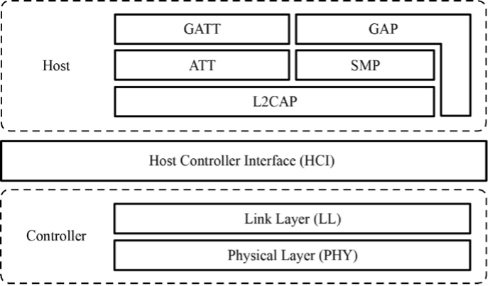
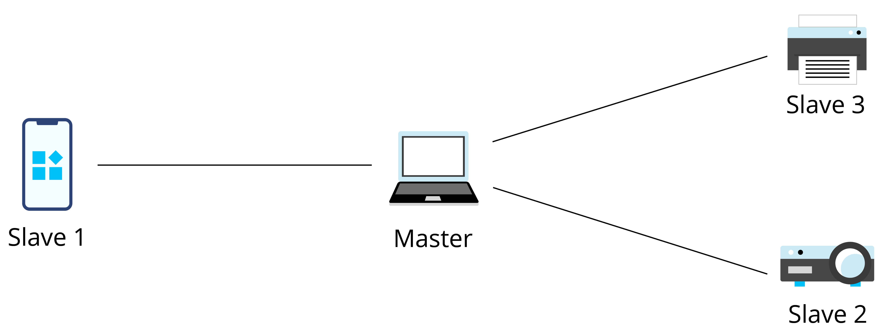
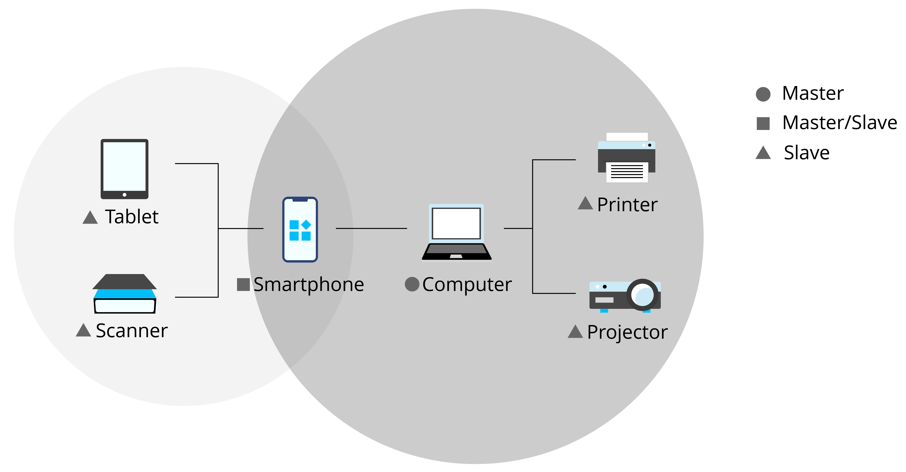

# Bluetooth Concepts
This section introduces the network technologies related to Bluetooth,
including the core architecture and components in Bluetooth
specifications.

## Core architecture

The core system of Bluetooth is composed of Host, Controller, and Host
Controller Interface (HCI). Host is used for application development,
while Controller is for message sending and receiving, physical
connection management, and other basic features which are implemented by dedicated Bluetooth chip manufacturers.

The original design is to run the Host and the Controller independently
on two chips or even systems, and they can communicate through the HCI.
In this way, it is easier to replace and upgrade either module. Although
there are many chips that put both the Host and the Controller together,
they still follow this architecture, except that the HCI is changed from
a hardware communication port to a software one.

The Bluetooth LE protocol stack includes Physical Layer (PHY), Link
Layer (LL), Logical Link Control and Adaptation Protocol (L2CAP),
Attribute Protocol (ATT), Security Manager Protocol (SMP), Generic
Attribute Profile (GATT), and Generic Access Profile (GAP), as shown in
Figure 7.12.

<figure align="center">
    
    <figcaption>Figure 7.12. Protocol stack layers of Bluetooth LE</figcaption>
</figure>

-   **Physical Layer (PHY)** specifies the wireless frequency band and
    modulation mode used by Bluetooth LE. How the PHY performs
    determines the power consumption, sensitivity, and selectivity of
    the Bluetooth LE chip and influences other radio frequency
    indicators.

-   **Link Layer (LL)** only sends or receives data, leaving data
    analysis to GAP or ATT at the upper layer. LL is at the core of the
    Bluetooth LE protocol stack, as it decides which radio frequency
    channel to choose for communication, how to identify data packets
    transmitted through the air, when to send data packets, how to
    ensure data integrity, and how to manage and control links, how to
    receive and retransmit ACKs, etc.

-   **Host Controller Interface (HCI)** provides a means of
    communication between the Host and the Controller. This layer can be
    implemented either by a hardware interface such as UART or USB in
    dual-chip architectures, or through a software API in single-chip
    architectures.

-   **Logical Link Control and Adaptation Protocol (L2CAP)** provides
    connection-oriented and connectionless data services to upper layer
    protocols with protocol multiplexing capability, segmentation and
    reassembly operation, and group abstractions. It also permits
    per-channel flow control and retransmission.

-   **Attribute Protocol (ATT)** defines data for user commands and
    command operations, such as reading or writing certain data.
    Bluetooth LE introduces the concept of attributes, which are used to
    describe data in a piece. Besides, ATT also defines the ATT commands
    that data can use. It is the layer that you will most frequently
    deal with.

-   **Security Manager Protocol (SMP)** is responsible for the
    encryption and security of Bluetooth LE connections, without
    affecting user experience.

-   **Generic Attribute Profile (GATT)** standardises the data content
    in attributes, and use the concept of groups to classify and manage
    attributes. Although the BLE protocol stack can operate without
    GATT, its interoperability will be compromised. It is GATT and a
    rich set of profiles that frees Bluetooth LE from the compatibility
    problem faced by other wireless protocols such as ZigBee.

-   **Generic Access Profile (GAP)** defines effective data packets in
    LL, offering an easiest way to analyse LL payload. It is limited to
    features such as broadcasting, scanning, and initiating connections.

## Roles of Bluetooth

Bluetooth can be an Advertiser, a Scanner, or an Initiator. A master
device plays the role of Initiator and Scanner, while a slave device
plays the role of Advertiser.

Bluetooth communication refers to the communication between two or more
Bluetooth devices. It only occurs between masters and slaves, as slave
devices cannot communicate directly.

-   **Master mode**

    Master (or "central") devices scan for slaves and initiate connection. In theory, if Bluetooth LE Mesh is not used to enable many-to-many device communication, only piconets can be established among devices.

    A device with Bluetooth technology can switch between master mode and slave mode. It normally works in slave mode and waits for master devices to connect. When needed, it switches to master mode and calls other devices. To initiate a call in master mode, a Bluetooth device needs to know the Bluetooth address and pairing password of the other device, and start calling after pairing successfully.

-   **Slave mode**

    Slave (or "peripheral") devices advertise and wait for connections. Once connected, slaves can exchange data with the master.

In summary, a master can search for slaves and actively connects with
them, while a slave cannot initiate any connection but to wait to be
connected.

## Building Bluetooth networks

Now that we've learned about master and slave, let's take a look at how
to build Bluetooth networks. According to topological structures,
Bluetooth networks can be divided into piconets, scatternets, and mesh
networks.

### Piconet

Every time a Bluetooth wireless link is formed, it is within a
context of piconet. A piconet consists of two or more devices that
occupy the same physical channel, which means the devices are
synchronised according to a common clock and frequency hopping sequence.
Figure 7.13 shows the piconet topology.

<figure align="center">
    
    <figcaption>Figure 7.13. Piconet topology</figcaption>
</figure>

### Scatternet

A scatternet is formed when multiple piconets overlap. Figure
7.14 shows the scatternet topology.

Each piconet that constitutes a scatternet maintains its own master. The
master of one piconet may act as the slave of another piconet at the
same time. In Figure 7.14, the mobile phone is the master of the left
piconet as well as the slave of the right piconet.

<figure align="center">
    
    <figcaption>Figure 7.14. Scatternet topology</figcaption>
</figure>

### Mesh

Bluetooth Mesh was born after Bluetooth 4.0. It is a Bluetooth LE
network used to establish many-to-many device communication. It allows
the creation of large-scale networks, where dozens, hundreds, or even
thousands of Bluetooth mesh devices can transmit data with each other.
Bluetooth mesh is not the focus of this book, so you only need to know
its definition for now.
