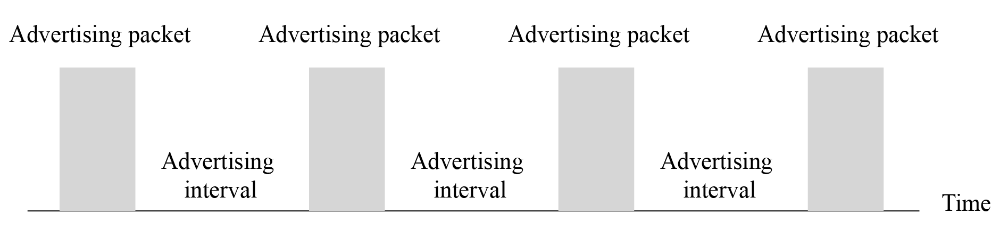
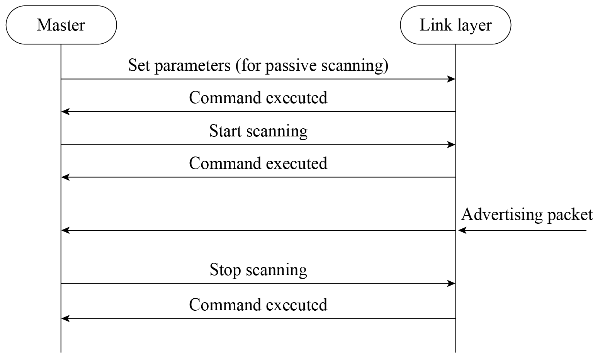
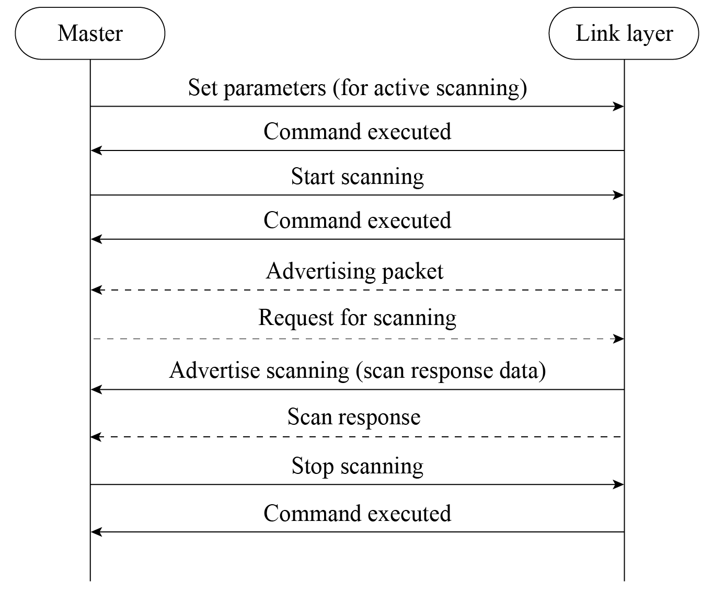
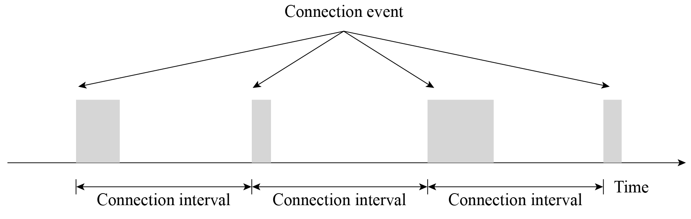

# Bluetooth Connection
Bluetooth first searches for nearby devices through advertising or
scanning, then establishes a connection, and finally form a network for
data transmission.

## 1. Slave advertising

Usually, the peripheral device (slave) advertises itself and waits for
the central device (master) to discover it and establish GATT connection
for more exchange. In some cases, the peripheral only disseminates its
own information to multiple central devices, without the need for
connection.

To be discovered by a master, a slave will periodically send out
advertising packets at an interval of *t*. We call every advertising
packet sent an "advertising event", so *t* is also called the
advertising event interval, as shown in Figure 7.15.

<figure align="center">
    
    <figcaption>Figure 7.15. Slave advertising interval</figcaption>
</figure>

Advertising events occur once in a while, and each event lasts for a
period. The Bluetooth chip only enables the radio frequency module to
send packets during the event, hence the relatively high power
consumption. At other times, the chip goes idle, so the average power
consumption is quite low.

Each advertising event contains three packets for the same message to be
advertised on channel 37, 38, and 39 simultaneously. The process of
slave advertising event is shown in Figure 7.16.

<figure align="center">
    
    <figcaption>Figure 7.16. Slave advertising event</figcaption>
</figure>

## 2. Master scanning

Scanning refers to the process when a master tries to find other
Bluetooth LE devices within a certain range using advertising channels.
Different from advertising, no interval or channel is set for scanning.
The master may customise its own settings.

### Passive scanning

In passive scanning, the scanner only listens to advertising packets
without sending any data to the advertiser., as shown in Figure 7.17.

<figure align="center">
    
    <figcaption>Figure 7.17. Passive scanning</figcaption>
</figure>

Once the scanning parameters are set, the master may send commands in
the protocol stack to start scanning. During the process, if the
controller receives an advertising packet that meets the filter policy
or other constraints, it will report an event to the master. In addition to the advertiser's address, the event also includes the data and the
received signal strength indication (RSSI) of the advertising packet.
Developers can estimate the signal path loss based on the RSSI and the
transmission power of the advertising packet. This feature can be used
to develop anti-lost trackers and positioning solutions.

### Active scanning

In active scanning, the master can capture not only the advertising
packets sent by slaves but also the scan response packets, and
distinguish the two types. See Figure 7.18 for the process of active
scanning.

<figure align="center">
    
    <figcaption>Figure 7.18. Active scanning</figcaption>
</figure>

After the controller receives any data, it will report an event to the
master, containing the advertising type of the LL packet. The master can
thereby decide whether to connect or scan the slave, and distinguish
advertising packets from scan response packets.

## 3. Master Connection

1.  The peripheral device starts advertising. Within the T_IFS after
    sending an advertising packet, it enables radio frequency to receive
    packets from the central device. (T_IFS: Inter Frame Space, the time
    interval between two packet transmissions on the same channel)

2.  The central device scans for advertising. Within the T_IFS after
    receiving the advertising packet, if it enables scan response, it
    will reply to the peripheral device.

3.  Once the peripheral device receives scan response, it will return an
    ACK packet and prepare to receive data.

4.  If the central device does not receive the ACK packet, it will
    continue sending scan responses until it times out. During this
    period, only one ACK packet being received is enough to establish
    the connection.

5.  Now that the two devices are connected, they start communicating.
    The central device will send data packets to the peripheral at
    connection intervals, starting from the time when the advertising
    packet is received. The data packets are used to synchronise the
    clocks of the two devices and establish communication in
    master-slave mode. The process is as follows:

    <ol type="a">
    <li>Every time the peripheral device receives a packet from the central device, it resets the starting point to synchronise with the central device (service synchronsied with the client).</li>
     
    <li>Bluetooth LE communication is established in master-slave mode. The central device becomes the master, and the peripheral device becomes the slave. A slave can only send data back to the master within a specified time after the master sends a packet to it.</li>
     
    <li>Connection is established.</li>
     
    <li>The peripheral device automatically stops advertising, and it can no longer be found by other devices.</li>
     
    <li>During the interval between packet transmissions by the central device, the peripheral device may send multiple advertising packets.</li>
    </ol>

    The communication sequence is shown in Figure 7.19.

    <figure align="center">
        
        <figcaption>Figure 7.19. Communication sequence</figcaption>
    </figure>
    
To be disconnected, the central device only needs to stop sending
packets. It can write the MAC address of the peripheral device into
flash, SRAM, or other storage devices to keep monitoring the address,
and reestablish communication when it receives advertising packets from
the peripheral again. In order to save power, the slave will not send
advertising packets if there is no data to be transmitted, and the two
parties will be disconnected due to connection timeout. At this time,
the central device needs to start monitoring, so that when the slave
needs to send data, they can connect again.