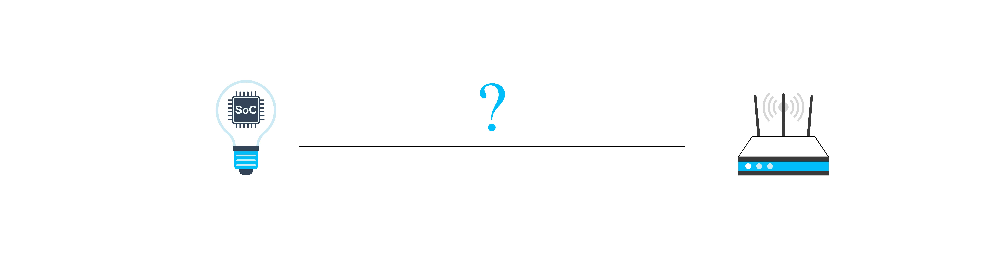

# Wi-Fi Network Configuration Guide
Network configuration is to provide SSID and password to Wi-Fi devices,
so that they can connect to a specified AP and join its Wi-Fi network.

The final goal here is to send the SSID and password of the AP to the
Wi-Fi device in different ways, and connect the device to the specified
Wi-Fi network to join the LAN or Internet. Figure 7.20 shows the process
of Wi-Fi network configuration.

<figure align="center">
    
    <figcaption>Figure 7.20. Process of Wi-Fi configuration</figcaption>
</figure>

The IoT devices waiting for connection also need to be associated with
an account, so here come some new concepts:

-   **Network configuration in a narrow sense**: A Wi-Fi device obtains
    the AP information (SSID, password, etc.) and connects to the AP.

-   **Binding**: Associating user's application accounts with the
    configured device.

-   **Network configuration in a broad sense**: Network configuration in a narrow sense + binding.

This section will focus on network configuration in a narrow sense, thus
omitting the binding process. At present, the most popular methods to
configure networks are SoftAP, SmartConfig, and Bluetooth.