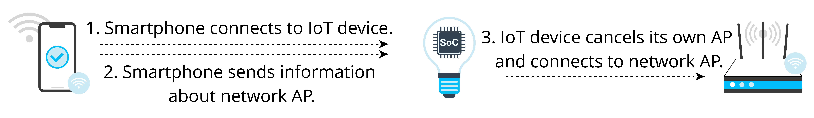

# SoftAP

## Introduction

SoftAP is a traditional method. First, the IoT device to be configured
establishes an AP. The user connects a smartphone, tablet, or other
devices with HCIs to this AP, and sends information about the network
providing device. Then, the IoT device looks for the corresponding
network and connects with it. Figure 7.21 shows the steps of SoftAP
network configuration.

<figure align="center">
    
    <figcaption>Figure 7.21. Steps of SoftAP network configuration</figcaption>
</figure>

The SoftAP mechanism connects devices directly to the LAN without
routers, thereby preventing router compatibility issues. This makes it
easier to successfully configure the network compared with SmartConfig.
But the downside is that there is an extra step for connection, as we
need to manually switch to the IoT SoftAP in the Wi-Fi list. If we want
to access cloud services, we still need a router. Some smartphones may
automatically switch APs, but with iOS 11.0 or previous versions, we
need to do the extra settings manually.

## Configuration

Figure 7.22 indicates how to configure networks via SoftAP.

In-depth introduction to SoftAP will be given later together with Wi-Fi
programming.

<figure align="center">
    
    <figcaption>Figure 7.22. Network configuration via SoftAP</figcaption>
</figure>