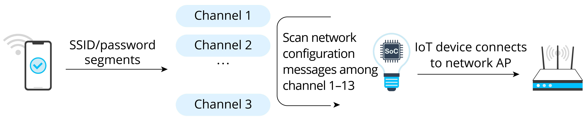
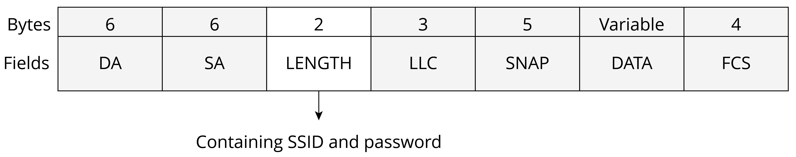

# SmartConfig

## Introduction

SmartConfig allows smartphones to fill the SSID and password in the
unencrypted header of the MAC packet according to a certain encoding
format, and send them in segments to the IoT device in multiple times by
broadcasting and multicasting. Generally, we need to install an
application on the smartphone for protocol interaction between the two
parties. The steps of SmartConfig network configuration are shown in
Figure 7.23.

<figure align="center">
    
    <figcaption>Figure 7.23. Steps of SmartConfig network configuration</figcaption>
</figure>

The frame format of MAC layer in IEEE 802.11 allows for clear
identification of LL payload data, which includes the header and data of
the network layer. This makes it possible to immediately extract and
calculate the length of the payload data as soon as the MAC frames are
received. The payload data here is usually the password. Figure 7.24
shows the packet structure of SmartConfig network configuration.

<figure align="center">
    
    <figcaption>Figure 7.24. Packet structure of SmartConfig network configuration</figcaption>
</figure>

Table 7.2 explains the fields of the data packet of SmartConfig network
configuration.

<i>Table 7.2. Fields of the data packet of SmartConfig network configuration</i>

|Data Frame|Description|
|:---:|:---:|
|DA|Target MAC Address|
|SA|Source MAC Address|
|LENGTH|Payload Data Length|
|LLC|LLC Head|
|SNAP|3 B for Manufacturer Code and 2 B for Protocol Type|
|DATA|Payload Data|
|FCS|Frame Check Sequence|

The sender usually uses the following methods to send data.

### UDP broadcasting

The MAC frame format of IEEE 802.11 ensures that the DA, SA, LENGTH,
LLC, SNAP, and FCS fields are always visible to wireless signal monitors
to acquire valid information, regardless of whether the channels are
encrypted. When broadcasting, the sender is limited by the operating
system, leaving only the LENGTH field at its disposal. However, by
specifying a length-encoded communication protocol, a LENGTH field is
enough for the sender to transmit the data needed.

### UDP multicasting

The multicast address is a reserved class D address, with a range of
224.0.0.0 to 239.255.255.255. The mapping between IP and MAC addresses is accomplished by
setting the first 25 bits of the MAC address to 01.00.5E, while the last
23 bits of the MAC address corresponding to the bits of the IP address.
As a result, the sender can encode data in the last 23 bits of the
multicast IP and transmit it through the multicast packet for the
receiver to decode.

  
SmartConfig offers user-friendly, smooth experience, but it places
stringent requirements on the compatibility of smartphones and routers.
For example, some routers may disable broadcast/multicast packet
forwarding by default, preventing devices from receiving packets
forwarded by the router. In other cases, different frequency bands used
by smartphones and IoT devices can also result in configuration failure.
If a smartphone is connected to a router using a 5 GHz frequency band, a
device using the 2.4 GHz band may not be able to receive data. Such
uncontrollable factors can significantly reduce overall compatibility
and make it hard to successfully configure the network.

## Configuration

The SmartConfig mechanisms developed by Espressif are:

-   **ESP-TOUCH V2**: UDP broadcast and multicast encoding.

-   **ESP-TOUCH**: UDP broadcast encoding.

-   **AIRKISS**: WeChat mini program.

> 📝 **Source code**
>
> In-depth introduction to SmartConfig will be given later together with Wi-Fi programming. Visit <https://github.com/espressif/esp-idf> to find the example code for [`examples/wifi/smart_config`](https://github.com/espressif/esp-idf/tree/master/examples/wifi/smart_config).