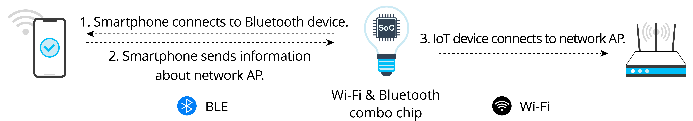
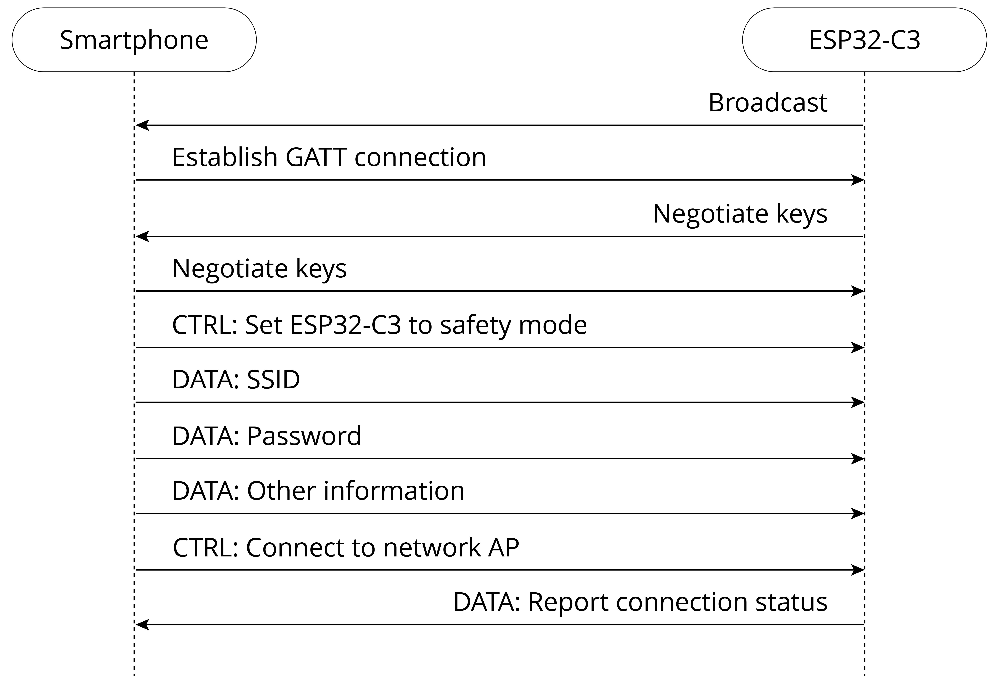

# Bluetooth

## Introduction

If the IoT device to be configured features Bluetooth, the network
binding information can be sent via Bluetooth channel.

The principle behind the network configuration by Bluetooth is similar
to that by SoftAP, except that the communication method used for
transmitting Wi-Fi information is changed from Wi-Fi (AP mode) to
Bluetooth. The IoT device to be configured creates a Bluetooth profile.
The user then connects smartphones, tablets, or other devices with HCIs
to it through a Bluetooth channel, and sends the information needed for
network configuration. After receiving the information, the IoT device
looks for corresponding AP and connects with it. The steps of Bluetooth
network configuration are shown in Figure 7.25.

<!-- {width="80%"} -->

<figure align="center">
    
    <figcaption>Figure 7.25. Steps of Bluetooth network configuration</figcaption>
</figure>

The advantage of Bluetooth network configuration is that it eliminates
the compatibility issues related to routers, producing higher connection
rate. It can also discover and connect devices directly, so there is no
need to turn on the device and connect to its own AP. However, the
compatibility between the Bluetooth module and the mobile phone may
affect network configuration. Additionally, using Bluetooth modules will
increase the cost of the device.

## Configuration

ESP32-C3 chip features both Wi-Fi and Bluetooth LE, thus supporting
different network configuration methods. When it comes to Bluetooth
network configuration, ESP32-C3 offers a comprehensive solution called
BluFi. Figure 7.26 indicates how to configure networks via BluFi.

<!-- {width="70%"} -->

<figure align="center">
    
    <figcaption>Figure 7.26. Network configuration via BluFi</figcaption>
</figure>

> 📝 **Source code**
>
> In-depth introduction to Bluetooth network configuration will be given later together with Wi-Fi programming. Visit <https://github.com/espressif/esp-idf> to find the example code for [`examples/bluetooth/blufi`](https://github.com/espressif/esp-idf/tree/master/examples/bluetooth/blufi).