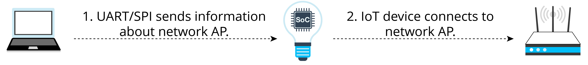
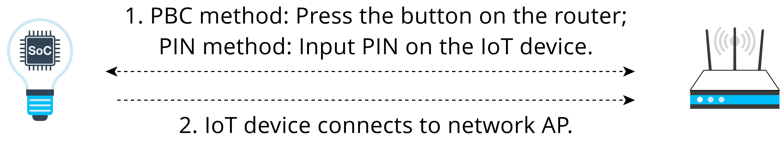
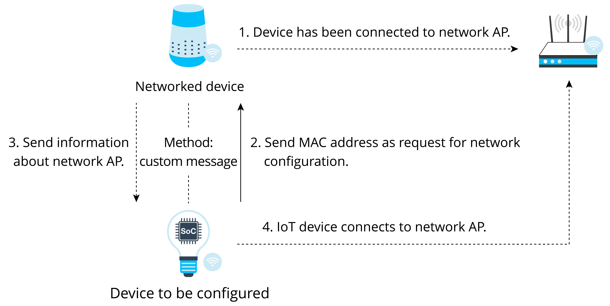
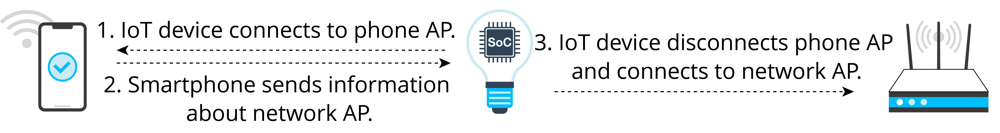

# Other Methods

## Direct network configuration

Direct network configuration refers to sending SSID and password
directly to IoT devices through peripheral interfaces such as UART, SPI,
SDIO, and I2C according to a certain communication protocol. It is also
known as wired network configuration. Once the IoT device receives the
SSID and password, it connects to the AP and then returns the connection
result through the master interface.

Moreover, some devices come with pre-set Wi-Fi information, such as SSID
and password. When such devices are started in specified Wi-Fi
environment, they can automatically connect to the corresponding AP.
Such devices are typically used in large-scale networks, factory
testing, or industrial scenarios. The steps of direct network
configuration are shown in Figure 7.27.

<figure align="center">
    
    <figcaption>Figure 7.27. Steps of direct network configuration</figcaption>
</figure>

This method adopts a software solution and is easy to implement. It is
well-suited for devices with Wi-Fi chips or connected by transmission
lines of other protocols. However, transmission lines must be
pre-installed between systems.

The Espressif AT (ESP-AT) command firmware provided by Espressif can be
directly used in mass-produced IoT applications. Developers can easily
join wireless networks by running the Wi-Fi commands. For details,
please refer to [ESP-AT User Guide](https://docs.espressif.com/projects/esp-at/en/latest/esp32/index.html).

## RouterConfig

RouterConfig is based on Wi-Fi Protected Setup (WPS), a standard
introduced by the Wi-Fi Alliance to address the complex process of
configuring wireless network encryption and authentication settings. The
goal of WPS is to simplify Wi-Fi security and network management for
users. The standard offers two methods, Personal Identification Number
(PIN) method and Push Button Configuration (PBC) method. Figure 7.28
shows the steps of RouterConfig.

<figure align="center">
    
    <figcaption>Figure 7.28. Steps of RouterConfig</figcaption>
</figure>

The process is relatively straightforward, but it requires both the
router and the device to support WPS. Unfortunately, many users neglect
encryption security settings due to the cumbersome steps involved, which
can lead to serious security issues. As a result, an increasing number
of routers are abandoning or disabling support for WPS by default. The
method has become less popular in recent years.

> 📝 **Source code**
>
> ESP-IDF, the official IoT development framework by Espressif, provides
> an example of this network configuration solution. The process there
> is quite simple. Visit <https://github.com/espressif/esp-idf> to see
> the example in [`examples/wifi/wps`](https://github.com/espressif/esp-idf/tree/master/examples/wifi/wps).

## ZeroConfig

ZeroConfig is a method of using one connected device to configure the
network for another one. This method does not involve smartphones, as
other devices like smart speakers can be used instead.

To initiate the process, the device to be connected sends its MAC
address to the networked device through a custom message. The networked
device then responds by sending back its saved router SSID and password
via another custom message. After connecting, the device can perform
further configuration such as external network binding. The steps of
ZeroConfig network configuration are shown in Figure 7.29.

<figure align="center">
    
    <figcaption>Figure 7.29. Steps of ZeroConfig</figcaption>
</figure>

Since the networked device stores the SSID and password of the router,
users do not need to enter them manually. The configuration will be
easier, thus providing better user experience. However, this method
cannot be widely adopted, as there must be networked devices connected
with the router. At the same time, because mobile applications have
limited access, it is impossible to assemble or receive Wi-Fi management
frames through third-party programs. Therefore, smartphones can only be
used to implement this method under certain circumstances.

## Phone AP network configuration

Phone AP network configuration refers to setting a smartphone as an AP
with a unique name and password, connecting the IoT device to the AP and
sending network binding information. Figure 7.30 shows the steps of
phone AP network configuration.

<figure align="center">
    
    <figcaption>Figure 7.30. Steps of phone AP network configuration</figcaption>
</figure>

Phone AP network configuration does not require the IoT device to
support AP mode, so users do not have to do much development work on the
device. It can be used with SmartConfig (simultaneously), making it a
good candidate for backup network configuration. However, the user
experience provided is barely satisfying. Many users struggle with
setting the AP name of the smartphone or even enabling the phone AP.
Particularly on iOS devices, the application cannot automatically create
an AP, so users have to manually modify the device name and enable the
AP. As a result, this method is not suitable for consumer devices.

In addition to the configuration methods above, Espressif also supports
Wi-Fi Easy Connect, also known as Device Provisioning Protocol (DPP).
For more information, please visit <https://bookc3/espressif.com/esp-dpp>.