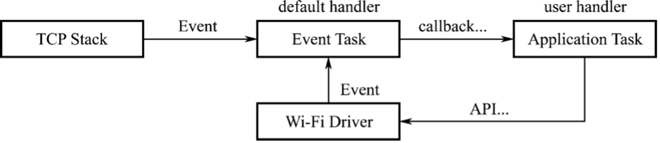

# Wi-Fi Components in ESP-IDF

## Features

Wi-Fi components can be used to configure and monitor the Wi-Fi network
connection of ESP32-C3. The following features are supported.

-   **STA mode**: aka station mode or Wi-Fi client mode. ESP32-C3 is
    connected to the AP in this mode.

-   **AP mode**: aka SoftAP mode or access point mode. The AP is
    connected to ESP32-C3 in this mode.

-   **AP-STA coexistence mode**: ESP32-C3 is connected to another AP as
    an AP.

-   **Security standards** for the modes above: WPA, WPA2, WPA3, WEP,
    etc.

-   **Scanning for APs**, including active and passive scanning.

-   **Promiscuous mode** for monitoring IEEE 802.11 Wi-Fi packets.

## APIs

`esp_wifi.h` defines the APIs for Wi-Fi components, as shown in Table 7.3.

<i>Table 7.3. APIs for Wi-Fi components</i>

|Function Name|Description|
|:---:|---|
|`esp_wifi_init()`|Initialise resources for the Wi-Fi driver, such as Wi-Fi control structures and Wi-Fi tasks|
|`esp_wifi_deinit()`|Free resources allocated in `esp_wifi_init()` and stop Wi-Fi tasks|
|`esp_wifi_set_mode()`|Set the WiFi operating mode for ESP32-C3|
|`esp_wifi_get_mode()`|Get the WiFi operating mode of ESP32-C3|
|`esp_wifi_start()`|Start Wi-Fi according to current configuration|
|`esp_wifi_stop()`|Stop Wi-Fi according to current configuration|
|`esp_wifi_connect()`|Connect ESP32-C3 to the AP|
|`esp_wifi_disconnect()`|Disconnect ESP32-C3 from the AP|
|`esp_wifi_scan_start()`|Scan for all available APs|
|`esp_wifi_scan_stop()`|Stop the scan in progress|
|`esp_wifi_scan_get_ap_num()`|Get the number of APs found by ESP32-C3|
|`esp_wifi_scan_get_ap_records()`|Get the information about APs found by ESP32-C3|
|`esp_wifi_set_config()`|Set the configuration of the ESP32-C3 STA or AP|
|`esp_wifi_get_config()`|Get the configuration of the ESP32-C3 STA or AP|

## Programming model

The ESP32-C3 Wi-Fi programming model is depicted in Figure 7.31.

<figure align="center">
    
    <figcaption>Figure 7.31. ESP32-C3 Wi-Fi programming model</figcaption>
</figure>

The Wi-Fi driver can be considered a black box that knows nothing about
upper-layer code, such as TCP stacks, application tasks, and event
tasks. The application task (code) generally calls Wi-Fi driver APIs to
initialise Wi-Fi and handles Wi-Fi events when necessary. The Wi-Fi
driver receives API calls, handles them, and posts events in the
application.

Wi-Fi event handling is based on the `esp_event` library. Events are
sent by the Wi-Fi driver to the default event loop. Applications may
handle these events in callbacks registered using
`esp_event_handler_register()`. Wi-Fi events are also handled by the
`esp_netif` component to provide a set of default behaviors. For
example, when a Wi-Fi station connects to an AP, `esp_netif` will
automatically start the Dynamic Host Configuration Protocol (DHCP)
client by default.