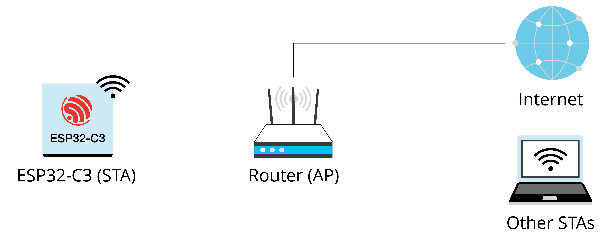

# Exercise: Wi-Fi Connection

### 1. Put ESP32-C3 into STA mode, and connect to an AP.

When operating in STA mode, ESP32-C3 can connect to an AP as an STA.

The BSS based on the central AP allows for multiple STAs to build a
wireless network, with the AP forwarding all communications within the
network. In this mode, the device is able to access both the external
and internal network directly, using the Internet Protocol (IP) address
assigned by the AP. Figure 7.32 explains Wi-Fi STA mode.

<figure align="center">
    
    <figcaption>Figure 7.32. Wi-Fi STA mode</figcaption>
</figure>

## 2. Use ESP-IDF components to connect devices to routers.

Figure 7.33 shows how to use ESP-IDF components to connect devices to
routers.

<figure align="center">
    
    <figcaption>Figure 7.33. Using ESP-IDF components to connect devices to
routers</figcaption>
</figure>

(1) **Initialisation**. See 1.1, 1.2, and 1.3 in Figure 7.33.

a. **Initialise LwIP**. Create an LwIP core task and initialise LwIP-related work.

```c
ESP_ERROR_CHECK(esp_netif_init());
```

b. **Initialise event**. As introduced before, Wi-Fi event handling is based on the `esp_event` library, assisted by the `esp_netif` component. The code to initialise the event is as follows:

```c
ESP_ERROR_CHECK(esp_event_loop_create_default());
esp_netif_create_default_wifi_sta();
esp_event_handler_instance_t instance_any_id;
esp_event_handler_instance_t instance_got_ip;
ESP_ERROR_CHECK(esp_event_handler_instance_register(WIFI_EVENT,
                                                    ESP_EVENT_ANY_ID,
                                                    &event_handler,
                                                    NULL, &instance_any_id));
ESP_ERROR_CHECK(esp_event_handler_instance_register(IP_EVENT,
                                                    IP_EVENT_STA_GOT_IP,
                                                    &event_handler,
                                                    NULL, &instance_got_ip));
```

c. **Initialise Wi-Fi**. Create the Wi-Fi driver task, and initialise
the Wi-Fi driver. The code to initialise Wi-Fi is as follows:

```c
wifi_init_config_t cfg = WIFI_INIT_CONFIG_DEFAULT();
ESP_ERROR_CHECK(esp_wifi_init(&cfg));
```

(2) **Configuration**. Once the Wi-Fi driver is initialised, you can
start configuration. At this stage, the driver is in STA mode, so you
may call `esp_wifi_set_mode(WIFI_MODE_STA)` to put ESP32-C3 into STA
mode. Refer to the code below:

```c
wifi_config_t wifi_config = {
    .sta = {
        .ssid = EXAMPLE_ESP_WIFI_SSID,
        .password = EXAMPLE_ESP_WIFI_PASS,
    },
};
ESP_ERROR_CHECK(esp_wifi_set_mode(WIFI_MODE_STA));
ESP_ERROR_CHECK(esp_wifi_set_config(WIFI_IF_STA, &wifi_config));
```

(3) **Startup**. Call `esp_wifi_start()` to start the Wi-Fi driver.

```c
ESP_ERROR_CHECK(esp_wifi_start());
```

The Wi-Fi driver posts `WIFI_EVENT_STA_START` to the event task; then,
the event task will do some routine work and call the application event
callback function.

The application event callback function relays `WIFI_EVENT_STA_START` to
the application task, and then we call `esp_wifi_connect()`.

(4) **Connection**. Once `esp_wifi_connect()` is called, the Wi-Fi
driver will start the internal scan/connection process.

If the internal scan/connection is successful, `WIFI_EVENT_STA_CONNECTED` will be generated. In the event task, the DHCP client will be started and trigger the DHCP process. Refer to the
code below:

```c
static void event_handler(void* arg, esp_event_base_t event_base,
                          int32_t event_id, void* event_data)
{
    if (event_base == WIFI_EVENT && event_id == WIFI_EVENT_STA_START) {
        esp_wifi_connect();
    } else if (event_base == WIFI_EVENT && event_id == WIFI_EVENT_STA_DISCONNECTED) {
        if (s_retry_num < EXAMPLE_ESP_MAXIMUM_RETRY) {
            esp_wifi_connect();
            s_retry_num++;
            ESP_LOGI(TAG, "retry to connect to the AP");
        } else {
            xEventGroupSetBits(s_wifi_event_group, WIFI_FAIL_BIT);
        }
        ESP_LOGI(TAG, "connect to the AP fail");
    } else if (event_base == IP_EVENT && event_id == IP_EVENT_STA_GOT_IP) {
        ip_event_got_ip_t* event = (ip_event_got_ip_t*) event_data;
        ESP_LOGI(TAG, "got ip:" IPSTR, IP2STR(&event->ip_info.ip));
        s_retry_num = 0;
        xEventGroupSetBits(s_wifi_event_group, WIFI_CONNECTED_BIT);
    }
}
```

(5) **Getting IP**. Once the DHCP client is initialised, the "getting
IP" phase will begin. If the IP address is successfully received from
the DHCP server, `IP_EVENT_STA_GOT_IP` will be triggered and commonly
handled in event task.

In the application event callback, `IP_EVENT_STA_GOT_IP` is relayed to
the application task. For LwIP-based applications, this marks a special
event which means that everything is ready for the application to
perform subsequent tasks. But remember not to start the socket-related
work before receiving the IP.

(6) **Disconnection**. Wi-Fi connection may fail because of active
disconnection, wrong password, AP not found, etc. In this case,
`WIFI_EVENT_STA_DISCONNECTED` will arise and provide the reason for the
failure, such as `esp_wifi_disconnect()` being called to actively
disconnect.

```c
ESP_ERROR_CHECK(esp_wifi_disconnect());
```

(7) **IP Changed**. If the IP address is changed, `IP_EVENT_STA_GOT_IP` will be triggered with `ip_change` set to `true`.

(8) **Cleanup**, including breaking Wi-Fi connection, stopping and unloading the Wi-Fi driver, etc. The code is as follows:

```c
ESP_ERROR_CHECK(esp_event_handler_instance_unregister(IP_EVENT,
                                                      IP_EVENT_STA_GOT_IP,
                                                      instance_got_ip));
ESP_ERROR_CHECK(esp_event_handler_instance_unregister(WIFI_EVENT,
                                                      ESP_EVENT_ANY_ID,
                                                      instance_any_id));
ESP_ERROR_CHECK(esp_wifi_stop());
ESP_ERROR_CHECK(esp_wifi_deinit());
ESP_ERROR_CHECK(esp_wifi_clear_default_wifi_driver_and_handlers(station_netif));
esp_netif_destroy(station_netif);
```
