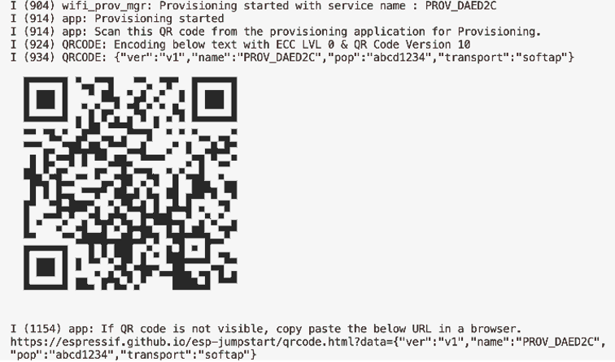
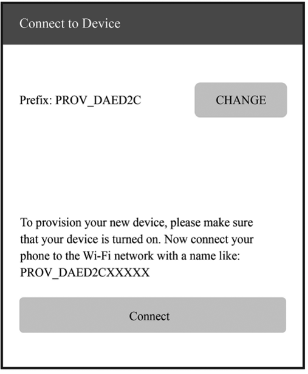
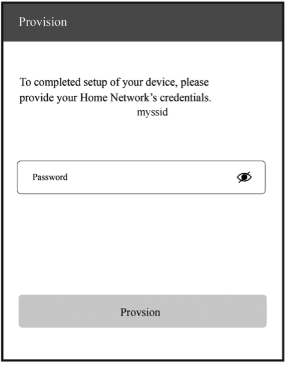
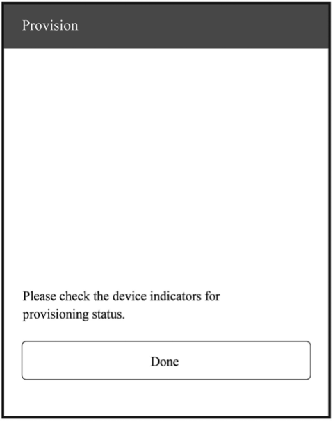
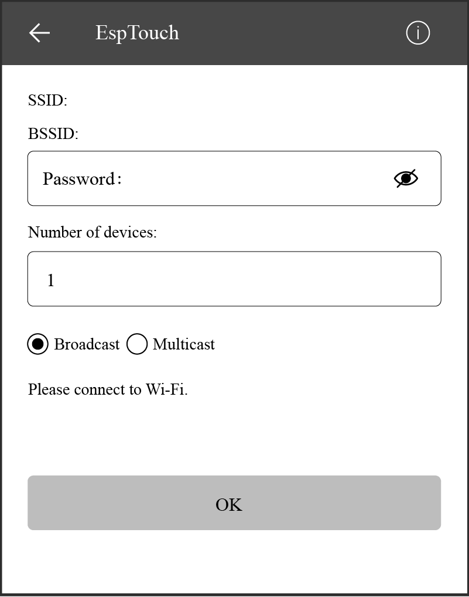
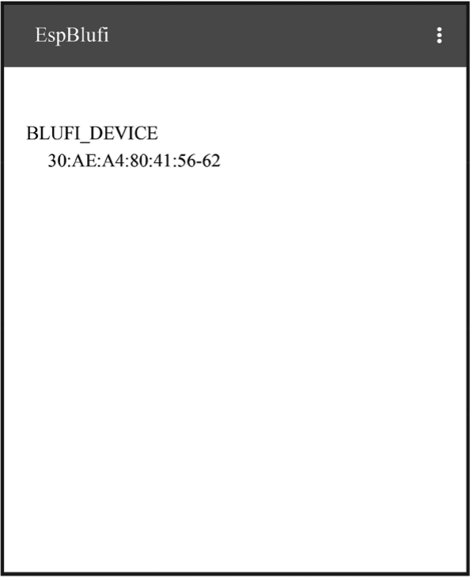
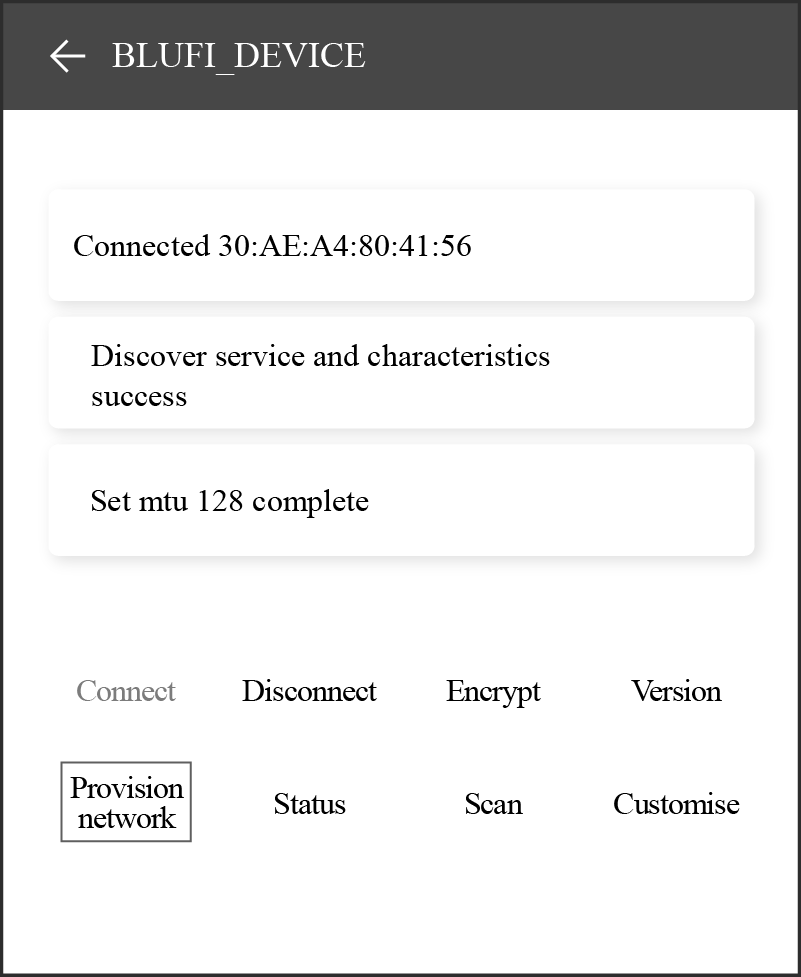
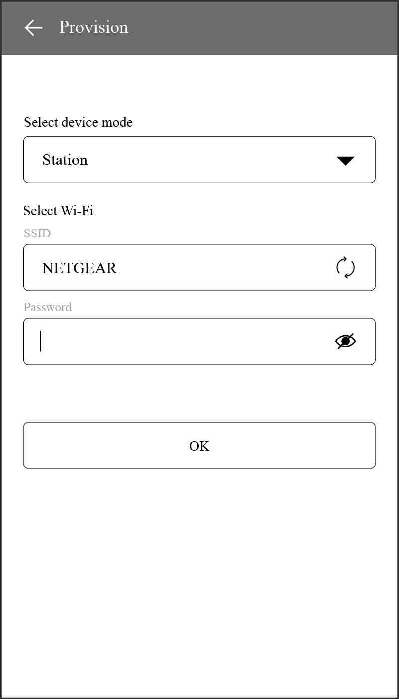
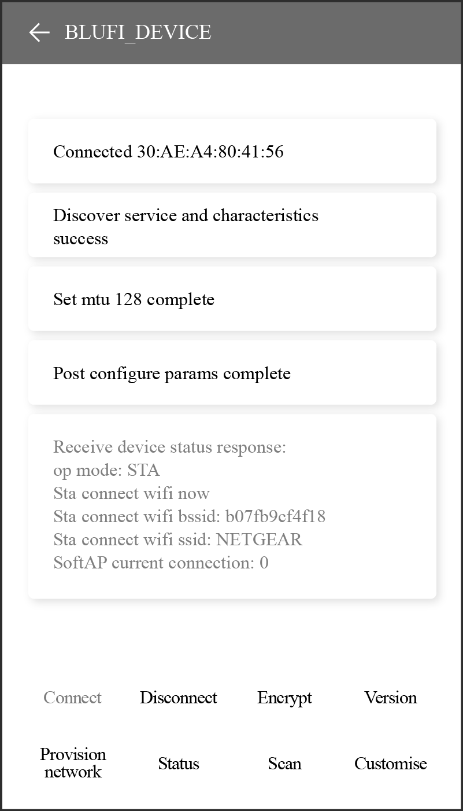

# Exercise: Smart Wi-Fi Connection

## 💡 SoftAP

The `wifi_provisioning` components provided by ESP32-C3 can transmit
SSID and password of the AP through SoftAP or Bluetooth LE, and then use
them to connect to the AP.

### APIs

The APIs for `wifi_provisioning` are defined in [`esp-idf/components/wifi_provi sioning/include/wifi_provisioning/manager.h`](https://github.com/espressif/esp-idf/blob/master/components/wifi_provisioning/include/wifi_provisioning/manager.h), as shown in Table 7.4.

<p align="center"><i>Table 7.4. APIs for <code>wifi_provisioning</code> components</i></p>

|API|Description|
|---|---|
|`wifi_prov_mgr_init()`|Initialise `provisioning` manager interface according to current configuration|
|`wifi_prov_mgr_deinit()`|Release `provisioning` manager interface|
|`wifi_prov_mgr_is_provisioned()`|Check the `provisioning` status of ESP32-C3|
|`wifi_prov_mgr_start_provisioning()`|Start the `provisioning` service|
|`wifi_prov_mgr_stop_provisioning()`|Stop the `provisioning` service|
|`wifi_prov_mgr_wait()`|Wait for the `provisioning` service to finish|
|`wifi_prov_mgr_disable_auto_stop()`|Disable auto stopping of the `provisioning` service upon completion|
|`wifi_prov_mgr_endpoint_create()`|Create an `endpoint` and allocate internal resources for it|
|`wifi_prov_mgr_endpoint_register()`|Register a handler for the created `endpoint`|
|`wifi_prov_mgr_endpoint_unregister()`|Unregister the handler for the created `endpoint`|
|`wifi_prov_mgr_get_wifi_state()`|Get the state of the Wi-Fi STA during `provisioning`|
|`wifi_prov_mgr_get_wifi_disconnect_reason()`|Get the reason code for Wi-Fi STA disconnection during `provisioning`|

### Program structure

-   Initialisation:

    ```c
    wifi_prov_mgr_config_t config = {
        .scheme = wifi_prov_scheme_softap,
        .scheme_event_handler = WIFI_PROV_EVENT_HANDLER_NONE
    };

    ESP_ERR_CHECK(wifi_prov_mgr_init(config));
    ```

-   Checking the `provisioning` status:

    ```c
    bool provisioned = false;
    ESP_ERROR_CHECK(wifi_prov_mgr_is_provisioned(&provisioned));
    ```

-   Starting `provisioning` service:

    ```c
    const char *service_name = "my_device";
    const char *service_key  = "password";

    wifi_prov_security_t security = WIFI_PROV_SECURITY_1;
    const char *pop = "abcd1234";

    ESP_ERR_CHECK(wifi_prov_mgr_start_provisioning(security, pop, service_name, service_key));
    ```

-   Releasing resources for `provisioning`.

    Once the `provisioning` service is complete, the main application will
    release the resources for `provisioning` and start executing its own
    logic. There are two ways to do this. The simpler way is to call
    `wifi_prov_mgr_wait()`. See the code below:

    ```c
    //Wait for the provisioning service to finish
    wifi_prov_mgr_wait();

    //Release the resources for provisioning
    wifi_prov_mgr_deinit();
    ```

    The other way is to use the callback function of the event. See the code
    below:

    ```c
    static void event_handler(void* arg, esp_event_base_t event_base,
                            int event_id, void* event_data)
    {
        if (event_base == WIFI_PROV_EVENT && event_id == WIFI_PROV_END) {
            //Release the resources for provisioning upon completion
            wifi_prov_mgr_deinit();
        }
    }
    ```

### Functional verification

To get started, install ESP SoftAP Provisioning on your phone. Next,
turn on the Wi-Fi and power on the device. Ensure that the output log by
the serial port (see Figure 7.34) contains information beginning with
`PROV_`.

> 📌 **Tip**
>
> You may download the APP at <https://www.espressif.com/en/support/download/apps>.

<figure align="center">
    
    <figcaption>Figure 7.34. Output log by the serial port</figcaption>
</figure>

1.  **Startup**

    Open the application on your phone and tap "Start Provisioning". Then
    you will find the device PROV_DAED2CXXXXX on the screen (refer to Figure
    7.35).

    <figure align="center">
        
        <figcaption>Figure 7.35. Startup</figcaption>
    </figure>

2.  **Connection**

    Tap "Connect" to navigate to the Wi-Fi setting interface. Select to
    connect the device PROV_DAED2CXXXXX. If connected, you will see the
    screen as Figure 7.36.

    <figure align="center">
        
        <figcaption>Figure 7.36. SoftAP connection</figcaption>
    </figure>

    The output log is as follows:

    ```shell
    I (102906) wifi:station: 88:40:3b:40:c1:13 join, AID=1, bgn, 40U
    I (103056) esp_netif_lwip: DHCP server assigned IP to a station, IP is: 192.168.4.2
    I (124286) wifi:station: 88:40:3b:40:c1:13 leave, AID = 1, bss_flags is 134259, bss:0x3fca7844
    I (124286) wifi:new: <1,0>, old: <1,1>, ap: <1,1>, sta: <0,0>, prof:1
    I (149036) wifi:new: <1,1>, old: <1,0>, ap: <1,1>, sta: <0,0>, prof:1
    I (149036) wifi:station: 88:40:3b:40:c1:13 join, AID=1, bgn, 40U
    I (149246) esp_netif_lwip: DHCP server assigned IP to a station, IP is: 192.168.4.2
    ```

3.  **Provisioning**

    Tap "Provision Network" to enter the provisioning screen shown in Figure
    7.37.

    <figure align="center">
        
        <figcaption>Figure 7.37. Provisioning</figcaption>
    </figure>

4.  **Completion**

    Tap "Provision" to enter the completion screen shown in Figure 7.38.

    <figure align="center">
        
        <figcaption>Figure 7.38. Completion</figcaption>
    </figure>

    The output log is as follows:

    ```shell
    I (139471) app: Received Wi-Fi credentials
              SSID     : myssid
              Password : mypassword
              .
              .
              .
    I (144091) app: Connected with IP Address:192.168.50.31
    I (144091) esp_netif_handlers: sta ip: 192.168.50.31, mask: 255.255.255.0, gw: 192.168.50.1
    I (144091) wifi_prov_mgr: STA Got IP
    I (144101) app: provisioningsuccessful
    I (144101) app: Hello World!
    I (145101) app: Hello World!
              .
              .
              .
    I (146091) wifi_prov_mgr: Provisioning stopped
    I (146101) app: Hello World!
    I (147101) app: Hello World!
    I (148101) app: Hello World!
    ```

## 💡 SmartConfig

The SmartConfig component provided by ESP32-C3 can transmit the SSID and
password of the AP through promiscuous mode, and then use them to
connect to the AP.

### APIs

The APIs for SmartConfig are defined in [`esp-idf/components/esp_wifi/include/ esp_smartconfig.h`](https://github.com/espressif/esp-idf/blob/master/components/esp_wifi/include/esp_smartconfig.h), as shown in Table 7.5.

<p align="center"><i>Table 7.5. APIs for SmartConfig</i></p>

|API|Description|
|---|---|
|`esp_smartconfig_get_version()`|Get the version of the current SmartConfig|
|`esp_smartconfig_start()`|Start SmartConfig|
|`esp_smartconfig_stop()`|Stop SmartConfig|
|`esp_esptouch_set_timeout()`|Set the timeout of SmartConfig process|
|`esp_smartconfig_set_type()`|Set the protocol type of SmartConfig|
|`esp_smartconfig_fast_mode()`|Set the mode of SmartConfig|
|`esp_smartconfig_get_rvd_data()`|Get the reserved data of ESPTouch v2

### Program structure

-   Wi-Fi event handling

    This module takes care of Wi-Fi connection, disconnection, reconnection,
    scanning, etc., as detailed in the sections before. Additionally, when
    the `WIFI_EVENT_STA_START` event occurs, it will also create a
    SmartConfig task.

-   NETIF event handling

    This module helps acquire the IP address. Details are provided in the
    sections before. When the `IP_EVENT_STA_GOT_IP` event occurs, the
    connection flag will be set.

-   SmartConfig event handling

    The received request determines how the event is handled and processed.
    SmartConfig events are shown in Table 7.6.

    <p align="center"><i>Table 7.6. SmartConfig events</i></p>

    |Event|Description|
    |---|---|
    |`SC_EVENT_SCAN_DONE`|Scan to obtain the information about nearby APs|
    |`SC_EVENT_FOUND_CHANNEL`|Get the channel of the target AP|
    |`SC_EVENT_GOT_SSID_PSWD`|Enter STA mode to get the SSID and password of the target AP|
    |`SC_EVENT_SEND_ACK_DONE`|Set the SmartConfig completion flag|

-   SmartConfig tasks

    The code for SmartConfig tasks is as follows.

    ```c
    static void smartconfig_example_task (void *param)
    {
        EventBits_t uxBits;
        ESP_ERROR_CHECK(esp_smartconfig_set_type(SC_TYPE_ESPTOUCH));
        smartconfig_start_config_t cfg = SMARTCONFIG_START_CONFIG_DEFAULT();
        ESP_ERROR_CHECK(esp_smartconfig_start(&cfg));
        while (1) {
            uxBits = xEventGroupWaitBits (s_wifi_event_group,
                                        CONNECTED_BIT | ESPTOUCH_DONE_BIT,
                                        true,
                                        false,
                                        portMAX_DELAY);
            if (uxBits & CONNECTED_BIT) {
                ESP_LOGI (TAG, "WiFi Connected to ap");
            }
            if (uxBits & ESPTOUCH_DONE_BIT) {
                ESP_LOGI (TAG, "smartconfig over");
                esp_smartconfig_stop();
                vTaskDelete (NULL);
            }
        }
    }
    ```

    As demonstrated in the code above, a SmartConfig task primarily performs
    three functions. First, it sets the SmartConfig type, such as ESP-TOUCH
    and ESP-TOUCH V2. Second, after the configuration, it enables
    SmartConfig by calling `esp_smartconfig_start()`. Finally, it checks the
    event group in a loop. Upon receiving the `SC_EVENT_SEND_ACK_DONE`
    event, it stops SmartConfig by calling `esp_smartconfig_stop()`.

-   Main program

    It creates an event group to set the flag when a relevant event is
    triggered, and then initialises Wi-Fi.

### Functional verification

To get started, install Espressif Esptouch on your phone. Then turn on
the Wi-Fi and power on the device. You will see the output log by the
serial port as follows:

```shell
I (1084) wifi:mode : sta (30:ae:a4:80:65:7c)
I (1084) wifi:enable tsf
I (1134) smartconfig: SC version: V3.0.1
I (5234) wifi:ic_enable_sniffer
I (5234) smartconfig: Start to find channel...
I (5234) smartconfig_example: Scan done
```

> 📌  **Tip**
>
>You may download the APP at <https://www.espressif.com/en/support/download/apps>.

Connect your phone to Wi-Fi, and enter the password to start
configuration. The SmartConfig interface is shown in Figure 7.39.

<figure align="center">
    
    <figcaption>Figure 7.39. SmartConfig configuration</figcaption>
</figure>

The output log is as follows:

```shell
I (234592) smartconfig: TYPE: ESPTOUCH
I (234592) smartconfig: T|PHONE MAC:68:3e:34:88:59:bf
I (234592) smartconfig: T|AP MAC:a4:56:02:47:30:07
I (234592) sc: SC_STATUS_GETTING_SSID_PSWD
I (239922) smartconfig: T|pswd: 123456789
I (239922) smartconfig: T|ssid: IOT_DEMO_TEST
I (239922) smartconfig: T|bssid: a4:56:02:47:30:07
I (239922) wifi: ic_disable_sniffer
I (239922) sc: SC_STATUS_LINK
I (239932) sc: SSID:IOT_DEMO_TEST
I (239932) sc: PASSWORD:123456789
I (240062) wifi: n:1 0, o:1 0, ap:255 255, sta:1 0, prof:1
I (241042) wifi: state: init -> auth (b0)
I (241042) wifi: state: auth -> assoc (0)
I (241052) wifi: state: assoc -> run (10)
I (241102) wifi: connected with IOT_DEMO_TEST, channel 1
I (244892) event: ip: 192.168.0.152, mask: 255.255.255.0, gw: 192.168.0.1
I (244892) sc: WiFi Connected to ap
I (247952) sc: SC_STATUS_LINK_OVER
I (247952) sc: Phone ip: 192.168.0.31
I (247952) sc: smartconfig over
```

## 💡 Bluetooth

The BluFi components of ESP32-C3 help transmit the SSID and password
through Bluetooth LE, which can be used to connect to the AP.

### APIs

The APIs for BluFi components are defined in [`esp_blufi_api.h`](https://github.com/espressif/esp-idf/blob/master/components/bt/common/api/include/api/esp_blufi_api.h), as shown in Table 7.7.

<p align="center"><i>Table 7.7. APIs for BluFi components</i></p>

|API|Description|
|---|---|
|`esp_blufi_register_callbacks()`|Register BluFi callback events|
|`esp_blufi_profile_init()`|Initialise BluFi profile|
|`esp_blufi_profile_deinit()`|Deinitialise BluFi profile|
|`esp_blufi_send_wifi_conn_report()`|Send Wi-Fi connection reports|
|`esp_blufi_send_wifi_list()`|Send the Wi-Fi list|
|`esp_blufi_get_version()`|Get the version of the current BluFi profile|
|`esp_blufi_close()`|Disconnect the device|
|`esp_blufi_send_error_info()`|Send BluFi error messages|
|`esp_blufi_send_custom_data()`|Send custom data|

### Program structure

-   **Wi-Fi event handling**: taking care of Wi-Fi connection,
    disconnection, reconnection, scanning, etc., as detailed in the
    sections before.

-   **NETIF event handling**: acquiring IP address. Details are provided
    in the sections before.

-   **BluFi event handling**: determined by the received request. BluFi
    events are shown in Table 7.8.

    <p align="center"><i>Table 7.8. BluFi events</i></p>

    |Event|Description|
    |---|---|
    |`ESP_BLUFI_EVENT_INIT_FINISH`|Initialise BluFi features, name the device, and send specified broadcast data|
    |`ESP_BLUFI_EVENT_DEINIT_FINISH`|Handle deinit configuration events|
    |`ESP_BLUFI_EVENT_BLE_CONNECT`|Connect to Bluetooth LE and put the device into safe mode|
    |`ESP_BLUFI_EVENT_BLE_DISCONNECT`|Set Bluetooth LE to disconnect and reconnect|
    |`ESP_BLUFI_EVENT_SET_WIFI_OPMODE`|Put ESP32-C3 into operating mode|
    |`ESP_BLUFI_EVENT_REQ_CONNECT_TO_AP`|Disconnect from the original Wi-Fi and connect to the specified Wi-Fi|
    |`ESP_BLUFI_EVENT_REQ_DISCONNECT_FROM_AP`|Disconnect from the AP currently connected to ESP32-C3|
    |`ESP_BLUFI_EVENT_REPORT_ERROR`|Send error messages|
    |`ESP_BLUFI_EVENT_GET_WIFI_STATUS`|Get Wi-Fi status, including the current Wi-Fi mode and whether it is connected|
    |`ESP_BLUFI_EVENT_RECV_SLAVE_DISCONNECT_BLE`|Notify BluFi that the GATT connection is closed|
    |`ESP_BLUFI_EVENT_RECV_STA_BSSID`|Enter STA mode and get the BSSID of the target AP|
    |`ESP_BLUFI_EVENT_RECV_STA_SSID`|Enter STA mode and get the SSID of the target AP|
    |`ESP_BLUFI_EVENT_RECV_STA_PASSWD`|Enter STA mode and get the password of the target AP|
    |`ESP_BLUFI_EVENT_RECV_SOFTAP_SSID`|Enter SoftAP mode and get the custom AP SSID|
    |`ESP_BLUFI_EVENT_RECV_SOFTAP_PASSWD`|Enter SoftAP mode and get the custom AP password|
    |`ESP_BLUFI_EVENT_RECV_SOFTAP_MAX_CONN_NUM`|Set the maximum number of connected devices in SoftAP mode|
    |`ESP_BLUFI_EVENT_RECV_SOFTAP_AUTH_MODE`|Enter authentication mode in SoftAP mode|
    |`ESP_BLUFI_EVENT_RECV_SOFTAP_CHANNEL`|Set the channel in SoftAP mode|
    |`ESP_BLUFI_EVENT_GET_WIFI_LIST`|Obtain the SSID list, channel, and STA MAC address scanned over the air|
    |`ESP_BLUFI_EVENT_RECV_CUSTOM_DATA`|Print the received data and trim it to fit the application|

-   **Main program**: initialising Wi-Fi, initialising and enabling
    Bluetooth controller, initialising and enabling Bluetooth protocol,
    obtaining Bluetooth address and BluFi version, processing Bluetooth
    GAP events, and creating BluFi events.

### Functional verification

To get started, install EspBlufi on your phone. Turn on the Wi-Fi and
power on the device. You will see the output log by the serial port as
follows:

```shell
I (516) phy_init: phy_version 500,985899c,Apr 19 2021,16:05:08
I (696) wifi:set rx active PTI: 0, rx ack PTI: 12, and default PTI: 1
I (908) wifi:mode : sta (30:ae:a4:80:41:55)
I (908) wifi:enable tsf
W (706) BTDM_INIT: esp_bt_controller_mem_release not implemented, return OK
I (706) BTDM_INIT: BT controller compile version [9c99115]
I (716) coexist: coexist rom version 9387209
I (726) BTDM_INIT: Bluetooth MAC: 30:ae:a4:80:41:56
I (746) BLUFI_EXAMPLE: BD ADDR: 30:ae:a4:80:41:56
I (1198) BLUFI_EXAMPLE: BLUFI VERSION 0102
I (1198) BLUFI_EXAMPLE: BLUFI init finish
```

> 📌 **Tip**
>
> You may download the APP at <https://www.espressif.com/en/support/download/apps>.

1.  **Startup**

    Open the application on your phone and pull down to refresh. You will
    see the information about nearby Bluetooth devices on the screen as
    shown in Figure 7.40.

    <figure align="center">
        
        <figcaption>Figure 7.40. EspBlufi startup</figcaption>
    </figure>

2.  **Connection**

    Select the ESP32-C3 module BLUFI_DEVICE to get details about the device.
    Tap "Connect" to connect with Bluetooth. If connected, you will see the
    interface as Figure 7.41.

    <figure align="center">
        
        <figcaption>Figure 7.41. Bluetooth connected</figcaption>
    </figure>

    The output log is as follows:

    ```shell
    I (32736) BLUFI_EXAMPLE: BLUFI ble connect
    ```

3.  **Provisioning**

    Tap "Provision network" in Figure 7.41 to enter the provisioning
    interface shown in Figure 7.42.
    
    <figure align="center">
        
        <figcaption>Figure 7.42. Provisioning</figcaption>
    </figure>

4.  **STA connection**

    Tap "OK" in Figure 7.42 to configure the network. If the configuration
    succeeds, you will see the STA connected interface shown in Figure 7.43.
    Details about STA connection in Wi-Fi mode will be displayed at the
    bottom of the screen, including the BSSID and SSID of the AP and the
    connection status.

    <figure align="center">
        
        <figcaption>Figure 7.43. STA connected</figcaption>
    </figure>

    The output log is as follows:

    ```shell
    I (63756) BLUFI_EXAMPLE: BLUFI Set WIFI opmode 1
    I (63826) BLUFI_EXAMPLE: Recv STA SSID NETGEAR
    I (63866) BLUFI_EXAMPLE: Recv STA PASSWORD 12345678
    I (63936) BLUFI_EXAMPLE: BLUFI requset wifi connect to AP
    I (65746) wifi:new: <8,2>, old: <1,0>, ap: <255,255>, sta: <8,2>, prof:1
    I (66326) wifi:state: init -> auth (b0) 
    I (67326) wifi:state: auth -> init (200) 
    I (67326) wifi:new: <8,0>, old: <8,2>, ap: <255,255>, sta: <8,2>, prof:1 
    I (69516) wifi:new: <10,0>, old: <8,0>, ap: <255,255>, sta: <10,0>, prof:1 
    I (69516) wifi:state: init -> auth (b0) 
    I (69566) wifi:state: auth -> assoc (0)
    I (69626) wifi:state: assoc -> run (10) 
    I (69816) wifi:connected with NETGEAR, aid = 1, channel 10, BW20, bssid = 5c:02:14:03:a5:7d
    I (69816) wifi:security: WPA2-PSK, phy: bgn, rssi: -48
    I (69826) wifi:pm start, type: 1
    I (69826) wifi:set rx beacon pti, rx_bcn_pti: 14, bcn_timeout: 14, mt_pti: 25000, mt_time: 10000
    I (69926) wifi:BcnInt:102400, DTIM:1 W (70566) wifi:idx:0 (ifx:0, 5c:02:14:03:a5:7d), tid:0, ssn:2, winSize:64
    I (71406) esp_netif_handlers: sta ip: 192.168.31.145, mask: 255.255.255.0, gw:192.168.31.1
    ```
    