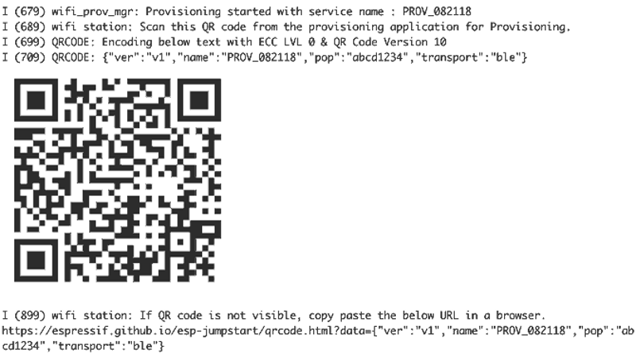

# Smart Wi-Fi Configuration
Now, we will turn to Wi-Fi configuration based on ESP32-C3. Similar to
Wi-Fi connection, we will encapsulate the smart Wi-Fi configuration
features according to application requirements, in order to provide APIs
for initialising smart Wi-Fi configuration.

After initialising the provisioning, the program will check its status.
If the device has been provisioned, the program will complete Wi-Fi
connection using the router information; otherwise, it will output a QR
code for you to start provisioning.

```c
wifi_prov_mgr_initialize();
```

To integrate the code for Bluetooth network configuration into the
project in section 7.5.1, please refer to
[`book-esp32c3-iot-projects/device_firmware/4_network_config`](https://github.com/espressif/book-esp32c3-iot-projects/tree/main/device_firmware/4_network_config).
With the ESP BLE Provisioning App, you may compile and run the code on
the development board. The output is as follows.

> 📌 **Tip**
>
> You may download the APP at <https://www.espressif.com/en/support/download/apps>.

🌟 If the device has not been provisioned, you will see the log shown in
Figure 7.44.

<figure align="center">
    
    <figcaption>Figure 7.44. Log output if device not provisioned</figcaption>
</figure>

🌟 If the device has been provisioned, you will see the following log:

```shell
I (399) wifi station: Application driver initialization   
I (399) gpio: GPIO[9]| InputEn: 1| OutputEn: 0| OpenDrain: 0| Pullup: 1| Pulldown: 0| Intr:0 
I (429) wifi station: NVS Flash initialization   
I (429) wifi station: Wi-Fi initialization   
I (549) wifi station: Wi-Fi Provisioning initialization   
I (549) wifi station: Already provisioned, starting Wi-Fi STA   
I (809) wifi station: wifi_station_initialize finished.   
I (1939) wifi station: got ip:192.168.3.105
```
