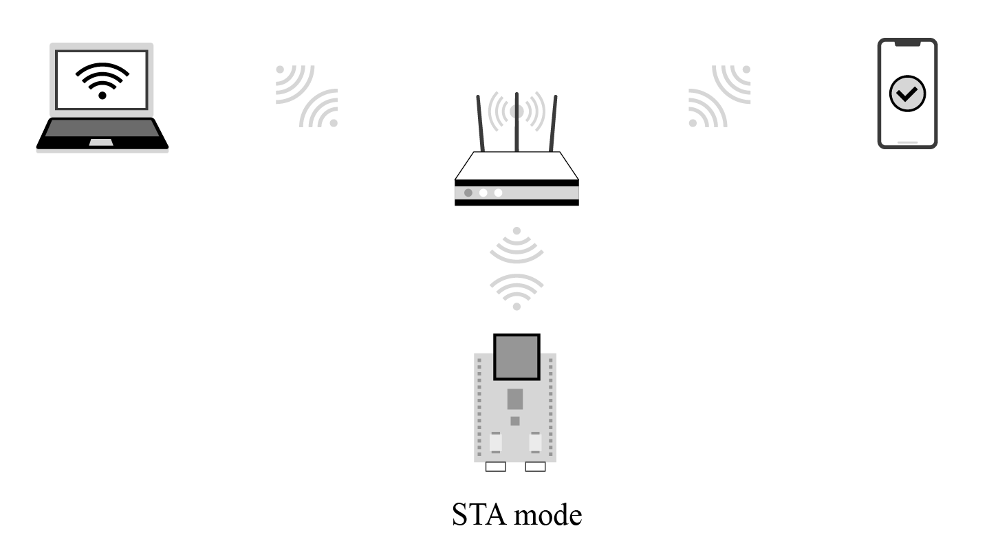

# Introduction to Local Control

This section first introduces what local control is and its usage conditions, scenarios, and advantages. Then it will expound on the device discovery function and data communication protocols involved in local control, and how to choose the data transmission medium for local control. After reading this section, you will have a full understanding of local control of devices.

As the name suggests, local control refers to operating controlled devices within a certain distance through a series of methods such as hardware switches, touch buttons, infrared remote control, smartphones, and computer networks. It is ubiquitous in our daily life, such as setting air conditioners through infrared remote controls, controlling voice-activated equipment through voice commands, and turning on household lighting through switches or smartphone apps. The concept and technology of local control have become deeply integrated into every aspect of our daily lives.

You may have noticed that some of the examples listed above are performed through hardware circuit switches or wireless communication technologies such as infrared remote control, while others involve voice recognition, and data communication technologies such as the Internet of Things. In this book, we will focuse on the data communication technology of IoT, and help you build your own local control framework to control the ESP32-C3 smart lights.

Within the Internet of Things, each device needs to transmit commands through certain data communication method. Some common ways are as follows:

-   **Using Wi-Fi or Ethernet**. Generally, devices based on Wi-Fi and
    Ethernet natively run the TCP/IP protocol stack, which greatly
    reduces the workload of protocol adaptation and development. When
    performing local communication, they also need a gateway or Wi-Fi
    router.

-   **Using short-range wireless communication technologies** such as
    Bluetooth and ZigBee, which is suitable for data transmission
    between low-speed and low-power devices.

According to the functional characteristics of ESP32-C3, we will introduce two commonly used local control technologies in this chapter, namely through Wi-Fi or Bluetooth within a LAN.

The network topology centered on Wi-Fi is shown in Figure 8.1. The command sending devices (smartphone or PC) should be in the same LAN as the controlled device, and send data to the device through Wi-Fi. But for Bluetooth control, there is no need of Wi-Fi routers, as data can be directly transmitted between the smartphone and the controlled device via Bluetooth.

<figure align="center">
    
    <figcaption>Figure 8.1. Network topology centered on Wi-Fi within a LAN</figcaption>
</figure>

Using Bluetooth is simpler than using Wi-Fi as Bluetooth does not require Wi-Fi routers. However, in practice, if the IoT device wants to access cloud platforms, it needs Wi-Fi routers to connect to the Internet and then the cloud platform. Moreover, smartphones are mostly connected to Wi-Fi routers. Therefore, an LAN usually includes Wi-Fi routers, which makes it convenient to use Wi-Fi for local control. If the IoT device does not need access to cloud platforms, Bluetooth can be a good option for local control. You can select one of the methods according to whether your device needs access to cloud platforms.

-   If **yes**, it is recommended to choose Wi-Fi, as it supports
    multiple smartphones controlling one device at the same time, and
    its transmission bandwidth is larger than that of Bluetooth. You can
    use Bluetooth only for network configuration, and then stop its
    protocol stack to save ESP32-C3's resources.

-   If **no**, you can use Bluetooth instead of Wi-Fi to exchange data
    between the smartphone and controlled device.
