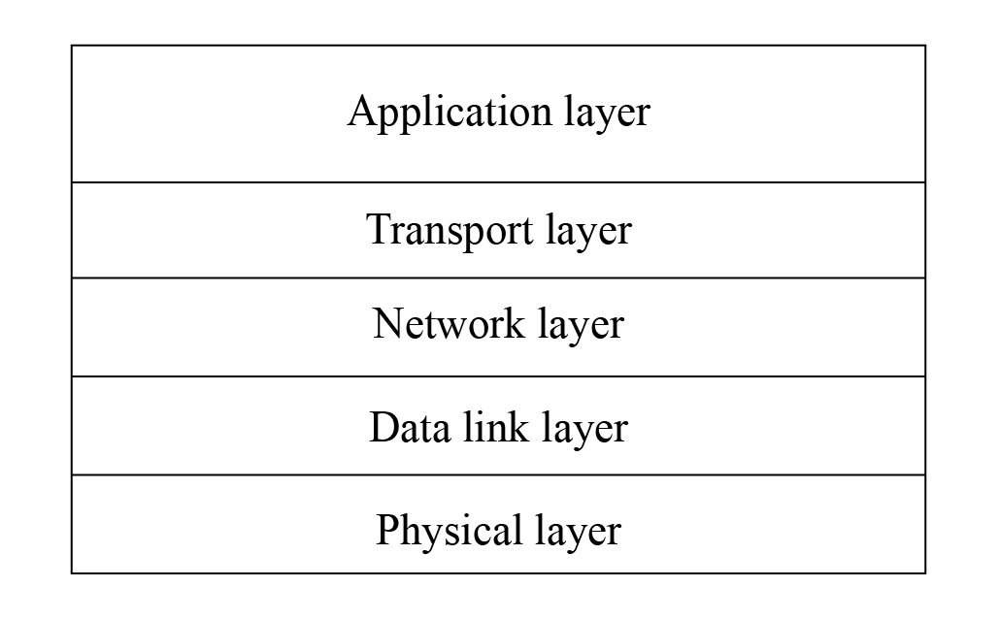

# Transmission Control Protocol (TCP)

TCP is one of the major protocols in the Internet protocol family. In the TCP/IP model, TCP serves as the transport layer protocol, providing reliable data transmission for application layer protocols such as HTTP, MQTT, FTP, etc. The TCP/IP model is shown in Figure 8.2.

<figure align="center">
    
    <figcaption>Figure 8.2. TCP/IP model</figcaption>
</figure>

### 1. Introduction to TCP

TCP is a connection-oriented, reliable, byte-stream-based communication protocol at the transport layer, defined by RFC 793 of IETF.

-   **Connection-oriented**. Before sending data using TCP, a connection
    must be established between the sender and receiver, which is
    commonly referred to as a three-way handshake.

-   **Reliable**. When sending data using TCP, the receiver's receipt
    can be guaranteed. If data is lost, the lost data will be
    retransmitted. TCP can also ensure that the receiver receives data
    in order.

-   **Byte-stream-based**. When sending data using TCP, the application
    layer data is first written into the TCP buffer. Then, TCP controls
    the transmission of data in a byte-stream-based manner, which is
    independent of the length of the message written by the application
    layer. Therefore, it is a byte-stream-based protocol.

The process of TCP sending upper-layer application data to the receiver is as follows:

<ol type="i">
<li style="margin-bottom:0.5em">The upper-layer application program writes the application data into the TCP buffer.</li>
<li style="margin-bottom:0.5em">The TCP buffer packages the data into a TCP message and sends it to the network layer.</li>
<li style="margin-bottom:0.5em">The receiver receives the TCP message and puts it into the TCP buffer.</li>
<li style="margin-bottom:0.5em">After a certain amount of data is received, the data is sorted and reorganised before being reported to the application layer.</li>
</ol>

The process of sending and receiving data using TCP is shown in Figure 8.3.

<figure align="center">
    
    <figcaption>Figure 8.3. Data sending and receiving process using TCP</figcaption>
</figure>

### 2. Creating a TCP server using socket

> 📝 **Source code**
>
> For the source code of the function `esp_create_tcp_server()`, please refer to [`book-esp32c3-iot-projects/test_case/tcp_socket`](https://github.com/espressif/book-esp32c3-iot-projects/tree/main/test_case/tcp_socket).

The function `esp_create_tcp_server()` can create a TCP server, including creating a TCP socket, configuring and binding the port, listening, receiving data, and sending data. Compared with TCP clients, UDP servers and clients, the code flow of TCP servers is more complicated, and involves two socket functions, `listen` and `accept`, which are unique to TCP servers. The code is as below:

```c
esp_err_t esp_create_tcp_server(void)
{
    int len;
    int keepAlive = 1;
    int keepIdle = 5;
    int keepInterval = 5;
    int keepCount = 3;
    char rx_buffer[128] = {0};
    char addr_str[32] = {0};
    esp_err_t err = ESP_FAIL;
    struct sockaddr_in server_addr;

    //Create a TCP socket
    int listenfd = socket(AF_INET, SOCK_STREAM, 0);
    if (listenfd < 0) {
        ESP_LOGE(TAG, "create socket error");
        return err;
    }
    ESP_LOGI(TAG, "create socket success, listenfd : %d", listenfd);

    //Enable SO_REUSEADDR, allowing the server to bind the connected address
    int opt = 1;
    int ret = setsockopt(listenfd, SOL_SOCKET, SO_REUSEADDR, &opt, sizeof(opt));
    if (ret < 0) {
        ESP_LOGE(TAG, "Failed to set SO_REUSEADDR. Error %d", errno);
        goto exit;
    }

    //Bind the server to an interface with all-zero IP address and port number 3333
    server_addr.sin_family = AF_INET;
    server_addr.sin_addr.s_addr = INADDR_ANY;
    server_addr.sin_port = htons(3333);
    ret = bind(listenfd, (struct sockaddr *) &server_addr, sizeof(server_addr));
    if (ret < 0) {
        ESP_LOGE(TAG, "bind socket failed, socketfd: %d, errno : %d", listenfd, errno);
        goto exit;
    }
    ESP_LOGI(TAG, "bind socket success");
    ret = listen(listenfd, 1);
    if (ret < 0) {
        ESP_LOGE(TAG, "listen socket failed, socketfd : %d, errno : %d", listenfd, errno);
        goto exit;
    }
    ESP_LOGI(TAG, "listen socket success");
    while (1) {
        struct sockaddr_in source_addr;
        socklen_t addr_len = sizeof(source_addr);

        //Wait for new TCP connection, and return the communicating socket with the peer
        int sock = accept(listenfd, (struct sockaddr *)&source_addr, &addr_len);
        if (sock < 0) {
            ESP_LOGE(TAG, "Unable to accept connection: errno %d", errno);
            break;
        }

        //Enable TCP keep-alive function to prevent zombie clients
        setsockopt(sock, SOL_SOCKET, SO_KEEPALIVE, &keepAlive, sizeof(int));
        setsockopt(sock, IPPROTO_TCP, TCP_KEEPIDLE, &keepIdle, sizeof(int));
        setsockopt(sock, IPPROTO_TCP, TCP_KEEPINTVL,&keepInterval, sizeof(int));
        setsockopt(sock, IPPROTO_TCP, TCP_KEEPCNT, &keepCount, sizeof(int));
        if (source_addr. sin_family == PF_INET) {
            inet_ntoa_r(((struct sockaddr_in *)&source_addr)->sin_addr, addr_str, sizeof(addr_str) - 1);
        }
        ESP_LOGI(TAG, "Socket accepted ip address: %s", addr_str);
        do {
            len = recv(sock, rx_buffer, sizeof(rx_buffer) - 1, 0);
            if (len < 0) {
                ESP_LOGE(TAG, "Error occurred during receiving: errno %d", errno);
            } else if (len == 0) {
                ESP_LOGW(TAG, "Connection closed");
            } else {
                rx_buffer[len] = 0;
                ESP_LOGI(TAG, "Received %d bytes: %s", len, rx_buffer);
            }
        } while (len > 0);
        shutdown(sock, 0);
        close(sock);
    }
exit:
    close(listenfd);
    return err;
}
```

The above code creates a TCP server and listens to the application data on port 3333. The socket option `SO_REUSEADDR` allows the server to bind to the address of an already established connection, which is useful for the code on the server side. The socket option `SO_KEEPALIVE` enables the TCP keep-alive function, which can detect some abnormally disconnected clients and prevent them from occupying server processes. Socket options `TCP_KEEPIDLE`, `TCP_KEEPINTVL` and `TCP_KEEPCNT` correspond to the idle time since the last data sent by the peer, the interval time for sending TCP keep-alive messages, and the maximum number of retries for sending messages, respectively. For example, if a TCP client sets `TCP_KEEPIDLE` to 5, it means that if there is no data communication between the client and the server within 5 seconds, the client needs to send a TCP keep-alive message to the server; if the client sets `TCP_KEEPINTVL` to 5, it means that if the client sends a TCP keep-alive message to the server and the server does not reply within 5 seconds, the client needs to resend the message to the server; if the client sets `TCP_KEEPCNT` to 3, it means that the client can retry sending the TCP keep-alive message to the server for a maximum of 3 times.

### 3. Creating a TCP client using socket

> 📝 **Source code**
>
> For the source code of the function `esp_create_tcp_client()`, please refer to [`book-esp32c3-iot-projects/test_case/tcp_socket`](https://github.com/espressif/book-esp32c3-iot-projects/tree/main/test_case/tcp_socket).

The function `esp_create_tcp_client()` can create a TCP connection between a TCP client and a server, including creating of a TCP socket, configuring the destination address and port, connecting, and sending data. The code is as below:

```c
#define HOST_IP "192.168.3.80"
#define PORT 3333

esp_err_t esp_create_tcp_client(void)
{
    esp_err_t err = ESP_FAIL;
    char *payload = "Open the light";
    struct sockaddr_in dest_addr;
    dest_addr.sin_addr.s_addr = inet_addr(HOST_IP);
    dest_addr.sin_family = AF_INET;
    dest_addr.sin_port = htons(PORT);

    //Create a TCP socket
    int sock = socket(AF_INET, SOCK_STREAM, 0);
    if (sock < 0) {
        ESP_LOGE(TAG, "Unable to create socket: errno %d", errno);
        return err;
    }
    ESP_LOGI(TAG, "Socket created, connecting to %s:%d", HOST_IP, PORT);

    //Connect to the TCP server
    int ret = connect(sock, (struct sockaddr *)&dest_addr, sizeof(dest_addr));
    if (ret ! = 0) {
        ESP_LOGE(TAG, "Socket unable to connect: errno %d", errno);
        close(sock);
        return err;
    }
    ESP_LOGI(TAG, "Successfully connected");

    //Send TCP data
    ret = send(sock, payload, strlen(payload), 0);
    if (ret < 0) {
        ESP_LOGE(TAG, "Error occurred during sending: errno %d", errno);
        goto exit;
    }
    err = ESP_OK;
exit:
    shutdown(sock, 0);
    close(sock);
    return err;
}
```

After the client establishes a TCP connection with the server, it sends the TCP data "Open the light" to the server. In addition to using TCP sockets, the client can also use TCP debugging tools to simulate the client for TCP connection.

Based on the above TCP client and server code, and combined with the requirement of controlling the smart light through a smartphone, you can implement code of TCP server on the smart light device and code of TCP client on the smartphone. After establishing a TCP connection between the smartphone and the smart light, the smartphone can send data. For example, in the above code, the TCP client sends the data "Open the light"; and after the smart light receives the data, it can turn on the light by pulling up the GPIO pin level of the smart light.
