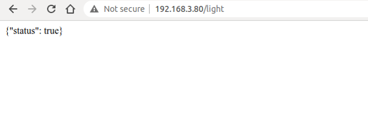
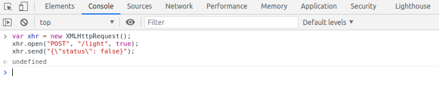
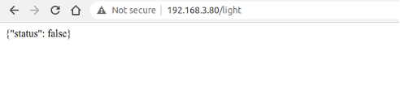

# HyperText Transfer Protocol (HTTP)

HTTP is an application protocol based on the transport layer. It is the data communication foundation of the World Wide Web (WWW or Web), which specifies the format and method of data transmission between clients and servers. Clients can use HTTP to obtain the on/off status of the smart light (GET) or turn the smart light on and off (POST) through HTTP requests, and each operation will have a response from the peer. Therefore, HTTP is completer and more reasonable in applications than simple TCP.

### 1. Introduction to HTTP

HTTP is a standard for requests and responses between clients (users) and servers (websites). The client establishes a TCP connection with the server through a web browser, web crawler or other tools, and then sends requests to read server data, upload data or forms to the server, and read the response status of the server, such as "HTTP/1.1 200 OK", as well as the returned content (such as requested files, error messages or other information). Resources requested through HTTP are identified by uniform resource identifiers (URIs).

In versions 0.9 and 1.0 of HTTP, the TCP connection is closed after each request and response. In version 1.1 of HTTP, a mechanism for maintaining the connection was introduced, allowing a connection to repeat multiple requests and responses, reducing TCP handshake time and network overhead before each data request.

Common HTTP request methods include:

-   **GET**: Request the specified URI resource.
-   **POST**: Submit data to the specified URI resource and request the
    server to process it (such as submitting a form or uploading a
    file).
-   **DELETE**: Request the server to delete the resource identified by
    the URI.

For local control of smart lights, you can use the GET method to obtain their status, and use the POST method to control them.

### 2. Creating an HTTP server using ESP-IDF component

> 📝 **Source code**
>
> For the source code of the function `esp_start_webserver()`, please refer to [`book-esp32c3-iot-projects/test_case/https_server`](https://github.com/espressif/book-esp32c3-iot-projects/tree/main/test_case/https_server).

The function `esp_start_webserver()` can create an HTTP server. The callback functions corresponding to the GET and POST operations on the server side are defined as `esp_light_get_handler()` and `esp_light_set_handler()` respectively, and must be registered through the function `httpd_register_uri_handler()` after calling the function `httpd_start()` on the server side.

```c
char buf[100] = "{\\"status\\": true}";
//Callback function of the HTTP GET request
esp_err_t esp_light_get_handler(httpd_req_t *req)
{
    //Send data in JSON containing the status of smart lights to the client
    httpd_resp_send(req, buf, strlen(buf));
    return ESP_OK;
}

//Callback function of the HTTP POST request
esp_err_t esp_light_set_handler(httpd_req_t *req)
{
    int ret, remaining = req->content_len;
    memset(buf, 0 , sizeof(buf));
    while (remaining > 0) {
        //Read HTTP request data
        if ((ret = httpd_req_recv(req, buf, remaining)) <= 0) {
            if (ret == HTTPD_SOCK_ERR_TIMEOUT) {
                continue;
            }
            return ESP_FAIL;
        }
        remaining -= ret;
    }
    ESP_LOGI(TAG, "%.*s", req->content_len, buf);

    //TODO: Read and parse the data; then control the smart light
    return ESP_OK;
}

//Callback function corresponding to GET
static const httpd_uri_t status = {
    .uri = "/light",
    .method = HTTP_GET,
    .handler = esp_light_get_handler,
};

//Callback function corresponding to POST
static const httpd_uri_t ctrl = {
    .uri = "/light",
    .method = HTTP_POST,
    .handler = esp_light_set_handler,
};

esp_err_t esp_start_webserver()
{
    httpd_handle_t server = NULL;
    httpd_config_t config = HTTPD_DEFAULT_CONFIG();
    config.lru_purge_enable = true;

    //Start the HTTP server
    ESP_LOGI(TAG, "Starting server on port: '%d'", config. server_port);
    if (httpd_start(&server, &config) == ESP_OK) {
        //Set the callback function corresponding to the HTTP URI
        ESP_LOGI(TAG, "Registering URI handlers");
        httpd_register_uri_handler(server, &status);
        httpd_register_uri_handler(server, &ctrl);
        return ESP_OK;
    }
    ESP_LOGI(TAG, "Error starting server!" );
    return ESP_FAIL;
}
```

The above code implements an HTTP server for querying and setting the status of the smart light. When accessing `http://[ip]/light` through a browser, the browser will return `{"status": true}` (as shown in Figure 8.4) or `{"status": false}` to indicate the status of the smart light.

<figure align="center">
    
    <figcaption>Figure 8.4. Using HTTP to query the status of the smart light</figcaption>
</figure>

Press F12 on the current page to enter the Console. Enter the following command and press "Enter" to send a POST request.

<pre><code>$ <b>var xhr = new XMLHttpRequest();</b>
$ <b>xhr.open("POST", "192.168.3.80/light", true);</b>
$ <b>xhr.send("{\"status\": false}");</b>
</code></pre>

Figure 8.5 shows how to use HTTP to set the status of the smart light.

<figure align="center">
    
    <figcaption>Figure 8.5. Using HTTP to set the status of the smart light</figcaption>
</figure>

At this point, the server will receive the HTTP POST request `{"status": false}`. The log of using HTTP to set the status of the smart light is as follows:

```console
I (773) wifi:mode:sta (30:ae:a4:80:48:98)
I (773) wifi:enable tsf 
I (773) wifi station: wifi init sta finished. 
I (793) wifi:new: <6,0>, old: <1,0>, ap: <255,255>, sta: <6,0>, prof:1 
I (793) wifi:state: init -> auth (be) 
I (813) wifi:state: auth -> assoc (0) 
I (823) wifi:state: assoc -> run (10) 
I (873) wifi:connected with myssid, aid = 1, channel 6, BW20, bssid = 34:29:12:43:c5:40
I (873) wifi:security: WPA2-PSK, phy: bgn, rssi: -21 
I (883) wifi:pm start, type: 1 
I (943) wifi:AP's beacon interval = 102400 us, DTIM period = 1 
I (1543) esp netif handlers: sta ip: 192.168.3.80, mask: 255.255.255.0, gw: 192.168.3.1
I (1543) wifi station: got ip:192.168.3.80
I (1543) wifi station: connected to ap SSID: myssid password: 12345678
I (1553) wifi station: Starting server on port: '80'
I (1563) wifi station: Registering URI handlers 
W (11393) wifi:<ba-add>idx:0 (ifx:0,34:29:12:43:c5:40), tid:7, ssn:4, winSize:64
I (11413) wifi station: {"status": false}
```

Refreshing the current page at this time can continue to query the status of the smart light, and the previously set status will be displayed, as shown in Figure 8.6.

<figure align="center">
    
    <figcaption>Figure 8.6. Displaying the modified status of the smart light</figcaption>
</figure>
