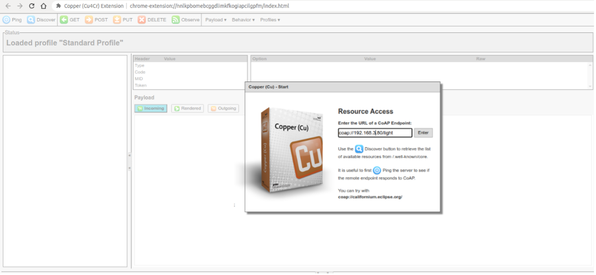
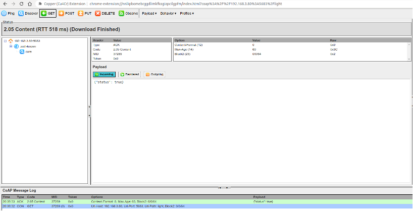
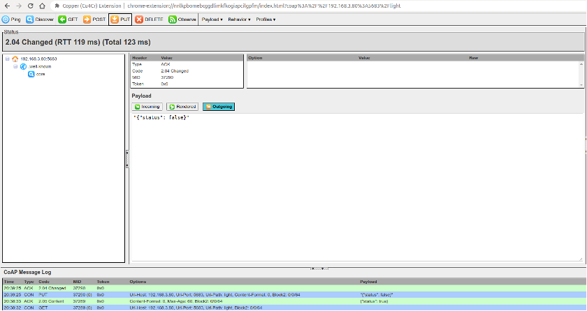
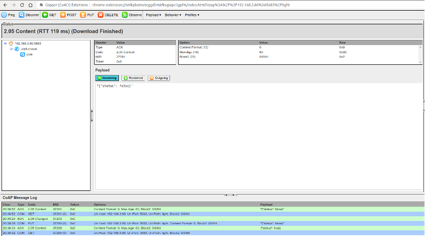

# Constrained Application Protocol (CoAP)

With the rapid development of IoT technology, a series of protocols have been created for IoT devices. Most IoT devices have limited resources, such as RAM, flash, CPU, network bandwidth, etc. More memory and network bandwidth are often required if they want to use TCP and HTTP protocols for data transmission. If UDP can be used for data transmission, is there an application protocol similar to HTTP? The answer is yes, CoAP is designed according to the REST architecture of HTTP.

### 1. Introduction to CoAP

CoAP is a protocol similar to web applications in IoT devices. It is defined in RFC 7252 and can be used for resource-constrained IoT devices, allowing those resource-constrained devices called nodes to communicate with a wider range of the Internet using similar protocols. CoAP is designed for devices on the same constrained network (such as low-power, lossy networks), between devices and general nodes on the Internet, and between devices on different constrained networks connected by the Internet.

CoAP is based on the request and response model, similar to HTTP, which can make up for the shortcomings of unreliable transmission of UDP and ensure that data is not lost or disordered. The server's resources are identified by URLs (such as `coap://[IP]/id/light_status`) to access the status of a smart light. The client accesses the server's resources through the URL of a resource and operate the server's resources through four request methods (GET, PUT, POST, and DELETE).

CoAP also has the following features:

-   Both the client and server can independently send requests to each other.
-   Supports reliable data transmission. 
-   Supports multicast and broadcast, enabling one-to-many data
    transmission. 
-   Supports communication with low power consumption and non-persistent
    connections.
-   Compared with HTTP, its header is lighter.

### 2. Creating a CoAP server using ESP-IDF component

The following code shows how to create a CoAP server using ESP-IDF component, which provides GET and PUT operations for resource retrieval and modification in CoAP. CoAP protocol operations are generally fixed, and you only need to focus on your own resource URI paths and the operations you need to provide. The function `coap_resource_init()` can be used to set the URI for resource access, and the function `coap_register_handler()` can be used to register GET and PUT callback functions corresponding to the resource URI.

> 📝 **Source code**
>
> For the source code of the functions `coap_resource_init()` and `coap_register_handler()`, please refer to [`book-esp32c3-iot-projects/test_case/coap`](https://github.com/espressif/book-esp32c3-iot-projects/tree/main/test_case/coap).

```c
static char buf[100] = "{\"status\": true}";

//Callback function of GET method in CoAP
static void esp_coap_get(coap_context_t *ctx, coap_resource_t *resource,
                        coap_session_t *session, coap_pdu_t *request,
                        coap_binary_t *token, coap_string_t *query,
                        coap_pdu_t *response)
{
    coap_add_data_blocked_response(resource, session, request, response,
                                  token, COAP_MEDIATYPE_TEXT_PLAIN, 0,
                                  strlen(buf), (const u_char *)buf);
}

//Callback function of PUT method in CoAP
static void esp_coap_put(coap_context_t *ctx, coap_resource_t *resource,
                        coap_session_t *session, coap_pdu_t *request,
                        coap_binary_t *token, coap_string_t *query,
                        coap_pdu_t *response)
{
    size_t size;
    const unsigned char *data;
    coap_resource_notify_observers(resource, NULL);

    //Read the received CoAP protocol data
    (void)coap_get_data(request, &size, &data);
    if (size) {
        if (strncmp((char *)data, buf, size)) {
            memcpy(buf, data, size);
            buf[size] = 0;
            response->code = COAP_RESPONSE_CODE(204);
        } else {
            response->code = COAP_RESPONSE_CODE(500);
        }
    } else { //A size of 0 indicates a receiving error
        response->code = COAP_RESPONSE_CODE(500);
    }
}

static void esp_create_coap_server(void)
{
    coap_context_t *ctx = NULL;
    coap_address_t serv_addr;
    coap_resource_t *resource = NULL;
    while (1) {
        coap_endpoint_t *ep = NULL;
        unsigned wait_ms;

        //Create a CoAP server socket
        coap_address_init(&serv_addr);
        serv_addr.addr.sin6.sin6_family = AF_INET6;
        serv_addr.addr.sin6.sin6_port = htons(COAP_DEFAULT_PORT);

        //Create CoAP ctx
        ctx = coap_new_context(NULL);
        if (!ctx) {
            ESP_LOGE(TAG, "coap_new_context() failed");
            continue;
        }

        //Set the CoAP protocol node
        ep = coap_new_endpoint(ctx, &serv_addr, COAP_PROTO_UDP);
        if (!ep) {
            ESP_LOGE(TAG, "udp: coap_new_endpoint() failed");
            goto clean_up;
        }

        //Set CoAP protocol resource URI
        resource = coap_resource_init(coap_make_str_const("light"), 0);
        if (!resource) {
            ESP_LOGE(TAG, "coap_resource_init() failed");
            goto clean_up;
        }

        //Register callback functions of GET and PUT methods corresponding to CoAP resource URI
        coap_register_handler(resource, COAP_REQUEST_GET, esp_coap_get);
        coap_register_handler(resource, COAP_REQUEST_PUT, esp_coap_put);

        //Set CoAP GET resource observable
        coap_resource_set_get_observable(resource, 1);

        //Add resource to CoAP ctx
        coap_add_resource(ctx, resource);
        wait_ms = COAP_RESOURCE_CHECK_TIME * 1000;
        while (1) {
            //Wait to receive CoAP data
            int result = coap_run_once(ctx, wait_ms);
            if (result < 0) {
                break;
            } else if (result && (unsigned)result < wait_ms) {
                //Decrease waiting time
                wait_ms -= result;
            } else {
                //Reset waiting time
                wait_ms = COAP_RESOURCE_CHECK_TIME * 1000;
            }
        }
    }
clean_up:
    coap_free_context(ctx);
    coap_cleanup();
}
```

The above code creates a CoAP server, and provides the GET method to query the status of the smart light and the PUT method to set the status of the smart light. You can use the Chrome browser to install CoAP to debug the client Copper plugin and simulate the CoAP client.

Open the Chrome plugin Copper, enter the `URL coap://[ip]/light`, and press "Enter" to connect to the server. Figure 8.7 shows the connection of the CoAP plugin.

<figure align="center">
    
    <figcaption>Figure 8.7. Connection of CoAP plugin</figcaption>
</figure>

After the connection is successful, click the "GET" button in the upper left corner to get the status and display `{"status": true}`, the query status of CoAP plugin is shown in Figure 8.8.

<figure align="center">
    
    <figcaption>Figure 8.8. Query status of CoAP plugin</figcaption>
</figure>

Click the "PUT" button in the upper left corner, and modify the data in "Payload" → "Outgoing" to `{"status": false}` to set the status of the smart light to `false`. Figure 8.9 shows the configuration status of the CoAP plugin.

<figure align="center">
    
    <figcaption>Figure 8.9. Setting status of CoAP plugin</figcaption>
</figure>

At this time, click the "GET" button in the upper left corner again to get the status, which displays `{"status": false}`. Figure 8.10 shows the query setting status of the CoAP plugin.

<figure align="center">
    
    <figcaption>Figure 8.10. Query setting status of CoAP plugin</figcaption>
</figure>
