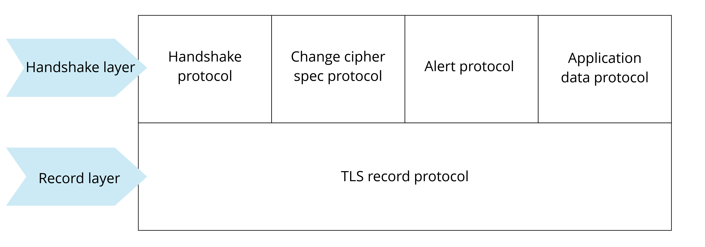
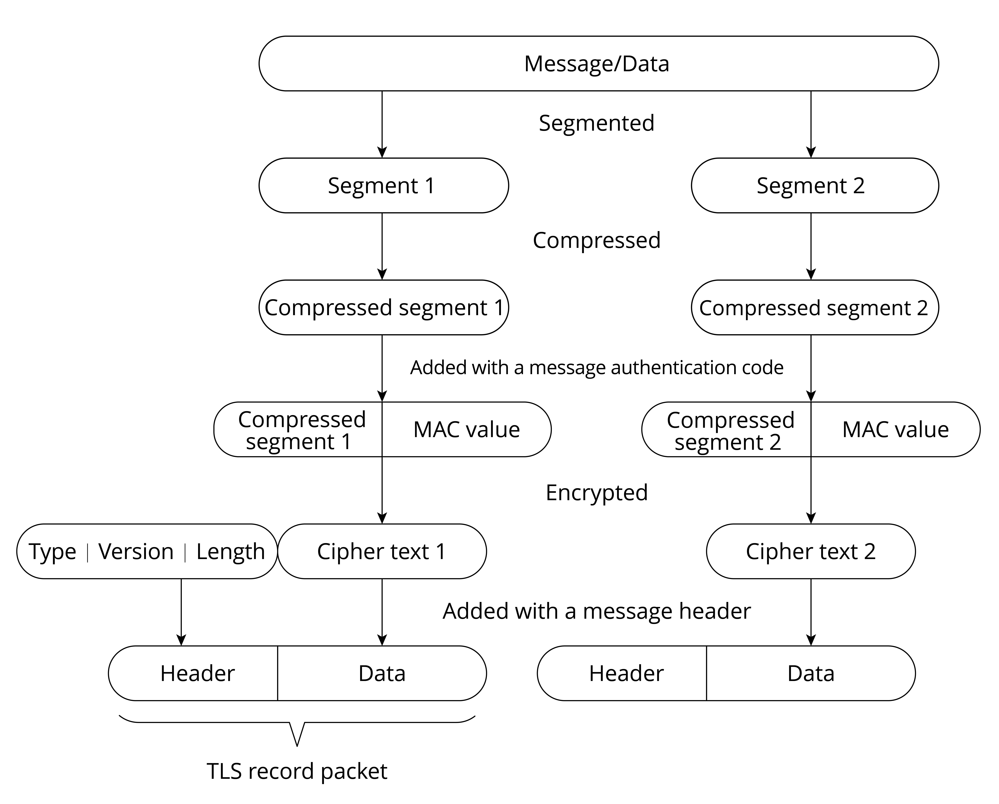
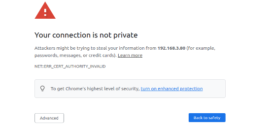
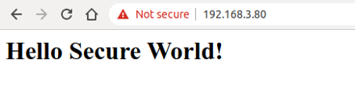
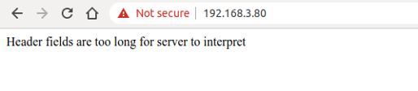

# Introduction to Transport Layer Security (TLS)

TLS is a protocol based on TCP and serves the application layer. Its
predecessor is the Secure Socket Layer (SSL) protocol. Through the TLS
protocol, the packets of the application layer can be encrypted and
delivered to the TCP layer for transmission.

### 1. What does TLS do?

The TLS protocol mainly solves the following three network problems:

-   Guarantee data confidentiality. All data is transmitted encrypted to
    ensure protection against unauthorised access or data theft by third
    parties.

-   Guarantee data integrity. All data is protected by a verification
    mechanism, so any tampering will be immediately detected by both
    parties involved in the communication.

-   Guarantee the authentication and identity verification of both
    parties involved in data communication. Certificate authentication
    can be employed by both parties in the communication to ensure the
    legitimacy of their identities.

### 2. How does TLS work?

The TLS protocol can be divided into two parts. The **record layer**
uses the key negotiated by the client and the server to encrypt and
transmit data. The **handshake layer** negotiates between the client and
the server to determine a set of key strings for data transmission
encryption. The TLS protocol model is shown in Figure 8.13, where the
handshake layer includes four sub-protocols: handshake protocol, change
cipher spec protocol, application data protocol, and alert protocol.

<figure align="center">
    
    <figcaption>Figure 8.13. TLS protocol model</figcaption>
</figure>

Record layer is responsible for all the underlying data exchanged at the
transport layer and can encrypt data. Each TLS record begins with a
short header, which includes the Content Type (or subprotocol), Protocol
Version, and Length fields. The underlying data is segmented (or
merged), compressed, added with a message authentication code,
encrypted, and then converted into the data part of the TLS record.
Figure 8.14 shows the structure of a TLS record packet.

<figure align="center">
    
    <figcaption>Figure 8.14. TLS record packet</figcaption>
</figure>

Handshake layer has four sub-protocols, which are introduced in the list
below.

#### Handshake protocol

Responsible for generating the shared key required for the communication
process and performing identity authentication. Note that the handshake
protocol does not use cipher suites directly. Instead, it relies on
public key cryptography or Diffie-Hellman key exchange to establish
secure communication and prevent data from being eavesdropped or
intercepted.

#### Change cipher spec protocol

Responsible for the synchronisation of password switching, and is used
after the handshake protocol. During the handshake process, the 'null'
cipher suite, which means no encryption, is used. After the handshake is
completed, the negotiated cipher suite is used for securing the
subsequent data transfer.

#### Application data protocol

Used by the communicating parties for data transmission. The
transmission process is carried out through the application data
protocol and TLS record protocol of the handshake layer.

#### Alert protocol

Used to notify the other party when an error occurs, such as an
exception during the handshake process, a message authentication code
error, or data that cannot be decompressed.

The algorithm used during TLS encryption is introduced in the list
below.

-   **Hash function** verifies data integrity. Common encryption
    algorithms include MD5, SHA, etc.
-   **Symmetric encryption** algorithm encrypts the application data.
    Common encryption algorithms include AES, RC4, DES, etc.
-   **Asymmetric encryption** algorithm for identity authentication and
    key agreement. Common encryption algorithms include RSA, DH, etc.

When using TLS, the client and server use asymmetric encryption
algorithm to authenticate identity and negotiate the key of symmetric
encryption algorithm, and then use symmetric encrypted data and data
digest for data communication. Figure 8.15 shows the TLS handshake
process.

<figure align="center">
    
    <figcaption>Figure 8.15. TLS handshake process</figcaption>
</figure>

1.  Client Hello. The client sends the highest version of the supported
    TLS protocol and all the cipher suites it supports, which are used
    to send information such as the random number for generating the
    session key to the server.

2.  Server Hello. After receiving the Client Hello message sent by the
    client, the server selects the TLS protocol version and a cipher
    suite according to the protocol version and cipher suite sent by the
    client, and returns them to the client.

3.  (Optional) Send Certificate. The server sends its own server-side
    certificate to the client, which is used by the client to verify the
    legitimacy of the server.

4.  (Optional) Request Certificate. When the server needs to verify the
    client's certificate, the server will send a certificate request
    message to the client if mutual authentication is selected.

5.  Server Hello Done. The server informs the client that the server has
    sent all the handshake messages, and the server will wait for the
    client to send messages.

6.  (Optional) Response Certificate. If mutual authentication is
    selected, the client will send its certificate to the server. Then
    the server will verify the identity of the client.

7.  Client Key Exchange. The client uses the server's public key to
    encrypt the client's public key and key seed before sending them to
    the server.

8.  (Optional) Certificate Verify. If mutual authentication is selected,
    the client uses the local private key to generate a digital
    signature and sends it to the server for authentication through the
    received client public key.

9.  Create Secret Key. The communicating parties generate the
    communication key based on information such as the key seed.

10. Change Cipher Spec. The client notifies the server that the
    communication method has been switched to encrypted mode.

11. Finished. The client is ready for encrypted communication.

12. Change Cipher Spec. The server notifies the client that the
    communication method has been switched to the encrypted mode.

13. Finished. Prepare for encrypted communication on the server side.

14. Encrypted/Decrypted Data. Both parties use the client key to
    encrypt/decrypt the communication content through a symmetric
    encryption algorithm.

15. Closed Connection. After the communication is over, either party
    sends a message to disconnect the TLS connection.

### 3. Creating an HTTP+TLS server with ESP-IDF

HTTPS, namely HTTP over SSL, encrypts HTTP data through the SSL or TLS
protocol. Compared with HTTP, HTTPS can prevent data from being stolen
or changed during transmission, thus ensuring data integrity. Section
8.3.2 introduces how to use ESP-IDF to create an HTTP server. In fact,
creating an HTTPS server is similar. Call `httpd_ssl_start()` to start
the HTTP+TLS service, and call `httpd_register_uri_handler()` to
register the corresponding callback function.

> 📝 **Source code**
>
> For the source code of functions `httpd_ssl_start()` and `httpd_register_uri_handler()`, please refer to [`book-esp32c3-iot-projects/test_case/https_server`](https://github.com/espressif/book-esp32c3-iot-projects/tree/main/test_case/https_server).

```c
static esperr_t root_get_handler(httpd_req_t *req)
{
    httpd_resp_set_type(req, "text/html");
    httpd_resp_send(req, "<h1>Hello Secure World! </h1>", HTTPD_RESP_USE_STRLEN);
    return ESP_OK;
}

static const httpd_uri_t root = {
    .uri       = "/",
    .method = HTTP_GET,
    .handler   = root_get_handler
};

esp_err_t esp_create_https_server(void)
{
    httpd_handle_t server = NULL;
    ESP_LOGI(TAG, "Starting server");
    httpd_ssl_config_t conf = HTTPD_SSL_CONFIG_DEFAULT();
    //Configure CA certificate and private key for the server
    extern const unsigned char cacert_pem_start[] asm("_binary_cacert_pem_start");
    extern const unsigned char cacert_pem_end[] asm("_binary_cacert_pem_end");
    conf.cacert_pem = cacert_pem_start;
    conf.cacert_len = cacert_pem_end - cacert_pem_start;
    extern const unsigned char prvtkey_pem_start[] asm("_binary_prvtkey_pem_start");
    extern const unsigned char prvtkey_pem_end[] asm("_binary_prvtkey_pem_end");
    conf.prvtkey_pem = prvtkey_pem_start;   
    conf.prvtkey_len = prvtkey_pem_end - prvtkey_pem_start;
    //Start the HTTP+TLS server
    esp_err_t ret = httpd_ssl_start(&server, &conf);
    if (ESP_OK ! = ret) {
        ESP_LOGI(TAG, "Error starting server!" );
        return ESP_FAIL;
    }
    //Set URI callback function
    ESP_LOGI(TAG, "Registering URI handlers");
    httpd_register_uri_handler(server, &root);
    return ESP_OK;
}
```

The above code provides an example of how to create an HTTPS server.
Before using this code, please manually create a CA certificate and a
private key in the `main` directory using the following command:

<pre><code>$ <b>openssl req -newkey rsa:2048 -nodes -keyout prvtkey.pem -x509 -days 3650 -out cacert.pem -subj "/CN=ESP32 HTTPS server example"</b>
</code></pre>

Then modify the `MakeLists.txt` file to compile the certificate into the
code.

```c
idf_component_register(SRCS "station_example_main.c" INCLUDE_DIRS "."
                      EMBED_TXTFILES "cacert.pem" "prvtkey.pem")
```

In addition, you also need to go to `idf.py menuconfig → Component config → ESP HTTPS server`, and configure `CONFIG_ESP_HTTPS_SERVER_ENABLE`.

Enter `https://[your device IP]:443/` in the Chrome browser. The CA
certificate on the server side is not issued by a certification
authority, thus it is not trusted. Therefore, you will see the screen
shown in Figure 8.16.

<figure align="center">
    
    <figcaption>Figure 8.16. Interface of untrusted HTTPS connection</figcaption>
</figure>

Users need to click the "Advanced" button to allow this untrusted
connection. Figure 8.17 shows the interface of a successful HTTPS
connection.

<figure align="center">
    
    <figcaption>Figure 8.17. Interface of successful HTTPS connection</figcaption>
</figure>

Should you encounter a "Header fields are too long for server to interpret" message, just go to `idf.py menuconfig → Component config → HTTP Server → Max HTTP Request Header Length`, and increase `HTTPD_MAX_REQ_HDR_LEN`. Figure 8.18 shows the interface where the HTTPS connection fails.

<figure align="center">
    
    <figcaption>Figure 8.18. Interface of HTTPS connection failure</figcaption>
</figure>
