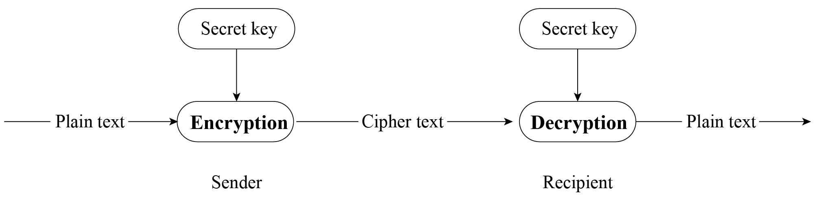

# Guarantee of Data Security

As we all know, TCP and UDP, as well as the application protocols HTTP and CoAP that run on top of them, transmit data in plaintext. This can lead to data being intercepted or tampered with during transmission. If sensitive information such as passwords or account numbers is included in the data, irreparable losses may occur. Therefore, it is necessary to encrypt the data transmitted in plaintext. For data transmitted via Bluetooth, since the Bluetooth is a point-to-point protocol, the data will not leak onto the network and the probability of it being intercepted is very low. In addition, the Bluetooth protocol itself encrypts user data. Therefore, this section mainly discusses the data encryption of TCP/IP.

Encryption is used to ensure confidentiality and integrity of transmitted data. Common encryption systems usually encode data before transmission. For example, in previous wars, telegrams were encoded and both the sender and receiver had the same codebook. The receiver used the numbers or letters in the codebook to replace the words or sentences in the telegram. Even if the telegram content was intercepted by a third
party, the third party could not decipher the true content of the
telegram in a short time. However, this method has a flaw that the
telegram content is still susceptible to being deciphered, which is just
a matter of time. In addition, to prevent the telegram from being
deciphered, the receiver and sender need to periodically change the
codebook. This may also lead to the codebook being leaked and the
telegram content being deciphered.

The telegram example above presents an application scenario of a common encryption algorithm &ndash; the symmetric encryption. In symmetric encryption, the same algorithm is used for encryption and decryption, and their keys are also the same. Symmetric encryption has the advantages of open algorithm, small computational complexity, fast encryption speed, and high encryption efficiency. However, before data transmission, the sender and receiver must agree on the key, and in order to ensure that the data is not deciphered, both parties must also periodically update the key, which makes key management a burden for both parties. Common symmetric encryption algorithms include AES, DES, and RC4. Figure 8.11 shows the process of symmetric encryption.

<figure align="center">
    
    <figcaption>Figure 8.11. Process of symmetric encryption</figcaption>
</figure>

In this section, we will introduce the algorithm that is opposite to
symmetric encryption, asymmetric encryption. Both parties in asymmetric
encryption have a pair of public key and private key. Data is encrypted
using the public key, and decrypted using the private key. Because
different keys are used for encryption and decryption, this encryption
algorithm is called asymmetric encryption. Compared with symmetric
encryption, asymmetric encryption is more secure. Because asymmetric
encryption is more complex than symmetric encryption, it takes longer
time to decrypt, and it is difficult for third parties to directly
decipher the data. Because the asymmetric encryption algorithm has high
complexity and the private key used for decryption is not transmitted on
the network, which can only be obtained by the recipient, this greatly
improves data security. Common asymmetric encryption algorithms include
RSA, Diffie-Hellman, DSA, etc.

The advantage of asymmetric encryption is its security. User A can keep the private key and transmit the public key to user B through the network. Even if user C obtains the public key, user C cannot decipher the data because user C does not have user A's private key. In this way, user A and user B can confidently transmit their respective public keys through the network. Remember, the public key is used for encryption, and the private key is used for decryption. Figure 8.12 shows the process of asymmetric encryption.

<figure align="center">
    
    <figcaption>Figure 8.12. Process of asymmetric encryption</figcaption>
</figure>

Asymmetric encryption seems very secure, but have you ever thought about
this question: what if user C replaces all the public keys sent to user
A and user B with its own corresponding private key's public key? User A
does not know whether this public key belongs to user B, so when user A
sends data, it will use user C's public key for encryption. At this
time, user C can steal the ciphertext data and decrypt it using the
corresponding private key. Therefore, it is crucial to ensure the
legitimacy of the public key. In reality, the legitimacy of the public
key can be ensured through a Certificate Authority (CA). CA also works
based on asymmetric encryption algorithms. With CA, user B will first
give its public key and some other information to CA. CA encrypts this
data using its private key, and the encrypted data is called user B's
digital certificate. The public key transmitted by user B to user A is
the digital certificate encrypted by the CA. After receiving the digital
certificate, user A will use the digital certificate published by CA
(which contains CA's public key) to decrypt user B's digital certificate
and obtain user B's public key.
