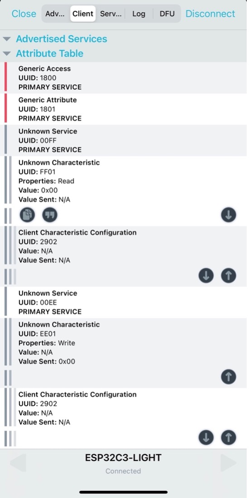

# Creating a Bluetooth-based Local Control Server

The following sample code creates a Bluetooth-based local control
server, which can be used to transmit data. You can refer to the
`gatt_server` sample. The following example implements a Bluetooth
server. You can compile and flash this example, then use a Bluetooth
debugging tool on your smartphone to scan and connect to a Bluetooth
device named `ESP32C3-LIGHT`. Once connected, you can access the
Bluetooth services provided by the device.

> 📝 **Source code**
>
> For the complete code of the `gatt_server` example, please refer to [`book-esp32c3-iot-projects/test_case/gatt_server`](https://github.com/espressif/book-esp32c3-iot-projects/tree/main/test_case/gatt_server).

This example provides two Bluetooth services: one for getting the device
status (`UUID: FF01`) and another for setting the device status
(`UUID: EE01`), as shown in Figure 8.19.

<figure align="center">
    
    <figcaption>Figure 8.19. Bluetooth services in the example</figcaption>
</figure>

The running log is as follows.

```console
I (387) GATTS_DEMO: NVS Flash initialization
I (387) GATTS_DEMO: Application driver initialization
I (397) gpio: GPIO[9]| InputEn: 1| OutputEn: 0| OpenDrain: 0| Pullup: 1| Pulldown: 0| Intr:0
W (437) BTDM_INIT: esp_bt_controller_mem_release not implemented, return OK
I (437) BTDM_INIT: BT controller compile version [501d88d]
I (437) coexist: coexist rom version 9387209
I (437) phy_init: phy_version 500,985899c,Apr 19 2021,16:05:08
I (617) system_api: Base MAC address is not set
I (617) system_api: read default base MAC address from EFUSE
I (617) BTDM_INIT: Bluetooth MAC: 68:ab:bc:a7:d8:d5
I (637) GATTS_DEMO: REGISTER_APP_EVT, status 0, app_id 0
I (647) GATTS_DEMO: CREATE_SERVICE_EVT, status 0,  service_handle 40
I (647) GATTS_DEMO: SERVICE_START_EVT, status 0, service_handle 40
I (647) GATTS_DEMO: ADD_CHAR_EVT, status 0,  attr_handle 42, service_handle 40
I (657) GATTS_DEMO: ADD_DESCR_EVT, status 0, attr_handle 43, service_handle 40
I (667) GATTS_DEMO: REGISTER_APP_EVT, status 0, app_id 1
I (677) GATTS_DEMO: CREATE_SERVICE_EVT, status 0,  service_handle 44
I (677) GATTS_DEMO: SERVICE_START_EVT, status 0, service_handle 44
I (687) GATTS_DEMO: ADD_CHAR_EVT, status 0,  attr_handle 46, service_handle 44
I (697) GATTS_DEMO: ADD_DESCR_EVT, status 0, attr_handle 47, service_handle 44
I (6687) GATTS_DEMO: ESP_GATTS_CONNECT_EVT, conn_id 0, remote 4a:13:d8:ca:b3:cf:
I (6687) GATTS_DEMO: CONNECT_EVT, conn_id 0, remote 4a:13:d8:ca:b3:cf:
I (6987) GATTS_DEMO: ESP_GATTS_MTU_EVT, MTU 500
I (6987) GATTS_DEMO: ESP_GATTS_MTU_EVT, MTU 500
I (7347) GATTS_DEMO: update connection params status = 0, min_int = 16, max_int = 32,conn_int = 24,latency = 0, timeout = 400
I (15117) GATTS_DEMO: GATT_READ_EVT, conn_id 0, trans_id 3, handle 42
I (23037) GATTS_DEMO: GATT_WRITE_EVT, conn_id 0, trans_id 4, handle 46
I (23037) GATTS_DEMO: GATT_WRITE_EVT, value len 1, value :
I (23037) GATTS_DEMO: 00 
I (23037) app_driver: Light OFF
I (30987) GATTS_DEMO: GATT_WRITE_EVT, conn_id 0, trans_id 5, handle 46
I (30987) GATTS_DEMO: GATT_WRITE_EVT, value len 1, value :
I (30987) GATTS_DEMO: 01 
I (30987) app_driver: Light ON
```
