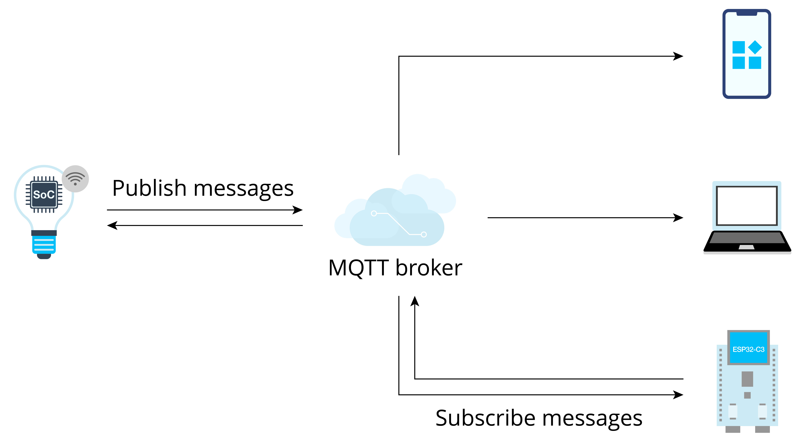

# MQTT Principles

The MQTT protocol is based on client-server communication. It defines
three roles: publisher, broker, and subscriber. The publisher and the
subscriber serve as the Client, which can both publish and subscribe
messages. The broker acts as the Server. Figure 9.1 shows the
architecture of the protocol.

<figure align="center">
    
    <figcaption>Figure 9.1. Architecture of MQTT protocol</figcaption>
</figure>

1. **Client**: a device running MQTT applications, such as smartphones and controlled devices. It can work as a publisher or subscriber. A Client always connects to the Server over the network. It can:
    -   Publish application messages that other Clients might be interested in.
    -   Subscribe to request application messages that it is interested in receiving.
    -   Unsubscribe to remove a request for application messages.
    -   Disconnect from the Server.

2. **Server**: a broker that acts as an intermediary between Clients
publishing application messages and Clients requesting to subscribe to
them, such as cloud platforms and cloud servers. It can:
    -   Accept network connections from Clients.
    -   Accept application messages published by Clients.
    -   Process subscribe and unsubscribe requests from Clients.
    -   Forward application messages that match Client subscriptions.

3. **Subscription**: comprising a Topic Filter and a maximum QoS. It
is associated with a single Session, while a Session may contain
multiple Subscriptions. Each Subscription within a session has a
different Topic Filter.

4. **Topic**: the label attached to an application message. It is
matched against the Subscriptions known to the Server. The Server sends
a copy of the application message to each Client that has a matching
Subscription.

5. **Topic Filter**: an expression contained in a Subscription,
indicating an interest in one or more topics. A Topic Filter can include
wildcard characters to represent single or multiple characters.

6. **Session**: a stateful interaction between a Client and a Server
from the start to the end of a connection. Some Sessions last only as
long as the Network Connection.

7. **Publish/Subscribe**: the core of the MQTT protocol. It allows
communication between subscribers and publishers without knowledge of
each other's IP address or port number. Direct connection is not even
necessary, and subscribers and publishers can operate without knowing
each other's existence. Message exchanges between them are done by the
broker, which filters all the published messages and then distributes
them to the matching subscribers.

Both subscribers and publishers are concerned about the topic of the
message. For example, a smartphone wants to check the status of a smart
light A. In this case, the smartphone can act as a subscriber to
subscribe to the message with the topic `A/light_state` from the broker.
Smart light A can act as a publisher. When its state changes, it
publishes a status message with the same topic to the broker. Then, the
broker filters subscribers who have subscribed to the topic and
publishes the status message to them. In this way, the smartphone can
query the status of smart light A.
