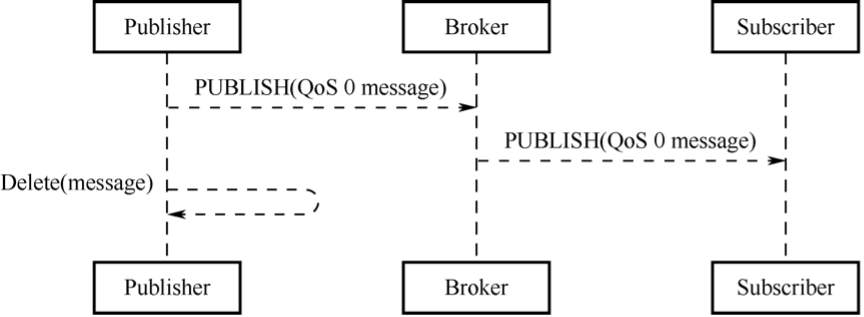

# MQTT Message Format

As defined by the MQTT protocol, an MQTT control packet consists of
three parts: fixed header, variable header, and payload.

## Fixed header
- present in all MQTT control packets.

As shown in Figure 9.2, the packet type takes 4 bits.

<figure align="center">
    
    <figcaption>Figure 9.2. Fixed header of MQTT control packets</figcaption>
</figure>

There are 14 types of control packets in total, as listed in Table 9.1.

<i>Table 9.1. Types of MQTT control packets</i>

|Name|Value|Direction of Flow|Description|
|:---:|:---:|:---:|---|
|Reserved|0|Forbidden|Reserved|
|CONNECT|1|
Server &leftarrow; Client
|Client request to connect to Server|
|CONNACK|2|Server &rightarrow; Client|Connection acknowledgement|
|PUBLISH|3|Server &leftrightarrow; Client|Publish message|
|PUBACK|4|Server &leftrightarrow; Client|Publish of QoS 1 message acknowledged|
|PUBREC|5|Server &leftrightarrow; Client|Publish received (assured delivery part 1)|
|PUBREL|6|Server &leftrightarrow; Client|Publish release (assured delivery part 2)|
|PUBCOMP|7|Server &leftrightarrow; Client|Publish of QoS 2 message complete (assured delivery part 3)|
|SUBSCRIBE|8|Server &leftarrow; Client|Subscribe request of Client|
|SUBACK|9|Server &rightarrow; Client|Subscribe acknowledgement|
|UNSUBSCRIBE|10|Server &leftarrow; Client|Unsubscribe request|
|UNSUBACK|11|Server &rightarrow; Client|Unsubscribe acknowledgement|
|PINGREQ|12|Server &leftarrow; Client|PING request|
|PINGRESP|13|Server &rightarrow; Client|PING response|
|DISCONNECT|14|Server &leftarrow; Client|Client is disconnecting|

There are three MQTT QoS levels: QoS 0, QoS 1, and QoS 2.

1. **QoS 0**: delivered once at most.

    The transmission of messages is completely dependent on the underlying TCP/IP network. As the MQTT protocol does not define response and retry, the message will either reach the server only once or not at all. The flow of MQTT QoS 0 is shown in Figure 9.3.

    <figure align="center">
        
        <figcaption>Figure 9.3. Flow of MQTT QoS 0</figcaption>
    </figure>

2. **QoS 1**: delivered once at least.
    
    The acknowledgement of message receipt is provided by the PUBACK message. If the communication link or the sending device is abnormal, or the message is not received within the specified time, the sender will redeliver the message, and in the fixed header of the MQTT Control packet set the duplicate flag (DUP). The flow of MQTT QoS 1 is shown in Figure 9.4.

    <figure align="center">
        
        <figcaption>Figure 9.4. Flow of MQTT QoS 1</figcaption>
    </figure>

3. **QoS 2**: delivered only once.
    
    This is the highest quality of service where message loss and duplication are unacceptable and increased overhead is incurred. The flow of MQTT QoS 2 is shown in Figure 9.5.

    <figure align="center">
        
        <figcaption>Figure 9.5. Flow of MQTT QoS 2</figcaption>
    </figure>

Bits [3&ndash;0] of the fixed header contain flags specific to each type of control packets. Except the PUBLISH type, the flag bits of other types are taken by the system. For types without flags, the bits are reserved. If invalid flags are received, the receiver must close the network connection. The bits [3&ndash;0] in byte 1 of the PUBLISH packet header are as follows:

1. **DUP (bit3)**: duplicate delivery.
    
    "0" means that this is the first time that the Client or Server requests to send a PUBLISH message. "1" indicates that this may be a duplicate delivery of an earlier message. The DUP flag of QoS 0 messages must be set to 0.

2. **QoS (bits [2&ndash;1])**: determining the number of message delivery.
    
    Table 9.2 shows how to represent QoS values in bits [2&ndash;1].
    
    
<i>Table 9.2. Representation of QoS values in bits [2&ndash;1]</i>

|QoS Value|Bit2|Bit1|Description|
|:-----:|:---:|:---:|:---------:|
|0|0|0|Delivered once at most|
|1|0|1|Delivered once at least|
|2|1|0|Delivered only once|
|&ndash;|1|1|Reserved|

3. **RETAIN (bit0)**: determining the need for message retaining.

    If this flag is set to 1 in a PUBLISH message sent by the Client to the Server, the Server must store this message and its QoS to distribute them later to subscribers with a matching topic. Each Client subscribing to a topic pattern that matches the topic of the retained message receives the retained message immediately after they subscribe. The RETAIN flag is usually used for will messages. For example, after a device is unexpectedly disconnected, the broker will send the will message to the smartphone, where the device will be displayed as offline.

The second and subsequent bytes indicate the remaining length,
indicating the number of remaining bytes within the current packet,
including data in the variable header and the payload. The remaining
length is encoded using a variable-length encoding scheme that uses a
single byte for values up to 127. For larger values, the least
significant seven bits of each byte encode the data, and the most
significant bit is used to indicate whether there are following bytes in
the representation. Thus, each byte encodes 128 values and a
"continuation bit". The maximum number of bytes in the remaining length
field is 4B. The number of remaining length bytes is shown in Table 9.3.

<i>Table 9.3. Number of remaining length bytes</i>

|Byte|Minimum Value|Maximum Value|
|:---:|---|---|
|1|0 (0x00)|127 (0x7F)
|2|128 (0x80, 0x01)|16383 (0xFF, 0x7F)|
|3|16384 (0x80, 0x80, 0x01)|2097151 (0xFF, 0xFF, 0x7F)|
|4|2097152 (0x80, 0x80, 0x80, 0x01)|268435455 (0xFF, 0xFF, 0xFF, 0x7F)|

## Variable header

Some types of MQTT Control Packets contain a variable header component.
It resides between the fixed header and the payload. The content of the
variable header varies depending on the packet type. The Packet
Identifier field of the variable header is present in multiple types of
packets, such as PUBLISH (when QoS>0), PUBACK, PUBREC, PUBREL, PUBCOMP,
SUBSCRIBE, SUBACK, UNSUBSCRIBE, and UNSUBACK.

## Payload
- the third part of an MQTT control packet, containing
the message content.

It exists in five types of packets, CONNECT, SUBSCRIBE, SUBACK,
UNSUBSCRIBE, and PUBLISH.

1.  CONNECT: Client ID, topic, message, user name, and password.
2.  SUBSCRIBE: a series of topics to subscribe to and the QoS.
3.  SUBACK: the server's acknowledgment and reply to the topic (that the
    Client requests to subscribe) and the QoS.
4.  UNSUBSCRIBE: the topics to unsubscribe.
5.  PUBLISH: the to-be-published application message, which can be
    zero-length.
