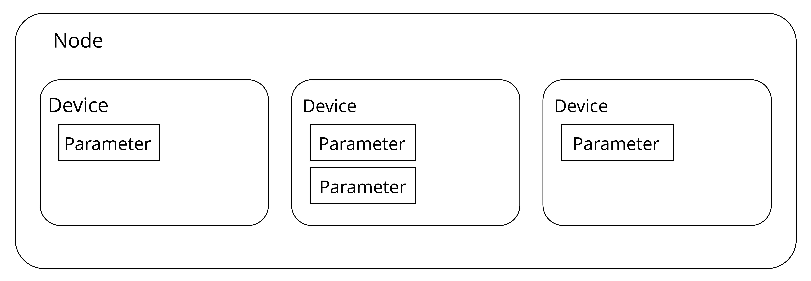

# ESP RainMaker Basics

Before delving into the functions of ESP RainMaker, this section first
explains some fundamental concepts that will be mentioned in the
description of the ESP RainMaker framework (backend and frontend). The
ESP RainMaker framework is illustrated in Figure 9.6.

<figure align="center">
    
    <figcaption>Figure 9.6. ESP RainMaker framework</figcaption>
</figure>

## Node

It refers to the device model that represents the physical device (such
as ESP32-C3) in the cloud. Each node has a unique identifier, namely,
node ID. It is the smallest operational unit and a representation of the
physical device in the ESP RainMaker framework.

## Node attribute

It is used to better describe and define the functions of nodes. ESP
RainMaker has set default metadata for the node, including `fw_version`
and `model`. The name and type that are set when a node is created also
belong to the default metadata. You can also add your own information to
the metadata to better describe the node.

## Device

It is a logical entity that the user can control, such as a switch,
smart light, temperature sensor, or fan. Unlike a node, a device is the
smallest unit that can be operated at the user level.

## Device attribute

Similar to node attribute, it is used to better describe and define
functions of devices.

## Service

In the ESP RainMaker framework, a service is a very similar entity to a
device. The main difference is that the service does not require
operations from the user. For example, the OTA upgrade service has some
states that do not require any operation and management from the user.

## Parameter

It is used to implement functions of devices and services, such as the
power status, brightness, and colour of a smart light, and status
updates during OTA upgrades.

  
The concepts of nodes, devices, parameters, and services in the ESP
RainMaker framework can aptly describe the form and functions of the
product. For example, to create a smart light with controllable power
status, brightness, colour, and scheduled switching, the light is
represented by a node and a device, the power status, brightness, and
colour are controlled by parameters, and the scheduling function is
achieved by a service.
