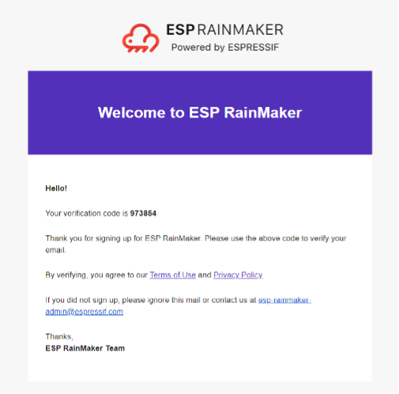
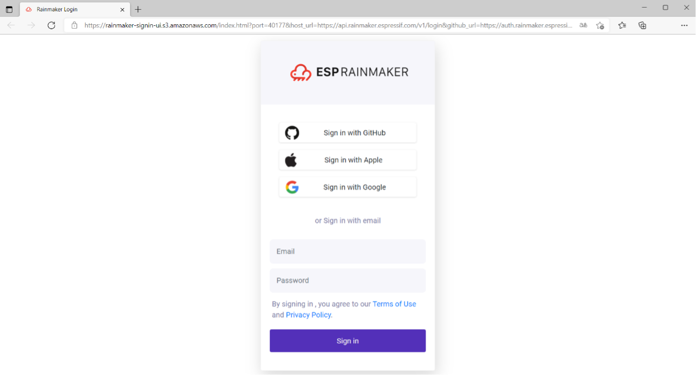

# Communication between Client and Cloud Backend

ESP RainMaker offers two client tools: app and CLI, both of which are
implemented using the RESTful API. This section briefly explains how to
use the CLI tool that comes with the device SDK to communicate with the
cloud backend.

The CLI tool is a Python-based submodule of the esp-rainmaker
repository, under the `esp-rainmaker/cli` directory. To use it, please refer to Chapter 4 to set up the ESP-IDF environment and export the ESP-IDF environment variables. You can verify whether the ESP-IDF and Python environments are ready by running the following commands:

<pre><code># Print ESP-IDF version
$ <b>idf.py --version</b>
ESP-IDF v4.3.2

# Print Python version
$ <b>python3 --version</b>
Python 3.6.9</code></pre>

A similar Shell output to the above indicates that the ESP-IDF
environment is ready. Note that the CLI tool depends on Python 3.x, and
the older versions need upgrading.

After the ESP-IDF environment is ready, use pip to install the Python
dependencies of the CLI tool with the following commands:

<pre><code>$ <b>cd your RainMaker path/esp-rainmaker/cli</b>
$ <b>pip install -r requirements.txt</b>
Collecting argparse
    Using cached argparse-1.4.0-py2.py3-none-any.whl (23 kB)
...
...
...
Installing collected packages: cryptography, argparse
    Attempting uninstall: cryptography
    Found existing installation: cryptography 2.9.2
    Uninstalling cryptography-2.9.2:
        Successfully uninstalled cryptography-2.9.2
Successfully installed argparse-1.4.0 cryptography-2.4.2
WARNING: You are using pip version 21.1.2; however, version 21.3.1 is available.</code></pre>

Once the environment is set up, you can use the CLI tool to communicate with the cloud backend. All the commands supported by the CLI are listed in Table 9.4, and you can view the usage of each command by running `python3 rainmaker.py –h`. Additionally, you can use the parameter `-h` together with each command to view more help information.

<i>Table 9.4. CLI commands</i>

|Command|Description|
|-------|-----------|
|`signup`|Sign up for ESP RainMaker|
|`login`|Login to ESP RainMaker|
|`logout`|Logout current (logged-in) user|
|`forgotpassword`|Reset the password|
|`getnodes`|List all nodes associated with the user|
|`getnodeconfig`|Get node configuration|
|`getnodestatus`|Get online/offline status of the node|
|`setparams`|Set node parameters|
|`getparams`|Get the last parameter of the node in the cloud|
|`removenode`|Remove user node mapping|
|`provision`|Provision the node to join Wi-Fi network|
|`getmqtthost`|Get the address of the MQTT host that the node connects to|
|`claim`|Perform host driven claimming to the node and get the MQTT cerficate|
|`test`|Test whether the node has been mapped to the user|
|`otaupgrade`|Distribute OTA upgrade information|
|`getuserinfo`|Get detailed information of the logged-in user|
|`sharing`|Share the node|

The claim command in the CLI tool is for host driven claiming, which is no longer supported in ESP32-C3. Instead, the more convenient Self Claiming is supported in ESP32-C3.

Before using any other command, you need to first run the `signup` command to sign up for an ESP RainMaker account:

<pre><code>$ <b>cd your RainMaker path/esp-rainmaker/cli</b>
$ <b>cd python3 rainmaker.py signup someone@example.com</b>
Choose a password
Password :
Confirm Password :
Enter verification code sent on your Email.
Verification Code : 973854
Signup Successful
Please login to continue with ESP Rainmaker CLI</code></pre>

Check the verification code in your email, as shown in Figure 9.9.

<figure align="center">
    
    <figcaption>Figure 9.9. Verification code in email</figcaption>
</figure>

Then, log in.

Execute the `login` command, and the Shell will open a web page, as shown in Figure 9.10. Enter your account and password in the box.

<figure align="center">
    
    <figcaption>Figure 9.10. Log in to ESP RainMaker using web browser</figcaption>
</figure>

Alternatively, you can enter the command `login` together with the parameter `-email` to directly log in using CLI:

<pre><code>$ <b>python3 rainmaker.py login --email someone@example.com</b>
Password:
Login Successful</code></pre>
